<!-- vim-markdown-toc GFM -->

* [Getting started with AWS](#getting-started-with-aws)
    * [AWS history](#aws-history)
    * [AWS use cases](#aws-use-cases)
    * [AWS global infrastructure](#aws-global-infrastructure)
    * [Tour of the AWS console](#tour-of-the-aws-console)
* [IAM & AWS CLI](#iam--aws-cli)
    * [IAM: Users & Groups](#iam-users--groups)
    * [IAM: Permissions](#iam-permissions)
    * [IAM Policies Structure](#iam-policies-structure)
    * [IAM - password policy](#iam---password-policy)
    * [Access AWS](#access-aws)
    * [IAM Roles for Services](#iam-roles-for-services)
    * [IAM Security Tools](#iam-security-tools)
    * [IAM guidelines & best practices](#iam-guidelines--best-practices)
* [Amazon EC2](#amazon-ec2)
    * [What is EC2:](#what-is-ec2)
    * [EC2 sizing & configuration options](#ec2-sizing--configuration-options)
    * [EC2 instance types: example](#ec2-instance-types-example)
    * [EC2 Instance Types - Overview](#ec2-instance-types---overview)
    * [Intro to Security Groups](#intro-to-security-groups)
    * [Classic Ports to know](#classic-ports-to-know)
    * [SSH connection](#ssh-connection)
    * [EC2 Instances Purchasing Options](#ec2-instances-purchasing-options)
* [more on EC2](#more-on-ec2)
    * [Private vs Public IP (IPv4)](#private-vs-public-ip-ipv4)
    * [EC2 Spot Instance Requests](#ec2-spot-instance-requests)
    * [ELastic Network Interfaces (ENI)](#elastic-network-interfaces-eni)
    * [EC2 Hibernate](#ec2-hibernate)
    * [EC2 Nitro](#ec2-nitro)
    * [vCPU](#vcpu)
    * [EC2 Capacity reservations](#ec2-capacity-reservations)
* [EC2 Instance Storage](#ec2-instance-storage)
    * [EBS Overview](#ebs-overview)
    * [EBS Snapshots](#ebs-snapshots)
    * [AMI Overview](#ami-overview)
    * [AMI Process (From an EC2 instance)](#ami-process-from-an-ec2-instance)
    * [EC2 Instance Store](#ec2-instance-store)
    * [EBS Volume Types](#ebs-volume-types)
    * [EBS Multi-Attach - io1/io2 family](#ebs-multi-attach---io1io2-family)
    * [EBS Encryption](#ebs-encryption)
    * [EBS RAID Options](#ebs-raid-options)
    * [EFS - Elastic File System](#efs---elastic-file-system)
    * [EBS vs EFS](#ebs-vs-efs)
* [ELB & ASG](#elb--asg)
    * [Scalability & High Availability](#scalability--high-availability)
    * [Elastic Load Balancing (ELB) overview](#elastic-load-balancing-elb-overview)
    * [Load Balancer Stickiness (Session Affinity)](#load-balancer-stickiness-session-affinity)
    * [Cross-Zone Load Balancing](#cross-zone-load-balancing)
    * [SSL Certificates](#ssl-certificates)
    * [Connection Draining](#connection-draining)
    * [Auto Scaling Groups (ASG) Overview](#auto-scaling-groups-asg-overview)
    * [ASG - Dynamic Scaling Policies](#asg---dynamic-scaling-policies)
    * [ASG - Scaling Cooldowns](#asg---scaling-cooldowns)
    * [more about ASG](#more-about-asg)
* [RDS + Aurora + ElastiCache](#rds--aurora--elasticache)
    * [AWS RDS Overview](#aws-rds-overview)
    * [RDS Backups](#rds-backups)
    * [RDS - Storage Auto Scaling](#rds---storage-auto-scaling)
    * [RDS - Read Replicas for read scalability](#rds---read-replicas-for-read-scalability)
    * [RDS Security](#rds-security)
    * [Amazon Aurora](#amazon-aurora)
    * [Aurora DB structure:](#aurora-db-structure)
    * [Aurora Security:](#aurora-security)
    * [ElastiCache Overview](#elasticache-overview)
    * [ElastiCache - Cache Security](#elasticache---cache-security)
    * [Patterns for ElastiCache](#patterns-for-elasticache)
* [Route53](#route53)
    * [Route53 Overview](#route53-overview)
    * [DNS Records TTL (Time to Live)](#dns-records-ttl-time-to-live)
    * [CNAME vs Alias](#cname-vs-alias)
    * [Health Checks](#health-checks)
    * [Routing Policy](#routing-policy)
    * [Route53 as a Registrar](#route53-as-a-registrar)
* [Solutions Architecture Discussions Overview](#solutions-architecture-discussions-overview)
    * [Stateless Web App: WhatIsTheTime.com](#stateless-web-app-whatisthetimecom)
    * [Stateful Web App: MyClothes.com](#stateful-web-app-myclothescom)
    * [Stateful Web App: MyWordPress.com](#stateful-web-app-mywordpresscom)
    * [Instantiating Application Quickly](#instantiating-application-quickly)
    * [Beanstalk Overview](#beanstalk-overview)
* [Amazon S3](#amazon-s3)
    * [S3 Buckets and Objects](#s3-buckets-and-objects)
    * [S3 Encryption for Objects](#s3-encryption-for-objects)
    * [S3 Security](#s3-security)
    * [S3 Websites](#s3-websites)
    * [S3 CORS](#s3-cors)
    * [S3 Consistency Model](#s3-consistency-model)
* [AWS CLI, SDK, IAM Roles & Policies](#aws-cli-sdk-iam-roles--policies)
    * [AWS CLI S3 commands](#aws-cli-s3-commands)
    * [IAM Roles and Policies](#iam-roles-and-policies)
    * [AWS Policy Simulator](#aws-policy-simulator)
    * [AWS EC2 Instance Metadata](#aws-ec2-instance-metadata)
* [S3 Advanced Topics and Athena](#s3-advanced-topics-and-athena)
    * [S3 MFA-Delete](#s3-mfa-delete)
    * [S3 Access Logs](#s3-access-logs)
    * [S3 replication (cross region and same region)](#s3-replication-cross-region-and-same-region)
    * [S3 Pre-signed URLs](#s3-pre-signed-urls)
    * [S3 Storage Classes](#s3-storage-classes)
    * [S3 Lifecycle Rules](#s3-lifecycle-rules)
    * [S3  Analytics - Storage Class Analysis](#s3--analytics---storage-class-analysis)
    * [S3 - performance](#s3---performance)
    * [S3 Select & Glacier Select](#s3-select--glacier-select)
    * [S3 Event Notifications](#s3-event-notifications)
    * [S3 Requester Pays](#s3-requester-pays)
    * [Athena Overview](#athena-overview)
    * [S3 Lock Polices & Glacier Vault Lock](#s3-lock-polices--glacier-vault-lock)
    * [S3 cross-account access](#s3-cross-account-access)
* [CloudFront](#cloudfront)
    * [AWS CloudFront overview](#aws-cloudfront-overview)
    * [CloudFront Signed URL / Cookies](#cloudfront-signed-url--cookies)
    * [CloudFront Advanced Concepts](#cloudfront-advanced-concepts)
    * [Global Accelerator - Overview](#global-accelerator---overview)
    * [Global Accelerator vs CloudFront:](#global-accelerator-vs-cloudfront)
* [AWS Storage Extra](#aws-storage-extra)
    * [AWS Snow Family](#aws-snow-family)
    * [AWS Storage Gateway](#aws-storage-gateway)
    * [Amazon FSx](#amazon-fsx)
    * [AWS Transfer Family](#aws-transfer-family)
    * [Storage Comparison](#storage-comparison)
    * [AWS DataSync](#aws-datasync)
* [AWS Integration & Messaging](#aws-integration--messaging)
    * [background](#background)
    * [Amazon SQS](#amazon-sqs)
    * [Amazon SNS](#amazon-sns)
    * [SNS + SQS: Fan Out](#sns--sqs-fan-out)
    * [Kinesis](#kinesis)
    * [Kinesis vs SQS ordering](#kinesis-vs-sqs-ordering)
    * [SQS vs SNS vs Kinesis](#sqs-vs-sns-vs-kinesis)
    * [Amazon MQ](#amazon-mq)
    * [Simple Workflow Service (SWF)](#simple-workflow-service-swf)
* [AWS Container](#aws-container)
    * [Docker overview](#docker-overview)
    * [Docker Containers Management](#docker-containers-management)
* [Serverless Overview](#serverless-overview)
    * [What's Serverless](#whats-serverless)
    * [serverless in AWS](#serverless-in-aws)
    * [AWS Lambda intro](#aws-lambda-intro)
    * [DynamoDB](#dynamodb)
    * [AWS API Gateway](#aws-api-gateway)
    * [AWS Cognito](#aws-cognito)
    * [AWS SAM - Serverless Application Model](#aws-sam---serverless-application-model)
* [Serverless Architectures](#serverless-architectures)
    * [Mobile application: MyTodoList](#mobile-application-mytodolist)
    * [Serverless hosted website: MyBlog.com](#serverless-hosted-website-myblogcom)
    * [Micro Services Architecture](#micro-services-architecture)
    * [Distributing paid content](#distributing-paid-content)
    * [Software Updates Offloading](#software-updates-offloading)
    * [Big Data Ingestion Pipeline](#big-data-ingestion-pipeline)
* [Database in AWS](#database-in-aws)
    * [Choosing the Right Database](#choosing-the-right-database)
    * [RDS](#rds)
    * [Aurora](#aurora)
    * [ElastiCache](#elasticache)
    * [DynamoDB](#dynamodb-1)
    * [S3](#s3)
    * [Athena](#athena)
    * [Redshift](#redshift)
    * [AWS Glue](#aws-glue)
    * [EMR](#emr)
    * [Neptune](#neptune)
    * [ElasticSearch](#elasticsearch)
* [AWS Monitoring & Audit](#aws-monitoring--audit)
    * [AWS CloudWatch](#aws-cloudwatch)
    * [AWS CloudTrail](#aws-cloudtrail)
    * [AWS Config](#aws-config)
    * [CloudWatch vs CloudTrail vs Config](#cloudwatch-vs-cloudtrail-vs-config)
* [Identity and Access Management (IAM) - Advanced](#identity-and-access-management-iam---advanced)
    * [AWS STS - Security Token Service](#aws-sts---security-token-service)
    * [Identity Federation in AWS](#identity-federation-in-aws)
    * [AWS Directory Services](#aws-directory-services)
    * [AWS Organizations](#aws-organizations)
    * [IAM Advanced](#iam-advanced)
    * [AWS Resource Access Manager (RAM)](#aws-resource-access-manager-ram)
    * [AWS Single Sign-On (SSO)](#aws-single-sign-on-sso)
* [AWS Security & Encryption](#aws-security--encryption)
    * [Why encryption](#why-encryption)
    * [AWS KMS (Key Management Service)](#aws-kms-key-management-service)
    * [AWS System Management (SSM) Parameter Store](#aws-system-management-ssm-parameter-store)
    * [AWS Secrets Manager](#aws-secrets-manager)
    * [CloudHSM](#cloudhsm)
    * [AWS Shield](#aws-shield)
    * [AWS WAF – Web Application Firewall](#aws-waf--web-application-firewall)
    * [AWS Firewall Manager](#aws-firewall-manager)
    * [Amazon GuardDuty](#amazon-guardduty)
    * [Amazon Inspector](#amazon-inspector)
    * [Amazon Macie](#amazon-macie)
    * [AWS Shared Responsibility Model](#aws-shared-responsibility-model)
* [Networking - VPC](#networking---vpc)
    * [Understanding CIDR - IPv4](#understanding-cidr---ipv4)
    * [VPC in AWS – IPv4](#vpc-in-aws--ipv4)
    * [Internet Gateways](#internet-gateways)
    * [DNS Resolution in VPC](#dns-resolution-in-vpc)
    * [Network ACL (NACL) & Security Groups](#network-acl-nacl--security-groups)
    * [VPC Peering](#vpc-peering)
    * [VPC Endpoints](#vpc-endpoints)
    * [Flow Logs](#flow-logs)
    * [Bastion Hosts](#bastion-hosts)
    * [Site to Site VPN](#site-to-site-vpn)
    * [Direct Connect and Direct Connect Gateway](#direct-connect-and-direct-connect-gateway)
    * [Egress Only Internet Gateway](#egress-only-internet-gateway)
    * [AWS PrivateLink - VPC Endpoint Services](#aws-privatelink---vpc-endpoint-services)
    * [EC2-Classic & AWS ClassicLink (deprecated)](#ec2-classic--aws-classiclink-deprecated)
    * [AWS VPN CloudHub](#aws-vpn-cloudhub)
    * [Transit Gateway](#transit-gateway)
    * [VPC Section Summary](#vpc-section-summary)
    * [Networking Costs in AWS per GB - Simplified](#networking-costs-in-aws-per-gb---simplified)
    * [IPv6 in VPC](#ipv6-in-vpc)
    * [AWS VPC Components](#aws-vpc-components)
* [Disaster Recovery Overview](#disaster-recovery-overview)
    * [Disaster Recovery Overview](#disaster-recovery-overview-1)
    * [Disaster Recovery Strategies](#disaster-recovery-strategies)
    * [Disaster Recovery Tips](#disaster-recovery-tips)
    * [DMS – Database Migration Service](#dms--database-migration-service)
    * [On-Premise strategy with AWS](#on-premise-strategy-with-aws)
    * [AWS DataSync](#aws-datasync-1)
    * [AWS Backup](#aws-backup)
    * [Transferring large amount of data into AWS](#transferring-large-amount-of-data-into-aws)
* [More Solution Architectures](#more-solution-architectures)
    * [Lambda, SNS & SQS](#lambda-sns--sqs)
    * [S3 Events](#s3-events)
    * [Caching Strategies](#caching-strategies)
    * [Blocking an IP address](#blocking-an-ip-address)
    * [High Performance Computing (HPC)](#high-performance-computing-hpc)
    * [creating a highly available EC2 instance](#creating-a-highly-available-ec2-instance)
    * [High Availability for a Bastion Host](#high-availability-for-a-bastion-host)
* [Other Services](#other-services)
    * [CICD](#cicd)
    * [CloudFormation](#cloudformation)
    * [AWS Step Functions](#aws-step-functions)
    * [Amazon EMR](#amazon-emr)
    * [AWS Opsworks](#aws-opsworks)
    * [AWS Elastic Transcoder](#aws-elastic-transcoder)
    * [AWS WorkSpaces](#aws-workspaces)
    * [AWS AppSync](#aws-appsync)
    * [Cost Explorer](#cost-explorer)
    * [AWS X-Ray](#aws-x-ray)
    * [AWS other services cheat-sheet](#aws-other-services-cheat-sheet)
* [Whitepapers](#whitepapers)
    * [Well Architected Framework](#well-architected-framework)
    * [Trusted Advisor](#trusted-advisor)

<!-- vim-markdown-toc -->
## Getting started with AWS

### AWS history
* 2002 internal launched
* 2003 idea to market 
* 2004 launched publicly with SQS
* 2006 re-launched publicly with SQS, S3 & EC2
* 2007 launched in Europe

### AWS use cases
* AWS enabled you to build sophisticated, scalable applications
* applicable to a diverse set of industries: McDonald, NETFLIX, Activision, 21st Century Fox etc
* Use case include:
    * enterprise IT, backup & Storage, Big Data analytics
    * Website hosting, mobile and social apps
    * gaming

### AWS global infrastructure
* AWS Regions:
    * names can be us-east-1, eu-west-3
    * a region is a cluster of data centers
    * most AWS services are region-scoped
    * how to choose an AWS region:
        * `Compliance` with data governance and legal requirements
        * `Proximity` to customer
        * `Available services` within a region: new services and new features aren't available in every region
        * `Pricing` varies region to region and is transparent in the pricing page
* AWS Availability Zones
    * each region has many availability zones
        * usually 3, min 2, max 6
        * e.g., ap-shouteast-2a/b/c/
    * each AZ is one or more discrete data centers with redundant power, networking and connectivity
    * they're separate from each other, isolate for disasters
    * connected with high bandwidth, ultra-low latency networking
* AWS Data Centers
* AWS Edge Locations / Points of presence
    * Amazon has 216 points of Presence (205 Edge locations & 11 Regional Caches) in 84 cities across 42 countries
    * contents is delivered to end users with lower latency

### Tour of the AWS console
* AWS has global services:
    * IAM (Identity and Access Management)
    * Route 53 (DNS services)
    * CloudFront (Content Delivery Network)
    * WAF (Web Application Firewall)
* Most AWS services are regional-scoped:
    * EC2 (Infrastructure as a Service)
    * Elastic Beanstalk (Platform as a Service)
    * Lambda (Function as a Service)
    * Rekognition (software as a Service)
    * [region table](https://aws.amazon.com/about-aws/global-infrastructure/regional-product-services/) 

## IAM & AWS CLI

### IAM: Users & Groups
* IAM = Identity and Access Management, Global service
* `Root account` created by default, shouldn't be used or shared
* `Users` are people within your organization, and can be grouped
* `Groups` only contain users, not other groups
    * Users don't have to belong to a group (tho not the best practice), and user can belong to multiple groups

### IAM: Permissions
* `Users or Groups` can be assigned JSON documents called policies
* These policies defined the `permissions` of the users
* in AWS you apply the `least privilege principle`: don't give more permissions than a user needs
    * User level IAM policy can be directed attached or inheritance from the groups he is assigned to
    * new users have **NO** permissions when first created

### IAM Policies Structure
* Consists of 
    * Version: policy language version, always include "2012-10-17"
    * Id: an identifier for the policy (optional)
    * Statement: one or more individual statements (required)
        *`Sid`: an identifier for the statement (optional)
        *`Effect`: whether the statement allows or denies access (Allow, Deny)
        *`Principal`: account/user/role to which this policy applied to
        *`Action`: list of actions this policy allows or denies
        *`Resource`: list of resource to which the actions applied to
        *`Condition`: conditions for when this policy is in effect (optional)

### IAM - password policy
* strong passwords = higher security for your accoutns
* in AWS, you can setup a password policy:
    * set a minimum password length
    * require specific character types:
        * uppercase letter; lower case letter; number; non-alphanumeric characters
    * allow all IAM users to change their own passwords
    * requires user to change their password after some time (password expiration)
    * prevent password re-use
* Multi Factor Authentication - MFA
    * **you want to protect your root accounts and IAM users** 
    * MFA = password you know + security device you own
        * if a password is stolen or hacked, the account is not compromised
    * MFA devices options in AWS:
        * virtual MFA device: Google authenticator (phone only); Authy (multi-device)
            * support for multiple tokens on a single devices
        * Universal 2nd Factor (U2F) Security Key: YubiKey by Yubico (3rd party)
            * support for multiple root and IAM users using a single security key
        * Hardware Key Fob MFA device: provided by Gemalto (3rd party)
        * Hardware Key Fob MFA device for AWS GovCloud (US): provided by SurePassID (3rd party)

### Access AWS
* to access AWS, you have 3 options:
    * AWS Management Console (protected by password + MFA)
        * AWS CloudShell, a terminal in the cloud of AWS
        * It has its own repository and the files created will stay
        * support file upload and download, multiple tabs and other functionalities
        * it is only available in some but not all regions
    * AWS Command Line Interface (CLI): protected by access keys
        * a tool that enable you to interact with AWS services using commands in your command-line shell
        * Direct access to the public APIs of AWS services
        * you can develop scripts to manage your resources
        * it is open-source [github](https:://github.com/aws/aws-cli) 
        * alternative to using AWS Management Console
    * AWS software Developer Kit (SDK) - for code: procted by access keys
        * language-specific APIs (Set of libraries)
        * enabled you to access and manage AWS services programmatically
        * embedded within your application
        * supports:
            * SDKs (JS, Python, PHP, .NET, Ruby, Java, Go, Node.js, C++)
            * Mobile SDKs (Android, iOS,...)
            * loT Device SDKs (embedded C, Arduio,...)
        * Example: AWS CLI is built on AWS SDK for Python
* Access keys are generated through the AWS Console
	* new users are assigned Access Key ID & Secret Access Key when first created 
		* can only access when create the login, regenerate if lose it
	*  can use to access AWS via the APIs and CLI
    * Users manage their own access keys
    * access keys are secret, don't share them
    * access key ID ~= username; Secret Access Key ~= password

### IAM Roles for Services
* Some AWS service will need to perform actions on your behalf
* To do so, we will assign permissions to AWS services with IAM roles (so to act like user actions)
* Common roles:
    * EC2 Instance Roles; Lambda Function Roles; Roles for CloudFormation

### IAM Security Tools
* IAM Credentials Reports (account-level)
    * a report that lists all your account's users and the status of their various credentials
* IAM Access Advisor (user-level)
    * access advisor shows the service permission granted to a user and when those services were last accessed

### IAM guidelines & best practices
* don't use the root account except for AWS account setup
* One physical user = One AWS user
* assign users to groups and assign permissions to groups
* create a strong password policy
* use and enforce the use of MFA
* create and use `Roles `for giving permission to AWS services
* use Access Keys for Programmatic Access (CLI/SDK)
* Audit permission of your account with the IAM Credentials Report
* **Never share IAM users & Access Keys**

## Amazon EC2

### What is EC2:
* EC2 = Elastic Compute Cloud = infrastructure as a service
* it mainly consists in the capability of:
    * renting virtual machines (EC2)
        * with AMI (OS)
    * Storing data on virtual drives (EBS)
    * Distributing load across machines (ELB)
    * Scaling the services using an auto-scaling group (ASG)

### EC2 sizing & configuration options
* Operating System (OS): Linux, Windows or Mac OS
* How much compute power & cores (CPU)
* How much random-access memory (RAM)
* How much storage space:
    * Network-attached (EBS & EFS)
    * hardware (EC2 Instance Store)
* Firewall rules: `security group` 
* Bootstrap script (configure at first launch): `EC2 User Data` script
    * `boostrapping` means launching commands when a machine starts
    * the script is only run once at the instance first start
    * is used to automate boot tasks such as:
        * install updates
        * install software
        * downloading common files from the Internet
        * others
    * runs with the root user

### EC2 instance types: example
| instance    | vCPU | Mem (GB) | Storage          | Network Performance | EBS Bandwidth (Mbps) |
|-------------|------|----------|------------------|:-------------------:|:--------------------:|
| t2.micro    | 1    | 1        | EBS-Only         |   Low to Moderate   |          na          |
| t2.xlarge   | 4    | 16       | EBS-Only         |       Moderate      |          na          |
| c5d.4xlarge | 16   | 32       | 1 x 400 NVMe SSD |    Up to 10 GBps    |         4,750        |
| m5.8xlarge  | 32   | 128      | EBS-Only         |       10 GBps       |         6,800        |
| r5.16xlarge | 64   | 512      | EBS-Only         |       20 GBps       |        13,600        |
* t2 is available in the free tier
    * t2.micro is free up to 750 hours per month

### EC2 Instance Types - Overview
* different types of EC2 instances are optimized for different use cases: 
    * [AWS link](https://aws.amazon.com/ec2/instance-types/) 
* AWS has the following naming convention: e.g., m5.2xlarge
    * m: instance class
    * 5: generation (AWS improves them over time)
    * 2xlarge: size within the instance class
* EC2 Instances Types:
    * General Purposes:
        * great for a diversity of workloads such as web servers or code repositories
        * balance between: compute, memory and networking
        * t2.micro is under General Purpose EC2 instance
    * Compute Optimized:
        * great for compute-intensive tasks that require high performance processors:
            * batch processing workloads
            * media transcoding
            * high performance web servers
            * high performance computing (HPC)
            * Scientific modeling & ML
            * Dedicated gaming servers
        * currently c-class is under use
    * Memory Optimized
        * fast performance for workloads that process large datasets in memory:
            * high performance, relational/non-relational databases
            * distributed web scale cache stores
            * in-memory databases optimized for BI (business intelligence)
            * applications performing real-time processing of big unstructured data
        * there are r-class (r stands for ram); x-class and z-class
    * Storage Optimized 
        * great for storage-intensive tasks that require high, sequential read and write access to large datasets on local storage:
            * high frequency online transaction processing (OLTP) systems
            * relational and NoSQL databases
            * cached for in-memory databases (e.g., Redis)
            * data warehousing applications
            * distributed file systems
        * there are i-/d-/h-classes

### Intro to Security Groups
* security groups act as a **firewall** that controls how traffic is allowed into or out of our EC2 Instances; they regulate:
    * access to ports
    * authorised IP ranges - IPv4 and IPv6
    * control of inbound and outbund network
* it only contain ** allow** rules
	* you cannot block specific IP address using SG, instead use NACL
* can reference by IP or by security group
* security groups key points:
    * Can be attached to multiple instances
    * Locked down to a region / VPC combination
    * It’s good to maintain one separate security group for SSH access
		* If your application is not accessible (time out), then it's a security group issue
		* If your application gives a "connection refused" error, then it's an application error or it's not launched
    * all inbound traffic is blocked by default
    * all outbound traffic is **authorised** by default
    * Security Groups are **STATEFULL**
		* if you create an inbound rule allowing traffic in, that traffic is automatically allowed back out

### Classic Ports to know
* 21 = FTP (File Transport Protocol) –upload files into a file share
* 22 = SSH (Secure Shell) -log into a Linux instance
* 22 = SFTP (Secure File Transport Protocol) –upload files using SSH
* 80 = HTTP –access unsecured websites
* 443 = HTTPS –access secured websites
* 3389 = RDP (Remote Desktop Protocol) –log into a Windows instance
* RDS Database ports:
	* PostgreSQL: 5432
	* MySQL: 3306
	* Oracle RDS: 1521
	* MSSQL Server: 1433
	* MariaDB: 3306 (same as MySQL)
	* Aurora: 5432 (if PostgreSQL compatible) or 3306 (MySQL compatible)

### SSH connection
* SSH Summary table: 

| OS      | SSH   | PUtty | EC2 Instance Connect |
|---------|-------|-------|----------------------|
| Mac     | True  | False | True                 |
| Linux   | True  | False | True                 |
| Win <10 | False | True  | True                 |
| Win >10 | True  | True  | True                 |

* SSH allows you to control a remote machine, all using the command line
* SSH command: `ssh -i path/to/ec2.pem ec2-user@xx.xx.xx.xx (public IP address)`
    * ec2.pem file need to be accessed by single user only (chmod 0400)
    * user name needs to be **ec2-user** 
* `EC2 instance connect`:
    * connect to your EC2 instance within your browser
    * a temporary key is uploaded onto EC2 by AWS
    * **works only out-of-the-box with Amazon Linux 2**
    * need port 22 access
* `EC2 Instance Role`: link to IAM roles 
    * so that EC2 have the same level of access as user/user-group
        * e.g., to list out all users in IAM requires certain privilege
    * never pass credentials directly to EC2 via SSH as it would expose it to others on the same instance

### EC2 Instances Purchasing Options

* `On-Demand Instances`: short workload, predictable pricing
    *  Pay for what you use:
        *  Linux -billing per second, after the first minute
        *  All other operating systems (ex: Windows) -billing per hour 
    *  Has the highest cost but no upfront payment
    *  No long-term commitment
    *  Recommended for short-term and un-interrupted workloads, where you can't predict how the application will behave
* Reserved: (MINIMUM 1 year)
    * Up to 72% discount compared to On-demand
    * Reservation period: 1 year = + discount | 3 years = +++ discount
    * Purchasing options: no upfront | partial upfront = + | All upfront = ++ discount 
    * `Reserved Instances`:long workloads 
        * Reserve a specific instance type
        * Recommended for steady-state usage applications (think database)
    * `Convertible Reserved Instances`:long workloads with flexible instances
        * can change the EC2 instance type
        * Up to 45% discount
    * `Scheduled Reserved Instances`
        * launch within time window you reserve
        * When you require a fraction of day / week / month
        * Commitment for 1 year only
    * `Spot Instances`: short workloads, cheap, can lose instances (less reliable)
        * Can get a discount of up to 90% compared to On-demand
			* if the instance is terminated by Amazon, you will not be charged for a partial hour of usage
			* if the instance is terminated by the user, you will be charged for a partial hour of usage
        * Instances that you can "lose" at any point of time if your max price is less than the current spot price
        * The MOST cost-efficient instances in AWS
        * Useful for workloads that are resilient to failure:
            * Batch jobs; Data analysis; Image processing
            * Any distributed workloads
            * Work loads with a flexible star and end time
        * Not suitable for critical jobs or databases
* `Dedicated Hosts`: book an entire physical server, control instance placement
    * An Amazon EC2 Dedicated Host is a physical server with EC2 instance capacity fully dedicated to your use. 
    * Can help you address compliance requirements and reduce costs by allowing you to use your existing server-bound software licenses. 
    * Allocated for your account for a 3-year period reservation
    * More expensive
    * Useful for software that have complicated licensing model (BYOL –Bring Your Own License)
    * Or for companies that have strong regulatory or compliance needs
* `Dedicated Instances`: no other customers will share your hardware
    * Instances running on hardware that’s dedicated to you
    * May share hardware with other instances in same account
    * No control over instance placement (can move hardware after Stop / Start)
    * comparing to dedicated hosts, it changes at instance level (per instance billing)
* exam tips:
	* hypervisor for EC2: Nitro- and Xen-


## more on EC2

### Private vs Public IP (IPv4)

- networking has 2 sorts of IPs: IPv4 and IPv6:
    - IPv4: 1.160.10.240
        - IPv4 is stil the most common format used online
        - IPv4 allows for **3.7 billion** different addresses in the public space
        - \[0-255\].\[0-255\].\[0-255\].\[0-255\]
    - IPv6: 3ffe: 1900:4545:3:200:f8ff:fe21:67cf
        - IPv6 is newer and solves problems for the Internet of Things (loT)
- Public IP:
    - the machine can be identified on the Internet (www)
    - must be unique across the whole web
    - can be geo-located facility
- Private IP:
    - the machine can be identified on a private network only
    - must be unique across the private network
    - 2 different private network can have the same IPs
    - machines connect to WWW using an internet gateway (a proxy)
    - only a specified range of IPs can be used as private IP (e.g., 192.168.0.1/22)
- Elastic IPs:
    - when you stop and re-start an EC2 instance, it can change its public IP
    - if you need a fixed public IP for your instance, you need an Elastic IP
    - an Elastic IP is a public IPv4 IP you own as long as you don't delete it
    - you can attach it to one instance at a time
    - with an Elastic IP address, you can mask the failure of an instance or software by rapidly remapping the address to another instance in your account.
    - you can only have 5 Elastic IP in your account per region (you can ask AWS to increase that)
    - Overall, try to avoid using Elastic IP:
        - they often reflect poor architectural decisions
        - instead, use a random public IP and register a DNS name to it
        - Or, use a Load Balancer and don't use a public IP
- in AWS EC2 settings:
    - by default, your EC2 machine comes with:
        - a private IP for the internal AWS Network
        - A public IP, for the WWW
    - when we are doing SSH into our EC2 machines:
        - we can't use a private IP, because we are not in the same network
        - we can only use the public IP.
    - if your machine is stopped (hibernated or terminated) and then started, **the public IP can change**

### EC2 Spot Instance Requests

- can get a discount of up to 90% compared to on-demand
- define **max spot price** and get the instance while current spot price < max
    - the hourly spot price varies based on offer and capacity
    - if the current spot price > your max price you can choose to stop or terminal your instance with a 2 minutes grace period
- other strategy: spot block
    - "block" Spot Instance during a specific time frame (1 to 6 hours) without interruptions (even if the spot price goes over your max spot price)
    - in rare situations, the instance may be reclaimed
- used for batch jobs, data analysis, or workloads that are resilient to failures
- not great for critical job or databases
- how to terminate Spot Instances?
    - 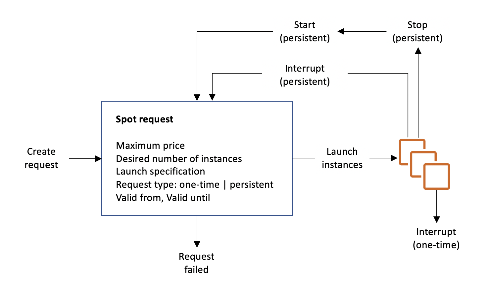
    - to stop spot request: cancel spot request first then stop instances you intend to stop
- Spot Fleets:
    - set of Spot Instance + (optional) on-demand instances
    - the Spot Fleet will try to meet the target capacity with price constraints:
        - define possible launch pools: instance type (m5.large), OS, AZ
        - can have multiple launch pools, so that the fleet can choose
        - stops launching instances when reaching capacity or max cost
    - Strategies to allocate Spot Instances:
        - lowest price: from the pool with the lowest price (cost optimization, short workload)
        - diversified: distributed across all pools (great for availability, long workloads)
        - capacity optimized: pool with the optimal capacity for the number of instances
        - Instance Pools To Use Count: distributed across pools specified with lowest price policy in place
    - Spot Fleets allows us to automatically request Spot Instances with the lowest price
- Placement Groups:
    - to control EC2 Instance placement strategy, one can specify one of the following strategies for the group:
        - *cluster*: clusters instance into a low latency group in a single AZ (same rack and same AZ)
            - pros: great network (10 Gbps bandwidth between instances)
            - cons: if the rack fails, all instances fails at the same time
            - use case:
                - big data job that needs to complete fast
                - application that needs extremely low latency and high network throughput
        - *spread*: spread instances across underlying hardware (max 7 instances per group per AZ) - critical applications
            - pros:
                - can span across AZs
                - reduced risk in simultaneous failure
                - EC2 Instances are on different physical hardware
            - cons:
                - limited to 7 instances per AZ per placement group
            - use case:
                - application that needs to maximize high availability
                - critical applications where each instance must be isolated from failure from each other
        - *Partition*: spreads instances across many different partitions (which rely on different sets of racks) within an AZ.
            - Up to 7 partitions per AZ
            - can span across multiple AZs in the same region
            - up to 100s of EC2 instances per group
            - the instances in a partition do not share rack with the instances in the other partitions
                - a partition failure can affect many EC2 but won't affect other partitions
                - EC2 instances get access to the partition information as metadata
            - Use cases: HDFS (Hadoop Distributed File System), Database: (HBase, Cassandra), event streaming: Kafka
	- exam tips:
		- the name you specify for a placement group must be unique within your AWS account
		- only certain types of instances can be launched in a placement group (xxx Optimized)
		- AWS recommend homogenous instances within clustered placement group
		- you can't merge placement groups
		- you can move an existing instance (in the stopped state) into a placement group
		- you can move or remove an instance from placement group using AWS CLI or an AWS SDK

### ELastic Network Interfaces (ENI)

- logical component in a VPC that represents a virtual network card
- the ENI can have the following attributes:
    - primary private IPv4, one or more secondary IPv4
    - one Elastic IP (IPv4) per private IPv4
    - one public IPv4
    - one or more IPv6 addresses
    - one or more security groups
    - a MAC address
    - a source/destination check flag
    - a description
- You can create ENI independently and attach them on the fly (move them) on EC2 instances for failover:
    - so you have more control over private IP address and networking
    - will be persistent to the EC2 once attached, even when you shutdown the instance
- Usecase:
    - create a management network
    - use network and security appliances in your VPC
    - create dual-homed instances with workloads / rols on distinct subnets
    - create a low-budget, high availability solution
- bound to a specific AZ
- ENA: Enhanced Networking Adapter.
    - use single root I/O virtualization to provide high-performance networking capabilities on *supported instance types*
        - higher bandwidth (up to 100 Gbps)
        - higher packet per seconds (pps)
        - lower inter-instance latencies
        - lower CPU utilization
    - no additional charge for using enhanced networking
    - older generation is called Intel 82599 Virtual Function (VF)
        - up to 10 Gbps
        - support older EC2 instances
- EFA: Elastic Fabric Adaptor:
    - a network devcie can be attached to EC2 to accelerate HPC and ML application
    - provides lower and more consistent latency and higher throughput than the TCP transport
    - supports OS-bypass: bypass the OS kernel and to communicate directly with the EFA device (Linux only)

### EC2 Hibernate

- We know we can stop, terminate instances
    - stop: the data on disk (EBS) is kept intact in the next start
    - terminate: any EBS volumes (root) also set-up to be destroyed is lost
- on start, the following happens:
    - first start: the OS boots & the EC2 User Data script is run
    - Following starts: the OS boots up
    - Then your application starts, cached get warmed up, and that can take time
- introducing **EC2 Hibernate**:
    - The in-memory (RAM) state is perserved
    - the instance boot is much faster (The OS is not stopped / restarted)
    - under the hood: the RAM state is written to a file in the root EBS volume
    - the root EBS volume must be encrypted
    - use cases:
        - long-running processing
        - saving the RAM state
        - services that take time to initialize
    - good to know:
        - only supported specific instance families: C3/4/5, M3/4/5, R3/4/5
        - instance RAM size: must be less than 150GB.
        - instance size: not supported for bare metal instances
        - AIM: Amazon Linux 2, Linux AMI, Ubuntu, windows
        - Root Volume: must be EBS, encrypted, not instance store, and large
        - available for on-demand and reserved instances
        - an instance cannot be hibernated more than 60 days

### EC2 Nitro

- underlying platform for the next generation of EC2 instances
- new vitalization technology
- Allows for better performance:
    - better networking options (enhanced networking, HPC, IPv6)
    - higher speed EBS (Nitro is necessary for 64,000 EBS IOPS - max 32,000 on non-Nitro)
- Better underlying security
- Instance types example:
    - Virtualized: A1, C5 and above, D3 and above, G4, I3en, Infl, M5 and above
    - Bare metal: a1.metal, c5.metal and above

### vCPU

- understanding vCPU:
    - multiple threads can run on one CPU (multithreading)
    - each thread is represented as a virtual CPU (vCPU)
    - example: m5.2xlarge:
        - 4 CPU, 2 threads per CPU => 8 vCPU in total
- Optimizing CPU options:
    - EC2 instances come with a combination of RAM and vCPU
    - But in some cases, you may want to change the vCPU options:
        - number of CPU cores: you can decrease it (helpful if you need high RAM and low number of CPU) - to decrease **licensing costs**
        - number of threads per core: disable multithreading to have 1 thread per CPU - helpful for high performance computing (HPC) workloads
    - can only be specified during instance launch

### EC2 Capacity reservations

- capacity reservations ensure you have EC2 capacity when needed
- manual or planned end-date for the reservation
- no need for 1 or 3-year commitment
- capacity access is immediate, you get billed as soon as it starts
- specify:
    - the AZ in which to reserve the capacity (only one)
    - the number of instances for which to reserve capacity
    - the instance attributes, including the instance type, tenancy, and platform/OS
- combine with Reserved Instance and Saving Plans to do cost saving


## EC2 Instance Storage

### EBS Overview
* an **EBS (Elastic Block Storage) Volume** is a **network** drive you can attach to your instances while running
    * analogy - think of them as a "network USB stick"
    * it uses network to communicate the instance, which means there might be a bit of latency
    * it can be detached from an EC2 instance and attached to another quickly
    * *they can only be mounted to one instance at a time* (at the CCP level)
    * multiple EBS volumes can be attached to a single EC2 instance
* it allows your instances to persist data, even after their termination
    * EBS - Delete on termination attribute
        * controls the EBS behavior when an EC2 instance terminates
            * by default, the root EBS volume is deleted (attribute enabled)
            * by default, any other attached EBS volume is not deleted (attribute disabled)
        * this can be controlled by the AWS console / AWS CLI
        * use case: preserve root volume when instance is terminated
* they are bound to a *specific AZ* 
    * to move a volume across, you first need to snapshot it
* Have a provisioned capacity (size in GBs, and IOPS)
    * you get billed for the provisioned capacity
        * Free tier: 30GB of free EBS storage of type General Purpose (SSD) or Magnetic per month
    * you can increase the capacity of the drive / storage time over time (on the fly)

### EBS Snapshots
* make a backup (snapshot) of your EBS volume at a point in time
* not necessary to detach volume to do snapshot, but recommended
* once snapshot is created: 
    * it can be copied across AZ or region
    * volume can be created from snapshot (across AZ or region)
* snapshots are incremental:
	* the blocks have changed since last snapshots are moved to S3

### AMI Overview
* AMI = Amazon Machine Image
* AMI are a customization of an EC2 instance 
    * you add your own software, configuration, operating system, monitoring...
    * faster boot / configuration time because all your software is pre-packaged
    * storage for the Root Device (root device volume):
		* Instance Store (Ephemeral Storage): launched from a template stored in S3
			* cannot be stopped;
			* if the underlying host fails, you will lose your data
		* EBS Backed Volumes: launched from EBS snapshot
			* can be stopped
			* you will not lose the data on this instance if it is stopped
		* you can reboot both, and will not lose data
* AMI are built for a specific region (And can be copied across regions)
	* can be used as cross-region EC2 volume transfer strategy
* You can launch EC2 instances from:
    * A public AMI: AWS provided
    * Your own AMI: you make and maintain them yourself
    * An AWS Marketplace AMI: an AMI someone else made (and potentially sells)
* exam tips
	* You can't delete a snapshot of the root device of an EBS volume used by a registered AMI. 
		* You must first deregister the AMI before you can delete the snapshot. 

### AMI Process (From an EC2 instance)
* start an EC2 instance and customize it
* stop the instance (for data integrity)
* build an AMI - this will also create EBS snapshots
	* AMI can be created from both EBS Volumes and Snapshots
* launch instances from other AMIs

### EC2 Instance Store
* EBS volumes are network drives with good but "limited" performance
* If you need high-performance hard disk, use (local) EC2 Instance Store:
    * better I/O performance
* EC2 Instance Store lose their storage if they're stopped (ephemeral)
    * Good for buffer / cache / scratch data / temporary content
    * risk of data loss if hardware fails
    * backups and replication are your responsibility 

### EBS Volume Types
* EBS Volumes come in 6 types
    * gp2 / gp3 (SSD): General purpose SSD volume that balance price and performance for a wide verity of workloads
        * cost effective storage, low latency
        * system boot volumes, virtual desktops, development and test environments
        * 1 GB ~ 16 TB
        * gp3:
            * baseline of 3,000 IOPS and throughput of 125 MB/s
            * can increase IOPS up to 16,000 and throughput up to 1,000 MB/s independently
        * gp2:
            * small gp2 volumes can burst IOPS to 3,000
            * size of the volume and IOPS are linked, max IOPS is 16,000
            * 3 IOPS per GB, means at 5,334 GB we are at the max IOPS
    * io1 / io2 (SSD): highest performance SSD volume for mission-critical / low-latency or high-throughput workloads *Provisioned IOPS (PIOPS) SSD*:
        * critical business application with sustained IOPS performance
        * or application that need more than 16,000 IOPS
        * great for *database workloads* (sensitive to storage performance and consistency)
        * io1/io2 (4 GB - 16 TB):
            * max PIOPS: 64,000 for Nitro EC2 instances & 32,000 for others
            * can increase PIOPS independently from storage size
            * io2 have more durability and more IOPS per GB (at the same price as io1)
        * io2 Block Express (4 GB - 64 TB):
            * sub-millisecond latency
            * max PIOPS: 256,000 with an IOPS:GB ratio of 1,000:1
        * support EBS Multi-attach
    * Hard Disk Drives:
        * cannot be a boot volume
        * 125 MB to 16 TB
        * st1 (HDD): low cost HDD volume designed for frequently accessed,throughput-intensive workloads 
            * use-case: big data, data warehouses, log processing
            * max throughput 500 MB/s - max IOPS 500
        * sc1 (HDD): lowest cost HDD volume designed for less frequently accessed workloads
            * use-case: scenarios where lowest cost is important
            * max throughput 250 MB/s - max IOPS 250
		* EBS Magnetic: previous generation HDD
* EBS volumes are characterized in Size | Throughput | IOPS (I/O Ops Per Sec)
* When in doubt, always consult the AWS documentation
* Only gp2 / gp3 and io1 / io2 (SSDs) can be used as boot volumes

### EBS Multi-Attach - io1/io2 family
* attach the same EBS volume to multiple EC2 instances in the same AZ
* each instance has full read & write permissions to the volume
* use case:
    * achieve higher application availability in clustered Linux applications (e.g., Teradata)
    * application must manage concurrent write operations
* must use a file system that's cluster-aware (not XF4, EX4, etc...)

### EBS Encryption
* when you create an encrypted EBS volume, you get the following:
    * data at rest is encrypted inside the volume
    * all the data in flight moving between the instance and the volume is encrypted
    * all snapshots are encrypted 
    * all volumes created from the snapshot
* encryption and decryption are handled transparently / handled by EC2
* encryption has a minimal impact on latency
* EBS Encryption leverages keys from KMS (AES-256)
* copying an unencrypted snapshot allows encryption
* snapshots of encrypted volumes are encrypted
* steps to encrypt an unencrypted EBS volume:
    1. create an EBS snapshot of the volume
    2. encrypt the EBS snapshot (using copy)
    3. create new EBS volume from the snapshot (the volume will also be encrypted)
    4. attach the encrypted volume to the original instance

### EBS RAID Options
* RAID (Redundant Array of Inexpensive Disks) or (Redundant Array of Independent Disks) is a data storage virtualization technology 
	* that combines multiple physical disk drive components into one or more logical units for the purposes of data redundancy, performance improvement, or both.
* EBS is already redundant storage (replicated within an AZ)
* but what if you want to:
    * increase IOPS to 100,000 IOPS?
    * mirror your EBS volumes?
* RAID is possible as long as your OS supports it
* Some RAID options are:
    * RAID 0 (increase performance)
        * combining 2 or more volumes and getting the total disk space and I/O
            * results a very big disk with a lot of IOPS
            * e.g., 2X 500 GB io1 volumes with 4,000 PIOPS = 1000 GB RAID 0 array with 8,000 IOPS and 1,000 MB/s of throughput
        * but one disk fails, all the data is failed
        * use-case: 
            * an application that needs a lot of IOPS and doesn't need fault-tolerance
            * a database that has replication already built-in
    * RAID 1 (increase fault tolerance)
        * RAID 1 = mirroring a volume to another
        * if one disk fails, our logical volume is still working
        * we have to send the data to 2 EBS volume at the same time (2X network)
        * use-case:
            * application that need increase volume fault tolerance
            * application were you need to service disks
        * e.g., 2X 500 GB io1 volumes with 4,000 PIOPS = 500 GB io1 volumes with 4,000 IOPS and 500 MB/s of throughput
    * RAID 5/6 (not recommended for EBS - see documentation)

### EFS - Elastic File System
* overvew
	* Managed **NFS** (network file system) that can be mounted on many EC2
	* EFS works with EC2 instace in multi-AZ
	* Highly available, scalable, expensive (3X gp2), pay per use
	* use cases: content management, web serving, data sharing, wordpress
	* uses NFSv4.1 protocol
	* uses security gorup to control access to EFS
	* **compatible with Linux based AMI**, not Windows
	* encryption at rest using KMS
	* OPSIX file system (~Linux) that has a standard file API
	* File system scales automatically, pay-per-use, no capacity planning
* performance & storage classes:
    * EFS scale: 
        * 1000s of concurrent NFS client, 10 GB+/s throughput
        * can grow to petabyte-scale network file system automatically 
    * performance mode (set at EFS creation time)
        * general purpose (default): latency-sensitve use cases (web server, CMS, etc...)
        * Max I/O - higher latency, throughput, highly parallel (big data, media processing)
    * throughput mode (need to select both performance mode and throughput mode when setting up EFS)
        * bursting (1 TB = 50 MB/s + burst of up to 100MB/s)
        * provisioned: set your throughput regardless of storage size. e.g., 1 GB/s for 1 TB storage
    * storage tiers (life-cycle management feature move file after N days)
        * standard: for frequently accessed files
        * infrequent access (EFS-IA): cost to retrieve files, lower price to store
            * files move to EFS-IA when the file is not accessed by x-days (determined by the user, default is 30)
		* you only pay for the storage you use (no pre-provisioning required)

### EBS vs EFS 
* EBS volumes:
    * can be attached to only one instance at a time
    * are locked at the AZ level
    * gp2: IO increases if the disk size increase
    * gp3, io1/2: can increase IO independently
    * to migrate an EBS volume across AZ:
        * take a snapshot
        * restore the snapshot to another AZ
        * EBS backups use IO and you shouldn't run them while your application a lot of traffic
    * root EBS volumes of instances get terminated by default if the EC2 instance gets terminated (user can disable that)
* EFS:
    * mounting to 1000s of instances across AZ
    * EFS share website files (wordpress)
    * only for Linux instances (POXIS)
    * EFS has a higher price point than EBS
        * can leverage EFS-IA for cost savings

## ELB & ASG

### Scalability & High Availability
* scalability means that an application / system can handle greater loads by adapting
* there are 2 kinds of scalability:
    * vertical scalability (Scale up/down)
        * increase the size of the instance
            * from t2.nano - 0.5G of RAM, 1vCPU
            * to: u-12tb1.metal - 12.3TB of RAM, 448 vCPUs
        * common for non distributed system, such as a database
        * RDS, ElasticCache are services that can scale vertically
        * there are usually limit to how much you can vertically scale (hardware limit)
    * horizontal scalability (elasticity, scale out/in)
        * increase the number of instances / systems for your application
            * Auto Scaling Grouping
            * Load Balancer
        * horizontal scaling implied distributed sytems
        * common for web application / modern applications
        * easy to horizontally scale thanks the cloud offerings such as Amazon EC2
* scalability is linked but different to high availability
    * running your application / system in at least 2 data centers (==AZs)
        * Auto Scaling Group multi AZ
        * Load Balancer multi AZ
    * the goal of high availability is to survive a data center loss
    * can be passive (For RDS multi AZ for example)
    * can be active (for horizontal scaling)

### Elastic Load Balancing (ELB) overview
* load balancers are servers that forward internet traffic to multiple servers (EC2 Instances) downstream
* why use a load balancer:
    * spread load across multiple downstream instances
    * expose a single point of access (DNS) to your application
    * seamlessly handle failures of downstream instances
    * do regular health checks to your instances
        * enable the load balancer to know if instances it forwards traffic to are available to reply to requests
			* instances monitored by ELB are reported as: InService, or OutofServcie
        * the health check is done on a port and a route
			* check the instance health by talking to it
        * if the response is not 200 (=OK), then the instance is unhealthy
    * provide SSL terminations (HTTP) for your websites
    * enforce stickiness with cookies
    * high availability across zones
    * separate public traffic from private traffic
* why use an EC2 Load Balancer:
    * an ELB (EC2 Load Balancer) is a manged load balancer
        * AWS guarantees that it will be working
        * AWS takes care of upgrades, maintenance, high availability
			* multiple AZ by default within a Regional Boundary
        * AWS provides only a few configuration knobs
    * it costs less to setup your own load balancer but it will requires more configuration
    * it is integrated with many AWS offerings / services
    * you can setup internal (private) or external (public) ELBs
		* you need to have at least 2 subnets setup in order to use ELBs
    * AWS has 3 kinds of managed Load Balancers:
        * Classic Load Balancer (v1 - old generation) - 2009:
            * HTTP, HTTPS (layer 7), TCP (layer 4)
            * Health checks re TPC or HTTP based
            * fixed hostname: xxx.region.elb.amazonaws.com
        * Application Load Balancer (v2 - new generation) - 2016
            * HTTP, HTTPS, WebSocket (layer 7)
            * load balancing to multiple HTTP applications across machines (target groups)
                * target groups:
                    * EC2 instances (can be managed by an Auto Scaling Group) - HTTP
                    * ECS tasks (managed by ECS itself) - HTTP
                    * Lambda functions - HTTP request is translated into a JSON event
                    * (private) IP Addresses
                * ALB can route to multiple target groups
                * Health checks are at the target group level
            * load balancing to multiple applications on the same machine (e.g., containers)
            * support redirects (e.g., from HTTP to HTTPS)
            * routing tables to different target groups based on path patterns (enable path patterns)
                * routing based on path in URL (example.com/users vs example.com/posts)
                * routing based on hostname in URL (one.example.com vs two.example.com)
                * routing based on query string, headers (example.com/users?id=123&order=fasle)
            * ALB are a great fit for micro services & container-based application (e.g., docker & Amazon ECS)
            * has a port mapping feature to redirect to a dynamic port in ECS
                * in comparison, we'd need multiple Classic Load Balancer per application
            * ALB - good to know:
                * fixed hostname: xxx.region.elb.amazonaws.com
                * the application server don't see the IP of the client directly
                    * the true IP of the client is inserted in the header X-Forwarded-For
                    * we can also get Port (X-Forwarded Port) and protocol (X-Forwarded-Proto)
        * Network Load Balancer (v2 - new generation) - 2017
            * TCP, TLS (Secure TCP) & UDP (layer 4)
            * Handle millions of request per seconds
            * Less latency ~ 100 ms (vs 400 ms for ALB)
            * has **one static IP per AZ**, and supports assigning Elastic IP (helpful for white-listing specific IP)
            * are used for extreme performance, TCP or UDP traffic
            * not included in AWS free tier
    * overall, it is recommended to use the newer / v2 generation load balancers as they provide more features
    * Load Balancer Security Groups:
        ```mermaid
        flowchart LR
        A(Usuer) <--HTTPS/HTTP<br>From anywhere--> B[Load Balancer]
        B <--HTTP Restricted<br>to Load balancer--> C([EC2])
        ```
* load balancer good to know:
    * LBs can scale but not instantaneously - contact AWS for a *warm-up* 
    * Troubleshooting
        * 4xx errors are client induced errors
        * 5xx errors are application induced errors
            * 503 means at capacity or no registered target
            * 504 error: gateway timeout (application level, e.g., database-server or web-server)
        * if the LB can't connect to your application, check your security groups
    * Monitoring
        * ELB access logs will log all access requests (allows you debug per request)
        * CloudWatch Metrics will give you aggregated statistics (e.g., connection count)


### Load Balancer Stickiness (Session Affinity)
* overview
    * stickiness:the same client is always redirected to the same instance behind a load balancer
    * works for Classic Load Balancers & Application Load Balancers
    * the "cookie" used for stickiness has an expiration date you control
    * use case: make sure the user doesn't loss his session data
    * enabling stickiness may bring imbalance to the load over the back-end EC2 instances
* Cookie Names
    * application-based cookies
        * custom cookie
            * generated by the target
            * can include any custom attributes required by the application
            * cookie name must be specified individually for each target group
            * don’t use AWSALB, AWSALBAPP, or AWSALBTG (reserved for use by the ELB)
        * application cookie
            * generated by the load balancer
            * cookie name is AWSALBAPP
    * duration-based cookies
        * cookie generated by the load balancer
        * cookie name is AWSALB for ALB, AWSELB for CLB

### Cross-Zone Load Balancing
* with cross zone load balancing:
    * each load balancer instance distributes evenly across all registered instances in all AZs
* without cross zone laod balancing:
    * requests are distributed in the instances of the node of the Elastic Load Balancer
* Application Load Balancer:
    * always on (Can't be disabled)
    * no charge for inter AZ data
* Network Load Balancer:
    * Disabled by default
    * you pay charges ($) for inter AZ data if enabled
* Classic Load Balancer:
    * through console => enabled by default
    * through CLI/API => disabled by default
    * no charges for inter AZ data if enabled


### SSL Certificates
* SSL/TLS - basics:
    * an SSL Certificate allows traffic betwen your clinets and your load balancer to be encrypted in transit (in-flight encryption)
    * SSL refers to Secure Sockets Layer, used to encrypt connections
    * TLS refers to Transport Layer Security, which is a newer version
    * nowadays, TLS certificats are mainly used, but people still refer as SSL
    * public SSL certificates are issued by Certificate Authorities (CA):
        * Comodo, Symantec, GoDaddy, GlobalSign, Digicert, Letsencrypt, etc...
    * SSL certificates have an expiration date (you set) and must be renewed
* Load Balancer - SSL Certificates:
    * the load balancer uses an x.509 certificate (SSL/TLS server certificate)
    * you can manage certificates using ACM (AWS Certificate Manager)
    * you can create / upload your own certificates alternatively
    * HTTPS listener:
        * you must specify a default certificate
        * you can add an optional list of certs to supports multiple domains
        * clients can use SNI (Server Name Indication) to specify the hostname they reach:
            * SNI solves the problem of loading multiple SSL certificates onto one web server (to serve multiple webistes)
            * it's a "newer" protocol, and requires the clients to indicate the hostname of the target server in the initial SSL handshake
            * the server will then find the correct certificate, or return the default one
            * only works for ALB & NLB (newer generation), CloudFront 
            * Does not work for CLB (older gen)
* from load balancers perspective:
    * CLB:
        * support only one SSL certificate
        * must use multiple CLB for multiple hostname with multiple SSL certificates
    * ALB / NLB:
        * supports multiple listeners with multiple SSL certificates
        * uses Server Name Indication (SNI) to make it work


### Connection Draining
* feature naming:
    * CLB: connection draining
    * target group: Deregistration Delay (for ALB & NLB)
* definition: time to complete "in-flight requests" while the instance is de-registering or unhealthy
* stops sending new requests to the instance which is de-registering
* between 1 to 3,600 seconds, default is 300 seconds
* can be disabled (set value to 0)
* set to a low value if your requests are short


### Auto Scaling Groups (ASG) Overview
* the goal of an Auto Scaling Grouping (ASG) is to:
    * scale out/in (add/remove EC2 instances) to match a increase/decreased load
    * ensure we have a minimum and a maximum number of machines running
    * automatically register new instances to a load balancer
* Auto Scaling has 3 components:
	* groups: logical component. 
		* e.g., webserver group, database group
		* network + subnets information
		* load balancer information
	* configuration templates
		* groups uses a launch template or a launch configuration as a configuration templates for its EC2 instances
	* scaling options / policies
		* ways / strategies for you to scale your ASGs
		* min size/ max size / initial capacity
* Auto Scaling Alarms:
    * it is possible to scale an ASG based on CloudWatch alarms
    * an alarm monitors a metric (such as average CPU)
        * computed for the overall ASG instances
    * base on the alarm: we can create scale-out/in policies (increase/decrease the number of instances)
* Auto Scaling Rules:
    * possible to define "better" auto scaling rules that are directly managed by EC2:
        * target average CPU usage
        * number of requests on the ELB per instance
        * average network in/out
    * these rules are easier to set up and can make more sense
* Auto Scaling Custom Metric
    * we can auto scale based on a custom metric (e.g., number of connected users)
        1. send custom metric from application on EC2 to CloudWatch (PutMetric API)
        2. Create CloudWatch alarm to react to low/high values
        3. use the CloudWatch alarm as the scaling policy for ASG
* ASG more info:
    * scaling policies can be on a schedule (if you know your visitors patterns)
    * ASGs use Launch Configurations or Launch Templates (newer)
    * to update an ASG, you must provide a new launch configuration / launch template
    * IAM roles attached to an ASG will assigned to EC2 instances
    * ASG are free. You pay for the underlying resources being launched
    * if instances under an ASG are terminated for whatever reason, the ASG will automatically **create new ones as a replacement**. 
        * ASG can terminate instances marked as unhealthy by an LB (and hence replace them)
            
### ASG - Dynamic Scaling Policies
* target tracking scaling
    * most simple and easy to set-up
    * example: i want the average ASG CPU to stay at around 40%
* simple / step scaling
    * when a CloudWatch alarm is triggered (e.g., CPU larger than 70%), then add 2 unites
    * when a CloudWatch alarm is triggered (e.g., CPU smaller than 30%), then remove 1 unit
* scheduled actions
    * anticipate a scaling based on known usage patterns
    * e.g., increase the min capacity to 10 at 5 pm on Friday
*  Predictive scaling
	* continuously forecast load and schedule scaling ahead


### ASG - Scaling Cooldowns
* the cooldown period helps to ensure ASG doesn't launch or terminate additional instances before the previous scaling activity takes effect
* we can create cooldowns that apply to a specific simple scaling policy
* a scaling-specific cooldown period overrides the default cooldown period. 
    * e.g., if the default cooldown period of 300 seconds is too long - you can reduce costs by applying a scaling-specific cooldown period of 180 seconds to the scale-in policy. 
    * e.g., if your application is scaling up an down multiple times each hour, modify the ASG cooldown timers and the CloudWatch alarm period that triggers the scale in. 
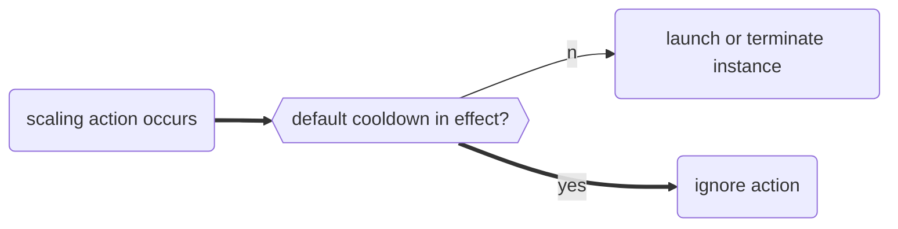
```mermaid
flowchart LR
A(scaling action occurs) ==> B{{default cooldown in effect?}}
B ==no==> C(launch or terminate instance)
B ==yes==> D(ignore action)
```
### more about ASG
* ASG default termination policy (simplified version):
    1. find the AZ which has the most number of instances
    2. if there are multiple instances in the AZ to choose from, delete the one with the oldest launch configuration
    * ASG tries the balance the number of instances across AZ by default
* ASG lifecycle hooks
    * by default as soon as instnace is launched in an ASG it is in service
    * you have the ability to perform extra steps before the instance goes in service (pending state) 
    * you have the ability to perform extra steps before the instance is terminated (terminating state)
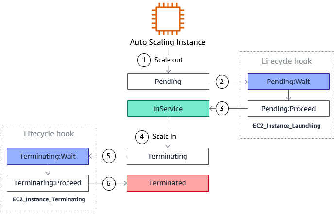
* Launch Template vs Launch Configuration
	* both: ID of the AMI, the instance type, a key pair, security groups, EBS volumes, and the other parameter that you use to launch EC2 instances (tags, EC2 user-data) 
	* Launch Configuration (legacy): 
            * must be created every time
	* Launch Template (newer): 
		* can have multiple version
		* create parameters subsets (partial configuration for re-use and inheritance)
		* provision using both on-demand and spot instances (or a mix)
		* can use T2 unlimited burst feature
		* *recommended by AWS going forward*


## RDS + Aurora + ElastiCache

### AWS RDS Overview
* RDS stands for relational Database Service:
    * it's a managed DB service for DB use BQL as a query language
    * it allows you to create DB in the cloud that are managed by AWS:
        * Postgres; MySQL; MariaDB; Oracle; Microsoft SQL Server; Aurora (AWS proprietary db)
        * SQL Server: 16 TB maximum size RDS volume by default with provisioned IOPS storage
* Advantage over using RDS versus deploying DB on EC2:
    * RDS is a managed service:
        * automated provisioning, OS patching
            * maintenance windows for upgrades
        * continuous backups and restore to specific time-stamp (PIT restore)
        * monitoring dashboards
        * read replicas for improved read performance
        * multi AZ setup for DR (disaster recovery)
        * scaling capability (vertical and horizontal)
        * storage backed by EBS (gp2 or io1)
        * reserved RDS instance benefits apply for both Multi-AZ and Single-AZ configurations
    * but *you can't SSH into your instances* 


### RDS Backups
* backups are automatically enabled in RDS
* automated backups:
    * daily full backup of the DB (during the maintenance window)
    * transaction logs are backed-up by RDS every 5 munites
        * ability to restore to any point in time (From oldest backup to 5 min ago)
        * 7 days retention (can be increased to 35 days)
* DB Snapshots:
    * manually triggered by the user
    * I/O may be briefly suspended during the backup process initializes and elevated latency (when using single-AZ RDS instance)
    * retention of backup for as long as you want
* when restore either automatic backup or snapshot, the restored version will be a new RDS instance 
	* with a new DNS endpoint


### RDS - Storage Auto Scaling
* when RDS detect you are running out of free database storage, it scales automatically
    * avoid manually scaling your database storage
* you have to set **maximum storage threshold** (max limit for DB storage)
* automatically modify storage if:
    * free storage if less than 10% of allocated storage
    * low-storage lasts at least 5 min
    * 6 hours have passed since last modification
* useful for applications with unpredictable workloads
* supports all RDS DB engines (Postgres; MySQL; MariaDB; Oracle; SQL Server;)


### RDS - Read Replicas for read scalability
* overview
	* up to 5 `Read Replicas` (for performance improvement / scaling)
		* you can have read replica of read replicas (with latency)
		* each read replica will have its own DNS end point
	* must have automatic backups turned on in order to deploy a read replica
	* within AZ, cross AZ or cross Region
	* replication is **ASYNC** so reads are eventually consistent
	* replicas can be promoted to their own DB
		* this breaks the replication
	* applications must update the connection string to leverage read replicas
	* *All RDS except SQL server supports read replica*
* example use-case:
    * create a Read Replica to run reporting workload without affecting the normal load on the main db
    * Read Replica are used for SELECT only kind of statements (not INSERT, UPDATE, DELETE)
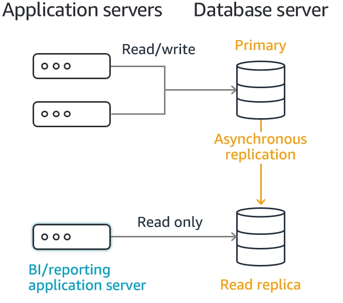
* network cost:
    * in AWS there's a network cost when data goes from one AZ to another
    * For RDS Read Replicas within the same region, you don't pay that fee
        * fees only incurs when cross-region replication 
        * data transferred between AZ for replication of Multi AZ deployment is also free
* Multi AZ (Disater Recovery only)
    * **Sync replication**
    * One DNS name - automatic app failover to standby
        * failover in case of loss of AZ, loss of network, instance or storage failure
    * increase **availability**
        * no manual intervention in apps
        * not used for scaling
    * Note: the Read Replicas can be setup as Multi AZ for Disaster Recovery (DR)
    * Note2: user can force a failover manually when rebooting a DB instance
* from Single AZ to Multi-AZ
    * zero downtime operation (no need to stop the DB)
    * just click on "modify" for the db
    * the following happens internally:
        * a snapshot is taken
        * a new DB is restored from the snapshot in a new AZ
        * synchronization is established between the two DBs


### RDS Security 
* at rest encryption:
    * possible to encrypt the master & read replicas with AWS KMS-AES-256 encryption
    * encryption has to be defined at launch time
    * *if the master is not encrypted, the read replicas **cannot** be encrypted* 
    * Transparent Data Encryption (TDE) available for Oracle and SQL Server
		* TDE: automatically encrypts data before it is written to storage and decrypt data when read from the DB
* in-flight encryption
    * SSL certificates to encrypt data to RDS in flight
    * provide SSL options with trust certificate when connecting to DB
    * to enforce SSL:
        * PostgreSQL: red.force_ssl=1 in the AWS RDS console (Parameter Groups)
        * MySQL: within the DB: GRANT USAGE ON *.*TO 'mysqluser'@'%' REQUIRE SSL;
* Encryption Operations
    * Encrypting RDS backups:
        * snapshots of un-encrypted RDS database are un-encrypted
        * snapshots of encrypted RDS database are encrypted
        * can copy a snapshot into an encrypted one
    * To encrypt an un-encrypted RDS DB:
        * create a snapshot of the un-encrypted DB
        * copy the snapsho and enable encryption for the snapshot
        * restore the DB from the encrypted snapshot
        * migrate applications to the new DB, and delete the old DB
* Network & IAM:
    * Network Security
        * RDS DB are usually deployed within a private subnet, not in a public one
        * RDS security works by leveraging security groups (the same concept as for EC2 instances) 
            * it controls which IP/security group can communicate with RDS
    * Access Management
        * IAM policies help control who can manage AWS RDS (through the RDS API)
        * Traditional Username and Password can be used to login into the DB
        * IAM-based authentication can be used to login into RDS MySQL & PostgreSQL
            * you don't need a password, just an authentication token obtained through IAM & RDS API calls
            * Auth token has a lifetime of 15 min
            * Benefits:
                * network in/out must be encrypted using SSL
                * IAM to centrally manage users instead of DB
                * can leverage IAM roles and EC2 Instance profile for easy integration
* Shared Responsibilities:
    * your responsibility:
        * check the ports/IP/security group inbound rules in DB's SG
        * in-database user creation and permissions or manage through IAM
        * creating a DB w/ or w/o public access
        * ensure parameter groups or DB is configured to only allow SSL connections
    * AWS responsibility: 
        * No SSH access
        * no manual DB patching
        * no manual OS patching
        * no way to audit the underlying instance


### Amazon Aurora
* Aurora is a proprietary technology from AWS (not open sourced)
* Postgres and MySQL are both supported as Aurora DB (That means your drivers will work as if Aurora was a Postgres or MySQL DB)
* "AWS cloud optimized" and claims 5X performance improvement over MySQL on RDS, 3X the performance of Postgres on RDS
    * 6 copies of your data across 3 AZs:
        * 4 copies of 6 needed for writes
        * 3 copies out of 6 needed for reads
        * self healing with peer-to-peer replication
        * storage is striped across 100s volumes
* storage automatically grows in increments of 10GB, up to 64TB.
* failover in Aurora is instantaneous , *High Availability* native
    * one Aurora Instance takes writes (master)
    * automated failover for master in less than 30 seconds
* can have 15 replicas while MySQL has 5, and the replication process is faster (sub 10 ms replica lag)
* support for cross region replication
* Costs more than RDS (20% more) - but more efficient
* Aurora feature summary:
    * Automatic failover
    * backup and recovery
		* automated backups are always enabled, does not impact performance
		* taking snapshots also does not impoact performance
		* you can share snapshots with outher AWS accounts
    * isolation and security
    * industry compliance
    * push-button scaling
    * automated patching with zero downtime
    * advanced monitoring
    * routine maintenance 
    * backtrack
		* restore data at any point of time without using backups

### Aurora DB structure:
* Aurora DB Cluster
    * client connect to `Writer Endpoint` which points to the master DB
        * typically only one writer, but also support multiple writers
    * client connect to `Reader Endpoint` which connects to Load Balancing to the Replica 
        * with auto scaling feature (e.g., scaling based on the CPU usage on reader endpoint)
        * typically multiple readers
    * client can specify a subset of Aurora Instances as a **Custom Endpoint**
        * run analytical queries on specific (more powerful) replicas
    * Master DB and Replica shares storage Volume (auto expanding from 10G to 64TB)
    * good for general-purpose option for most workloads
* A serverless Aurora DB:
    * you specify the min and max amount of resources needed
    * user links to the proxy fleet which is managed by Aurora
    * Aurora scales the capacity based on database load (auto-scaling)
    * good for intermittent or unpredictable workload
    * pay per second, can be more cost-effective
* Aurora Multi-Master:
    * in case you want immediate failover for write node (HA)
    * every node does R/W - vs promoting a Read Replica as the new master
* Global Aurora:
    * Aurora Cross Region Read Replicas:
        * useful for disaster recovery
        * simple to put in place
    * Aurora Global Database (recommended):
        * 1 primary Region (read/write)
        * up to 5 secondary (read-only) regions, replication lag is less than 1 second
        * up to 16 Read Replicas per secondary region
        * Helps for decreasing latency
        * Promoting another region (for disaster recovery) has a Recovery Time Objective (RTO) less than 1 minute
* Aurora Machine Learning
    * Enable you to add ML-based predictions to your applications via SQL
    * Simple, Optimized, and secure integration between Aurora and AWS ML services:
        * Amazon SagaMaker (use with any ML model)
        * Amazon Comprehend (for sentiment analysis)
    * You don't need to have ML experience
    * use cases: fraud detection, ads targeting, sentiment analysis, product recommendations


### Aurora Security:
* similar to RDS because uses the same engine
* encryption at rest using KMS
* automated backups, snapshots and replicas are also encrypted
* encryption in flight using SSL (same process as MySQL or Postgres)
* possibility to authenticate using IAM token (same method as RDS)
* you are responsible for protecting the instance with security groups
* you can't SSH
* RDS Database ports:
	* PostgreSQL: 5432
	* MySQL: 3306
	* Oracle RDS: 1521
	* MSSQL Server: 1433
	* MariaDB: 3306 (same as MySQL)
	* Aurora: 5432 (if PostgreSQL compatible) or 3306 (MySQL compatible)


### ElastiCache Overview
* ElastiCache is to get managed Redis or Memcached
* caches are in-memory DBs with really high performance, low latency
* helps reduce load off of DBs for read intensive workloads
* helps make application stateless
* AWS takes cares of OS maintenance / patching, optimizations, setup, configuration, monitoring, failure recovery and backups
* *using ElastiCache involves heavy application code changes* 
* DB Cache:
    * applications queries ElastiCache, if not available, get from RDS and store in ElastiCache
    * helps relieve load in RDS
    * cache must have an invalidation strategy to make sure only the most current data is used
* User session store - to make the application stateless:
    * user logs into any of the application 
    * the application writes the session data into ElastiCache
    * the user hits another instance of our application 
    * the instance retrieves the data and the user is already logged in (no need to re-log-in)
* Redis vs Memcached:

| Redis                                                   | MemCached                                      |
|---------------------------------------------------------|------------------------------------------------|
| Multi AZ with auto-failover                             | Multi-node for partitioning of data (sharding) |
| Read Replicas to scale read and high availability       | no high availability (replication)             |
| Data Durability using AOF(append only file) persistance | Non persistent                                 |
| backup and restore features                             | No backup and restore                          |
|                                                         | Multi-threaded architecture                    |
* Redis use case:
    * Gaming Leader-boards are computationally complex
    * Redis Sorted sets guarantee both uniqueness and element ordering
    * each time a new element added, it's ranked in real time, then added in correct order

### ElastiCache - Cache Security
* all caches in ElastiCache:
    * *do not support IAM authentication* 
    * IAM policies on ElastiCache are only used for AWS API-level security
* Redis AUTH
    * you can set a "password/token" when you create a Redis cluster (for encryption in-transition)
    * this is an extra level of security for your cache (on top of security groups)
    * support SSL in flight encryption
* Memcached
    * supports SASL-based authentication (advanced)


### Patterns for ElastiCache
* Lazy Loading: all the read data is cached, data can become stale in cache
* Write Through: add or update data in the cache when written to a DB (no stale data)
* Session Store: store temporary session data in a cache (using TTL features)


## Route53

### Route53 Overview
* Route53 is a (global) Managed DNS (Domain Name System) service
    * DNS is a collection of rules and records which helps clients understand how to reach a server through its domain name
    * The Start of Authority (SOA) record stores info about:
		* the name of the server that supplied the data for the zone
		* the admin of the zone
		* the current version of the data file
		* the default number of seconds for the TTL
	* NS stands for Name Server record
		* used by Top Level Domain servers to direct traffic to the Content DNS server which contains the authoritative DNS records
	* The DNS Port is on Port 53
* in AWS, the most common records are:
    * A: hostname to IPv4
    * AAAA: hostname to IPv6
    * CNAME (canonical name): hostname to hostname
    * Alias: hostname to AWS resource
* Route53 high level mechanism:
    * web browser send a DNS request (www.myapp.mydomain.com)
    * Route53 send back IP: 12.34.56.78 (A record: hostname to IP)
    * web browser send request based on IP returned
    * application server send back HTTP resposne
* Route53 can be used for:
    * public domain names you own (or buy)
    * private domain names that can be resolved by your instances in your VPCs. 
* advanced features of Route53:
    * load balancing (through DNS - also called client load balancing)
    * health check (limited)
    * routing policy: simple, failover, geo-location, latency, weighted, multi-value
* you pay $0.5 per month per hosted zone (+ the fee paid for domain name ~ $12)
	* you have a soft limit of 20 domains that you can manage using Route 53 >> can increase by contacting AWS support


### DNS Records TTL (Time to Live)
* Route53 high level mechanism:
    * web browser send a DNS request (www.myapp.mydomain.com)
    * Route53 send back IP: 12.34.56.78 (A record: hostname to IP)
        * also send back a **TTL:** e.g., 300s, and within TTL the browser will use the target IP received (cached)
    * web browser send request based on IP returned
    * application server send back HTTP response
* TTL types:
    * High TTL (e.g., 24hr)
        * less traffic DNS
        * possible outdated records
    * Low TTL (e.g., 60s)
        * more traffic on DNS
        * records are outdated for less time
        * easy to change records
* TTL is mandatory for each DNS records
    


### CNAME vs Alias
* AWS Resources (Load Balancer, CloudFront...) expose an AWS hostname: lbl-1234.us-east-2.elb.amazonaws.com 
    * and you want myapp.mydomain.com
* CNAME:
    * points a hostname to any other hostname (app.mydomain.com => blabla.anything.com)
    * **only for non root domain** 
    * root domain example: http://acloud.guru (no www)
* Alias:
    * points a hostname to an AWS Resource (app.mydomain.com => blabla.amazonaws.com)
		* alias can point at different account
    * **works for root domain and non root domain** 
    * free of charge
    * native health check

### Health Checks
* have x health check failed => unhealthy (default 3)
* after x health check passed => health (default 3)
* default health check internal: 30s (can set to 10s ~ higher cost)
* after 15 health checkers will check the endpoint health 
    * one request every 2 seconds on average if you set the interval to be 30s
* can have HTTP, TCP and HTTPS health checks (no SSL verification)
* possible of integrating the health check with CloudWatch
* health checks can be linked to Route53 DNS queries

### Routing Policy
* Simple Routing Policy:
    * use when you need to redirect to a single resource
    * you can't attach heath checks to simple routing policy
    * if multiple values (IPs) are returned, a random one is chosen by the **client**
        * client side load balancing
* Weighted Routing Policy:
    * control the % of the request that go to specific endpoint
    * helpful to test 1% of traffic on new app version for example
    * helpful to split traffic between 2 regions
    * can be associated with Health Checks on individual record sets
		* if a record set fails it will be removed from Route53 until it passes the health check
* Latency Routing Policy:
    * redirect to the server that has the least latency close to the user
    * super helpful when latency of users is a priority
    * latency is evaluated in terms of user to **designated AWS region**
        * Germany may be directed to the US (if that's the lowest latency)
* Failover Routing Policy:
    * need to specify one primary and one secondary "failover record type"
    * a health check is associated with failover-primary record
     ```mermaid
        flowchart LR
        A(web browser) ==DNS Request==> B((Route53))
        B =="Health check<br>(mandatory)"==> C[Primary]
        B -.Failover.-> D["Secondary<br>(disater recover)"]
    ```
* Geo-location Routing Policy:
    * Different from latency based
    * this is routing based on user location
    * here we specify: traffic from the UK should go to this specific IP
    * should create a "default" policy (in case there's no match on location)
* Geo-proximity Routing Policy
    * route traffic to your resources based on the geographic location of users and resources
    * ability to shift more traffic to resources based on the defined **bias**
    * to use geoproximity routing, yo umust use Route53 **traffic flow**
    * to change the size of the geographic region, specify bias values:
        * to expand (1 to 99) - more traffic to the resource
        * to shrink (-1 to -99) - less traffic to the resource
    * resources can be:
        * AWS resources (specify AWS region)
        * non-AWS resources (specify Latitude and Longitude)
    * you must use Route53 Traffic Flow (advanced) to use this feature
* Multi Value
    * use when routing traffic to multiple resources
    * want to associate a Route53 health checks with each record set
        * key difference from setting a single routing policy with multiple IP value
    * up to 8 healthy records are returned for each Multi Value query
    * if one IP address fails, it will fail over to the second IP address
    * Multi Value is not a substitute for having an ELB


### Route53 as a Registrar
* a domain name registrar is an organization that manages the reservation of Internet domain names
* famous names: GoDaddy, Google Domains
* Route53 is also a domain registrar
    * Domain Registrar != DNS
    * but each domain registrar usually comes with some DNS features
* if you buy your domain on a 3rd aprth website, you can still use Route53
    1. create a Hosted Zone in Route53
    2. Update name server records on 3rd party website to use Route 53 name servers


## Solutions Architecture Discussions Overview

### Stateless Web App: WhatIsTheTime.com
* goal:
    * allows peopel to know what time it is
    * we don't need a database
    * start small and can accept downtime
    * fully scale vertically and horizontally, no downtime
* solution:
    * public t2 with elastic ip
    * t2.micro >> m5
    * downtime while upgrading to m5
    * scale horizontally, more m5
    * setup Route53 with TTL 1 hour
        * use A Record
        * setup security group rules
    * setup ELB (public) + Health Checks linking to private m5 instances
        * use Alias record
    * setup auto-scaling group for EC2 instances (to scale-in and scale-out)
    * adding Multi AZ to ELB
    * reserved instances to achieve cost savings


### Stateful Web App: MyClothes.com
* goal:
    * MyCLothes.com allows people to buy clothes online
    * There's a shopping cart
        * user should not lose their shopping cart
    * website is having hundreds of users at the same time
    * need to scale, maintain horizontal scalability and keep web application as stateless as possible
* solution:
    * Route53 connects to ELB (Multi AZ | Stickiness) which link to private EC2 in multiple AZs
        * downside: if m5 goes down, user loses the shopping cart
        * solution - sending content in Web Cookies and achieve stateless
            * downside: security risk (cookie can be altered); must be validated; must be less than 4KB
            * solution - sending session_id in Web Cookies and EC2 writes/retrieves session data on ElastiCache 
                * Multi AZ to increase availability
            * writes/retrieves data onto DynamoDB for NoSql data and RDS for structured data 
                * with read replica for scaling reads
                * multiple AZ to increase availability
            * stickiness is not needed if using Cookies
    * security: 
        * public to Route53 and ELB; 
        * security group from the LB and EC2 and between Eco and ElastiCache / RDS


### Stateful Web App: MyWordPress.com
* goal:
    * a fully scalable WordPress website
    * to access and correctly display picture uploads
    * user data and the blog content stored in a MySQL database
* solution:
    * similar to previous MyClothes.com example with Aurora MySQL  (Multi AZ | Read Replica)
    * store image with EBS
        * downside: EBS works well with one EC2 instance only (single instance ,app) can't easily sync between EBS
        * solution: storing image with EFS connected with ENI to each EC2 (distributed app)

### Instantiating Application Quickly
* when launching a full stack (EC2, EBS, RDS), it can take time to:
    * install applications
    * insert initial (or recovery) data
    * configure everything
    * launch the application
* EC2 Instances:
    * **Golden AMI**: install your applications, OS dependencies etc beforehand
    * **Bootstrap using User Data**: for dynamic configuration, use User Data scripts
    * **Hybrid**: mix Golden AMI and User Data (Elastic Beanstalk)
* RDS Database:
    * restore from a snapshot: the database will have schemas and data ready
* EBS Volumes:
    * restore from a snapshot: the disk will already be formatted and have data


### Beanstalk Overview
* Developer problems on AWS 
    * managing infrastructure 
    * deploying code
    * configuring all the database, load balancers, etc
    * scaling concerns
    * while most web APPs have the same architecture: ALB + ASG
* ElasticBeanStalk Overview:
    * provides a developer centric view of deploying an app on AWS
    * it uses all the necessary components: EC2, ASG, ELB, RDS, etc.
    * user has the full control over the configuration 
        * while only needs to be responsible for the application code
    * ElasticBeanStalk is free managed service but you pay for the underlying instances
        * instance configuration / OS is handled by BeanStalk
			* automatically handles capacity provisioning, load balancing, 
			* scaling, application, health monitoring, instance configuration
			* etc
        * deployment strategy is configurable but performed by ElasticBeanStalk
    * 3 architecture models:
        * single instance deployment: good for dev
        * LB + ASG: great for production or pre-production web applications
        * ASG only: great for non-web apps in production (workers, etc)
    * ElasticBeanStalk has 3 components:
        * application
			*  collection of Elastic Beanstalk components (environments, versions, configurations, ...)
        * application version - each deployment gets assigned a version
                * you deploy APP versions to environment and can promote APP versions to the next environment
                * rollback feature to previous app version
        * environment
            * collection of AWS resources running an application version (only one application version at a time)
            * tiers: web server environment tier & worker environment tier
            * you can create multiple environments (dev, test, prod,... )
    * full control over life cycle of environments:
        ```mermaid
        flowchart LR
        A[create <br> application] ==>C["upload version <br> (+alias)"]
        B[create <br> environments] ==>C
        C==>D[release to <br> environments]
        ```
    * support for many platforms:
        * GO; Java SE; Java with Tomcat; .Net on Windows Server with IIS
        * Node.js; PHD; Python; Ruby, Packer Builder
        * single-container / multi-container docker
        * if not supported, you can create a custom platform (advanced)


## Amazon S3

### S3 Buckets and Objects

- Buckets overview:
    - Amazon S3 allows people to store objects (Files) in "buckets" (directories)
    - buckets must have a **globally unique name**
    - buckets are defined at the **region level**
    - you receive HTTP 200 code if the upload was successful
    - naming convention:
        - no uppercase
        - no underscore
        - 3-63 characters long
        - not an IP
        - must start with lowercase letter or number
- Objects overview:
    - objects (files) have a key
    - the *key* is the FULL path:
        - the key is composed of prefix + object name
        - s3://my-bucket/my\_folder/my\_file.txt
        - there's no concept of "directories" within buckets, just keys with very long names with "/"
            - UI will trick you to think otherwise
    - the object values are the content of the body:
        - max object size is 5TB
        - if uploading more than 5GB, must use "multi-part upload"
    - metadata (list of text key / value pairs - system or user metadata)
    - tags (unicode key / value pairs - up to 10) - useful for security / life-cycle
    - Version ID (if versioning is enabled):
        - it is enabled at the **bucket level**
        - same key overwrite will increment the *version*: with unique version ID
        - it is best practice to version your buckets
            - protect against unintended deletes (ability to restore a version)
            - easy roll back to previous version
        - notes:
            - any file that is not versioned prior to enabling visioning will have version *null*
            - suspending versioning does not delete the previous versions
            - delete a specified object adds a delete marker to it (so it can be restored later)
    - Subresources: access control lists and torrent

### S3 Encryption for Objects

- there are 4 methods of encrypting objects in S3:
    - SSE-S3: encrypts S3 objects using keys handled & managed by AWS
        - object is encrypted server side
        - AES-256 encryption type
        - must set request/response header: "x-amz-server-side-encryption":"AES256"
    - SSE-KMS: leverage AWS Key Management Service to manage encryption keys
        - KMS advantage: user control + audit trail
        - object is encrypted server side
        - must set request/response header: "x-amz-servier-side-enryption":"aws:kms"
    - SSE-C: user manage his own encryption keys
        - S3 does not store the encryption key you provide
        - HTTPS & encryption key must be used to when uploading the file
        - encryption key must be provided in HTTP headers, for every HTTP request made
    - client side encryption
        - client library such as the Amazon S3 Encryption Client
        - client must encrypt data themselves before sending S3
        - client must decrypt data themselves when retrieving from S3
        - customer fully manages the keys and encryption cycle
            - can use HTTP / HTTPS
            - treat S3 as buckets without encryption
- encryption in transit (SSL/TLS)
    - Transport Layer Security (TLS), the successor of the now-deprecated Secure Sockets Layer (SSL)
        - is a cryptographic protocol designed to provide communications security over a computer network.
    - S3 exposes:
        - HTTP endpoint: non encrypted
        - HTTPS endpoint: encryption in flight
    - you are free to use the endpoint you want, but HTTPS is recommended
        - HTTPS is mandatory for SSE-C
    - encryption in flight is also called SSL/TLS
- encryption policy can be applied to the bucket (default encryption) and to single files (when uploading files)

### S3 Security

- User based:
    - IAM policies - which API calls should be allowed for a specific user from IAM console
- resource based:
    - `bucket policy` - bucket wide rules from the S3 console - allows cross account
        - JSON based policies
            - resources: buckets and objects
            - actions: set of API to Allow or Deny
            - effect: allow/deny
            - principal: the account or user to apply the policy to
        - use S3 bucket policy to:
            - grant public access to the bucket
            - force objects to be encrypted at upload
            - grant access to another account (cross account)
    - object access control list (ACL) - finer grain
    - bucket access control list (ACL) - less common
- block public and cross-account access to buckets and objects granted through:
    - access control lists (ACLs)
    - public `bucket policy` or `access point policy`
		- access points are named network endpoints that are attached ot buckets that you can use to perform S3 object operations
    - set at the account level
        - these settings were created to prevent company data leaks
- note: an IAM principal can access an S3 object if
    - the user IAM permissions allow it OR the resource policy allows it
    - AND there is no explicit DENY
- other security layers:
    - networking:
        - supports VPC Endpoints (For instances in VPC without www internet)
    - logging and audit:
        - S3 access logs can be stored in other S3 buckets
        - API calls can be logged in AWS CloudTrail
    - user security:
        - MFA (multi-factor authentication) delete: can be required in versioned buckets to delete objects
        - pre-signed URLs: URLs that are valid only for a limited time (e.g.,: premium video service for logged in users)

### S3 Websites

- S3 can host static websites and have them accessible on the www
    - static web hosting needs to be enabled from S3 settings
        - specify the index document and error document
        - static web page supports client side scripting (JS)
- the website URL will be:
    - <bucket-name>.s3-website.<aws-region>.amazonaws.com</aws-region></bucket-name>
- if you get a 403 (Forbidden) error, make sure the bucket policy allows public reads

### S3 CORS

- CORS - explained:
    - CORS stands for Cross Origin Resource Sharing
    - an origin is a scheme (protocol), host (domain) and port
        - e.g., https://www.example.com (implies port is 443 for HTTPS)
    - CORS means cross-origin resource sharing
    - web browser based mechanism to allow request to other origins while visiting the main origin
        - same origin: http://example.com/app1 & http://example.com/app2
        - diff origins: http://www.example.com & http://www.other.com
    - the requests won't be fulfilled unless the other origin allows for the requests, using CORS Headers
        - via: Access-Control-Allow-Origin
            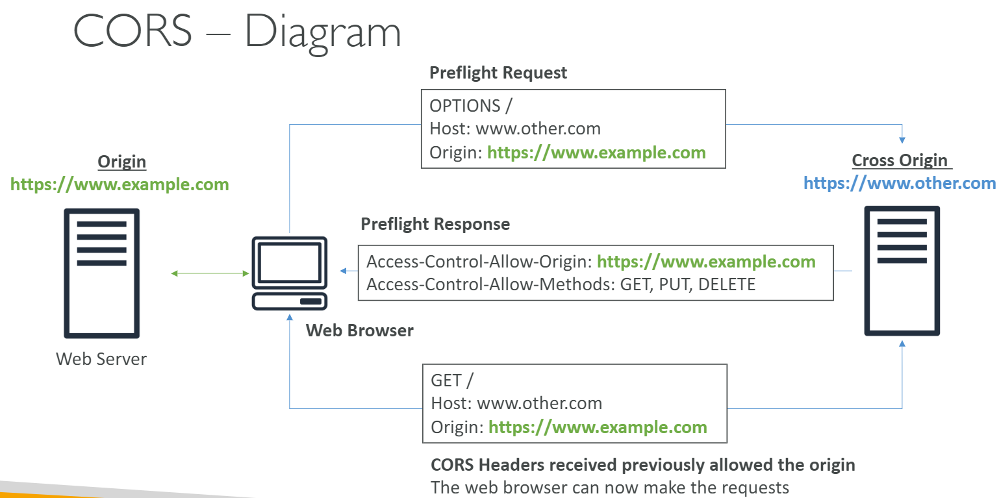
        - with GET permission, web browser can talk to the Cross Origin to access the resources
- S3 CORS:
    - if a client does a cross-origin request on our S3 bucket, we need to enable the correct CORS headers
    - you can allow for a specific origin or for * (all origin)
    - it has to be enabled in the cross-origin bucket (not the origin bucket) in a JSON format

### S3 Consistency Model

- strong consistency as of Dec 2020:
- after a (**eventual consistency**):
	- successful write of a new object (new PUT)
	- or an overwrite or delete of an existing object (overwrite PUT or DELETE)
- ...any:
	- subsequent read request immediately receives the latest version of the object (Read after Write consistency)
	- subsequent list request immediately reflect changes (list consistency)
- available at no additional cost, without any performance impact


## AWS CLI, SDK, IAM Roles & Policies

### AWS CLI S3 commands
* ls
* cp, mv, rm
* mb: make bucket
* rb: remove bucket
* AWS CLI available in many other services as well
    * [AWS CLI Command Reference](https://docs.aws.amazon.com/cli/latest/index.html) 


### IAM Roles and Policies 
* policy editor:
    * Visual editor
        1. choose service
        2. specify actions with access level:
            * list
            * read
            * write
            * permissions management
        3. specify resources: specific vs all resources
        4. specify request conditions (optional)
    * AWS Policy Generator: another policy generator with GUI 
    * JSON
* under each policy summary tab:
    * permissions
    * policy usage
    * policy versions
    * access advisor
* under each role summary tab:
    * permissions (policies attached to the role)
    * trust relationships
    * access advisor
    * revoke sessions
* level of access
	* power user access allows access to all AWS services except the management of groups and users within IAM
	* root account have adminstrator access including changing billing details and even close the account
* exam tips:
	* roles are more secure than storing access key and secret access key on individual EC2 instances
	* roles are easier to manage
	* roles can be assigned to an EC2 instnace using both the console and CLI
		* they take effect almost immediately (even if it is already attached to a running EC2)
	* roles are universal - you can use them in any region


### AWS Policy Simulator
* create users/groups/roles
    * create policy on the fly or test existing policies 
    * and Run Simulation: test actions w/ contexts
* can also test policy with CLI


### AWS EC2 Instance Metadata
* a powerful yet least known features to developers
* it allows EC2 instances to "learn about themselves" without using an IAM Role for that purpose
* the URL is [http://169.254.169.254/latest/meta-data](http://169.254.169.254/latest/meta-data) 
* you can retrieve the IAM Role name from the metadata, but you CANNOT retrieve the IAM policy.
* `Metadata` = info about the EC2 instance
* `Userdata` = launch script of the EC2 instance


AWS SDK Overview
* perform actions on AWS directly from your application code >> SDK (software development kit)
* official SDKs are: 
    * Java, .NET, Node.js, PHP, Python (named boto3 / botocore), Go, Ruby, C++
* the AWS CLI uses the Python SDK (boto3)
* if you don't specify or configure a default region, then us-east-1 will be chosen by default
* AWS SDK Credentials Security
    * it’s recommend to use the `default credential provider chain`
    * the default credential provider chain works seamlessly with:
        * AWS credentials at ~/.aws/credentials (only on our computers or on premise)
        * Instance Profile Credentials using IAM Roles (for EC2 machines, etc…)
        * environment variables (AWS_ACCESS_KEY_ID, AWS_SECRET_ACCESS_KEY)
    * overall, NEVER EVER STORE AWS CREDENTIALS IN YOUR CODE.
    * best practice is for credentials to be inherited from mechanisms above, and 100% IAM Roles if working from within AWS Services
* Exponential Backoff
    * any API that fails because of too many calls needs to be retried with Exponential Backoff
    * these apply to rate limited API
    * retry mechanism included in SDK API calls


## S3 Advanced Topics and Athena

### S3 MFA-Delete
* MFA forces user to generate a code on a device (mobile phone or other hardware) before doing important S3 operation
* to use MFA-Delete, enable versioning on the S3 bucket
* you will need MFA to:
    * permanently delete an object version
    * suspend versioning on the bucket
* you wont need MFA for:
    * enabling versioning
    * listing deleted versions
* only the bucket owner (root account) can enable/disable MFA-delete
* MFA-Delete currently can only be enabled using the CLI


### S3 Access Logs
* for audit purpose, you may want to log all access to S3 buckets
	* any request made to S3, from any account, authorized or denied, will be logged into another S3 bucket
	* that data can be analyzed using data analysis tools and Amazon Athena
* [S3 lgging format](https://docs.aws.amazon.com/AmazonS3/latest/userguide/LogFormat.html)
    * bucket owner - bucket - time - remote IP - requester - Request ID - Operation - key - request-URI - HTTP status - Error code - bytes sent - object size - total time - turn-around time - referrer - user-agent - version ID - host ID - signature version - cipher suite - authentication type - host header - TLS version
* Warning:
    * do not set your logging bucket to be the monitoring bucket
    * it will create a logging loop and your bucket will grow in size exponentially


### S3 replication (cross region and same region)
* must enable versioning in source and destination
* cross region replication (CRR)
    * use cases: compliance, lower latency access, replication across account
* same region replication (SRR)
    * log aggregation, live replication between production and test account
* buckets can be in different accounts
* copying is asynchronous
* must give proper IAM permissions to S3
* after activating, only new objects are replicated (not retroactive)
* for DELETE operations:
    * can replicate delete markers from source to target (optional setting)
    * deletions with a version ID (i.e., individual versions) are not replicated (to avoid malicious deletes)
* there is no "chaining" of replication
    * if bucket 1 has replication into bucket 2, which has replication into bucket 3
    * then objects created in bucket 1 are not replicated to bucket 3


### S3 Pre-signed URLs
* can generate pre-signed URLs using SDK or CLI
    * for downloads (easy, can use the CLI)
    * for uploads (harder, must use the SDK)
* valid for a default of 3600 seconds, can change timeout with --expires-in [TIME_BY_SECONDS] argument
* users given a pre-signed URL inherit the permissions of the person who generated the URL for GET/PUT
* examples:
    * allow only logged-in users to download a premium video on your S3 bucket
    * allow an ever hanging list of users to download files by generating URLs dynamically
    * allow temporarily a user to upload a file to a precise location in our bucket


### S3 Storage Classes
* Amazon S3 standard - general purpose
    * high durability 11x9's durability (99.999999999%) of objects across multiple AZ
    * if you store 10M objects, you can on average expect to incur a loss of a single object once every 10K years
    * 4x9's (99.99%) availability over a given year
    * sustain 2 concurrent facility failures
    * use cases: big data analytics, mobile & gaming applications, content distribution
* Amazon S3 Standard-Infrequent Access (IA)
    * suitable for data that is less frequently accessed, but requires rapid access when needed
    * same durability as S3 standarad
    * 3x9's (99.9%) availability
    * sustain 2 concurrent facility failures
    * use cases: as a data store for disaster recovery, backups
* Amazon S3 One Zone-Infrequent Access 
    * same as IA but data is stored in a single AZ
    * same durability but in a single AZ
    * 99.5% availability
    * low latency and high throughput performance 
    * supports SSL for data at transit and encryption at rest
    * low cost compare to IA (by 20%)
    * use cases: storing secondary backup copies of on-premise data, or storing data you can recreate
* Amazon S3 Intelligent Tiering
    * same low latency and high throughput performance of S3 standard 
    * small monthly monitoring and auto-tiering fee
    * automatically moves objects between two access tiers based on changing access patterns
    * same durability 
    * 3x9's (99.9%) availability
    * resilient against events that impact an entire AZ
* Amazon S3 Reduced Redundancy Storage
	* to store noncritical, reproducible data at lower levels of redundancy than S3 standard
	* for frequently accessed data (in contrast to one zone-IA)
	* concurrent facility fault tolerance: 1
	* **deprecated**
* Amazon Glacier
    * low cost object storage meant for archiving / backup
    * data is retrained for the longer term (10s years)
    * alternative to on-premise magnetic tape storage
    * same durability
    * 4x9's (99.99%) availability
    * cost per storage per month ($0.004/GB) + retrieval cost
    * each item in Glacier is called *Archive* (up to 40TB)
        * archives are stored in *Vaults* 
    * 3 retrieval options:
        * expedited (1 to 5 minutes)
        * standard (3 to 5 hours)
        * bulk (5 to 12 hours)
        * minimum storage duration of 90 days
* Amazon Glacier Deep Archive
    * even cheaper option than Glacier
    * 2 retrieval options:
        * standard (12 hours)
        * bulk (48 hours)
        * minimum storage duration of 180 days
* Amazon S3 Reduced Redundancy Storage (deprecated)

|                                               | S3 Standard               | S3 Intelligent-Tiering*   | S3 Standard-IA            | S3 One Zone-IA†           | S3 Glacier                                                           | S3 Glacier<br>Deep Archive                      |
| ---                                           | ---                       | ---                       | ---                       | ---                       | ---                                                                  | ---                                             |
| Designed for durability                       | 99.999999999%<br>(11 9’s) | 99.999999999%<br>(11 9’s) | 99.999999999%<br>(11 9’s) | 99.999999999%<br>(11 9’s) | 99.999999999%<br>(11 9’s)                                            | 99.999999999%<br>(11 9’s)                       |
| Designed for availability                     | 99.99%                    | 99.9%                     | 99.9%                     | 99.5%                     | 99.99%                                                               | 99.99%                                          |
| Availability SLA<br>(service level agreement) | 99.9%                     | 99%                       | 99%                       | 99%                       | 99.9%                                                                | 99.9%                                           |
| Availability Zones                            | ≥3                        | ≥3                        | ≥3                        | 1                         | ≥3                                                                   | ≥3                                              |
| Minimum capacity<br>charge per object         | N/A                       | N/A                       | 128KB                     | 128KB                     | 40KB                                                                 | 40KB                                            |
| Minimum storage<br>duration charge            | N/A                       | 30 days                   | 30 days                   | 30 days                   | 90 days                                                              | 180 days                                        |
| Retrieval fee                                 | N/A                       | N/A                       | per GB retrieved          | per GB retrieved          | per GB retrieved                                                     | per GB retrieved                                |
| First byte latency                            | milliseconds              | milliseconds              | milliseconds              | milliseconds              | select minutes or hours                                              | select hours                                    |
| Storage type                                  | Object                    | Object                    | Object                    | Object                    | Object                                                               | Object                                          |
| Lifecycle transitions                         | Yes                       | Yes                       | Yes                       | Yes                       | Yes                                                                  | Yes                                             |
| Storage Cost<br>(per GD per month)            | $0.023                    | $0.0125~$0.023            | $0.0125                   | $0.01                     | $0.004 <br>min 90 days                                               | $0.00099 <br>min 180 days
| Retrieval Cost<br>(per 1k requests)           | GET $0.0004               | GET $0.0004               | GET $0.0001               | GET $0.0001               | GET $0.0004+<br>Expedited: $10.00<br>Standard: $0.05<br>Bulk: $0.025 | GET $0.0004+<br>Standard: $0.10<br>Bulk: $0.025 |
| Time to retrieve                              | instantaneous             | instantaneous             | instantaneous             | instantaneous             | Expedited: 1~5 min<br>Standard: 3~5 hours<br>Bulk: 5~12 hours        | Standard: 12 hours<br>Bulk: 48 hours            |
| Monitoring Cost<br>(per 1k objects)           |                           | $0.0025                   |                           |                           |                                                                      |                                                 |

### S3 Lifecycle Rules
* you can transition objects between storage classes
    * e.g., Standard => one-zone IA or Glacier
    * e.g., Glacier to Deep Archive
    * you can't move objects from Glacier or Deep Archive back to Standard ones
* moving objects can be automated using a lifecycle configuration
    * transition actions: define when objects are transitioned to another storage class
        * move objects to Standard IA class 60 days after creation
        * move to Glacier for archiving after 6 months
    * expiration actions: configure objects to expire (delete) after some time
        * access log file can be set to delete after a 365 days
        * can be used to delete old versions of files (if versioning is enabled)
        * can be used to delete incomplete multi-part uploads
	* lifecycle rules:
		* rules can be created for a certain prefix (e.g., s3://mybucket/my3/*)
		* rules can be created for certain objects tags (e.g., department: finance)
		* rules can specifically target on *current*, *previous* version of objects


### S3  Analytics - Storage Class Analysis
* you can setup S3 Analytics to help determine when to transition objects from Standard to Standard_IA
* does not work for one-zone IA or Glacier
* report is updated daily
* takes about 24~48 hours to first start
* good first step to put together Lifecycle Rules (or improve them)


### S3 - performance
* Baseline performance:
    * S3 automatically scales to high request rates, latency @ 100~200 ms
    * your application can achieve at least 3,500 PUT/COPY/POST/DELETE and 5,500 GET/HEAD requests per second per prefix in a bucket
    * there are no limits to the number of prefixes in a bucket
    * if you spread reads across all prefixes evenly (assume you have 4 prefixes), you can achieve 4X 3,500 requests per seconds for GET and HEAD
* KMS Limitation:
    * if you uses SSE-KMS, you may be impacted by the KMS limits
    * when you upload, it calls the GenerateDataKey KMS API
    * when you download, it calls the Decrypt KMS API
    * count towards the KMS quota per seconds (5.5K, 10k, 30k req/s based on region)
    * you can request a quota increase using the `Service Quotas Console`
* Multi-Part upload:
    * recommended for files > 100MB, must use for files >5GB
    * can help parallelize uploads (speed up transfers)
* S3 Transfer Acceleration
    * increase transfer speed by transferring file to an AWS edge location which will forward the data to the S3 bucket in the target region
    * compatible with multi-part upload
    ```mermaid
    flowchart LR
    A[File in USA] --Fast<br>public www-->B["Edge Location<br>USA"]
    B --Fast<br>private AWS --->C["Edge location<br>Australia"]
    ```
* S3 Byte-Range Fetches:
    * parallelize GETs by requesting specific byte ranges
    * better resilience in case of failures
    * use-case:
        * to speed up downloads (requests in parallel)
        * to retrieve only partial data (for example the head of a file)


### S3 Select & Glacier Select
* retrieve less data using SQL by performing server side filtering
* can filter by rows & columns (simple SQL statements)
* less network transfer, less CPU cost client-side
    * up to 400% faster
    * up to 80% cheaper


### S3 Event Notifications
* notification on object creation/removed/restore/replication...
	* object name filtering possible (e.g., *.jpg)
	* can create as many "S3 events" as desired
* use-cases: generate thumbnails of images uploaded to S3
* S3 event notifications typically deliver events in seconds but can sometimes take a minute or longer
* if 2 writes are made to a single non-versioned object at the same time, it is possible that only a single event notification will be sent
* if you want to ensure that an event notification is sent for every successful write, you can enable versioning on your bucket
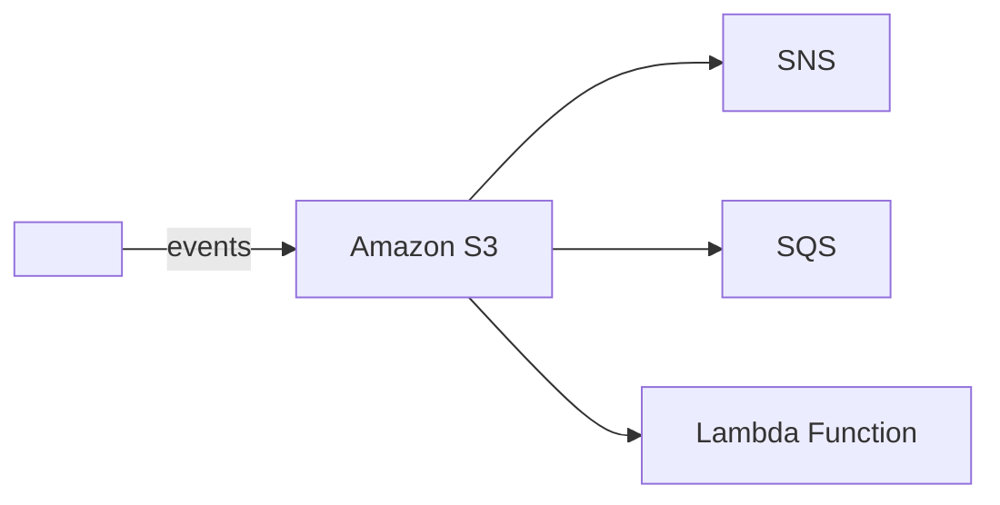
```mermaid
flowchart LR
A[" " ]--events-->B[Amazon S3]
B --> C[SNS]
B --> D[SQS]
B --> E[Lambda Function]
```


### S3 Requester Pays
* in general, bucket owners pay for all Amazon S3 storage and data transfer costs associated with their bucket
* with `requester pays buckets` the requester instead of the bucket owner pays the cost of the request and the data download from the bucket
* helpful when you want to share large datasets with other accounts
* the requester must be authenticated in AWS (can't be anonymous)


### Athena Overview
* **Serverless** service to perform analytics **directly against S3 files** 
* uses SQL language to query the files / logs
    * use SQL to directly analyze data in S3
        * you need to build the database against S3 bucket
        * run query on the database
* has a JDBC/ODBC driver
* charged per query and amount of data scanned
* Supports CSV, JSON, ORC, Avro, and Parquest (built on Presto)
* use cases: business intelligence / analytics / reporting, analyze & query VPC Flow Logs, ELB Logs, CloudTrail trails, etc


### S3 Lock Polices & Glacier Vault Lock
* Glacier Vault Lock:
    * adopt a WORM (write once read many) model
    * lock the policy for future edits (can no longer be changed)
    * helpful for compliance and data retention
* S3 Object Lock (versioning must be enabled)
    * adopt a WORM (write once read many) model
    * block an object version deletion for a specified amount of time
    * object retention:
        * retention period: specified a fixed period
        * legal hold: same protection, no expiry date
    * modes:
        * governance mode: 
            * users can't overwrite or delete an object version or alter its lock settings unless they have special permissions
        * compliance mode: 
            * a protected object version can't be overwritten or deleted by any user, including the root user in your AWS account. 
            * when an object is locked in compliance mode, its retention mode can't be changed, and its retention period can't be shortened. 

### S3 cross-account access
* 3 different ways to share S3 buckets across accounts
	* using bucket policies & IAM (applies across the entire bucket) - programmatic access only
	* using bucket ACLs & IAM (individual objects) - programmatic access only
	* cross-account IAM roles - programmtic AND console access


## CloudFront

### AWS CloudFront overview
* Content Delivery Network (CDN)
* improves read performance, content is cached at the edge
* 216 Point of Presence globally (edge locations)
* DDoS protection, integration with Shield, AWS Web Application Firewall (WAF)
* can expose external HTTPS and can talk to internal HTTPS backend
* CloudFront - Origins:
    * S3 bucket
        * for distributing files and caching them at the edge
        * enhanced security with CloudFront Origin Access Identity (OAI)
        * can be used as an ingress (to upload files to S3)
        * security: use OAI + S3 bucket policy (to prevent any non OAI access)
    * Custom Origin (HTTP):
        * application load balancer (must be public, EC2 can be private and link to LB)
        * EC2 instance (must be public)
        * S3 website (must first enable the bucket as a static S3 website)
        * any HTTP backend you want 
        * security: security group allow public IP of Edge Locations to ALB or EC2
        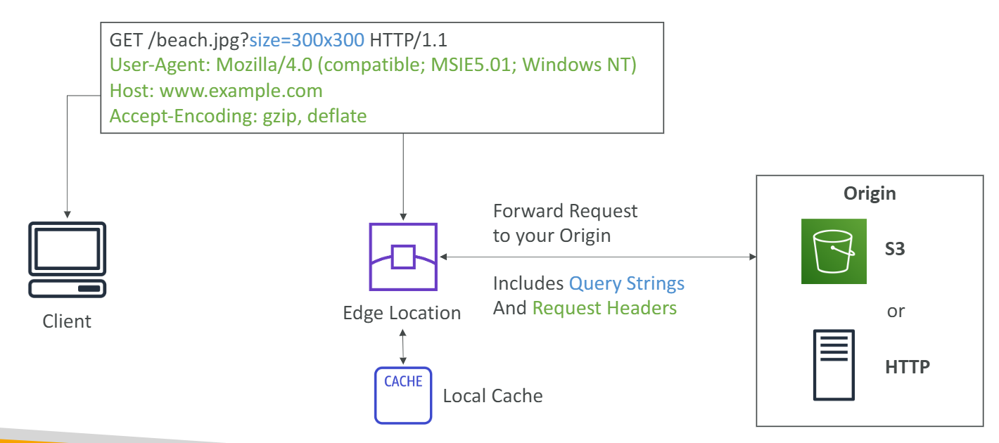
    ```mermaid
    flowchart LR
    A["GET:xxx<br>User-agent:yyy<br>Host:zzz<br>Accept-Encoding:XYZ"] -->B[Client]
    A--->C[Edge Location]
    C <--> D[Local Cache]
    C <--"forward reuqest to Origin:<br>include Query Strings and Request Headers"--->E["Origin:<br>S3 or HTTP"]
    ```
* Geo Restriction:
    * you can restrict who can access your distribution:
        * whitelist: allow your users to access your content only if they are in whitelist
        * blacklist: prevent your users from accessing your content if they are in blacklist
    * the country is determined using a 3rd party Geo-IP database
    * use case:Copyright Laws to control access to content
* CloudFront vs S3 Cross Region Replication
    * CloudFront:
        * Global edge network
        * files are cached for a TTL (maybe a day)
        * great for static content that must be available everywhere
    * S3 Cross Region Replication:
        * must be setup for each region you want replication to happen
        * files are updated in near real-time
        * read only
        * great for dynamic content that needs to be available at low-latency in few regions


### CloudFront Signed URL / Cookies
* you want to distribute paid shared content to premium users over the world
* we can use CloudFront Signed URL/Cookie. We attach a policy with:
    * URL expiration
    * IP ranges to access the data from
    * trusted signers (which AWS accounts can create signed URLs)
* how long should the URL be valid for?
    * shared(movies, songs) content => make it shorter
    * private content(user generated document) => make it last for years
* Signed URL = access to individual files 
	* **one signed URL per file**
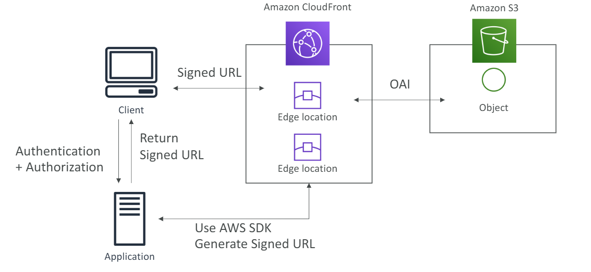
    ```mermaid
    flowchart LR
    A[client] <--authentication+authorization<br>returned signed URL-->B[application]
    B <--use AWS SDK generate signed URL--> C[CloudFront<br>Edge location]
    C <--Signed URL-->A
    C <--OAI-->D[S3<br>Object]
    ```
* Signed Cookies = access to multiple files 
	* **one signed cookie for many files**
* signed URL vs S3 pre-signed ULR
    * CloudFront Signed URL:
        * allow access to a path, no matter  the origin
        * account wide key-pair, only the root can manage it
        * can filter by IP, path, date, expiration
        * can leverage caching features
    * S3 Pre-signed URL:
        * issue a request as the person who per-signed the URL
        * uses the IAM key of the signing IAM principal
        * limited lifetime


### CloudFront Advanced Concepts
* CloudFront Edge locations are all around the world
	* edge locations are not just READ only, you can write to them too
* the cost of data out per edge location varies 
	* you can clear chaced objects, but at a cost
* the per TB cost decreases when you use more
* price classes:
    * Price Class All: all regions - best performance
    * Price Class 200: most regions, but excludes the most expensive regions
    * Price Class 100: only the least expensive regions
* Multiple Origin:
    * to route to different kind of origins based on the content type
    * based on path pattern:
        * /images/* => to S3 bucket
        * /api/* => to ALB
* Origin Groups:
    * To increase high-availability and do failover
    * Origin Group: one primary and one secondary origin (for EC2, or S3)
    * if the primary origin fails, the second one is used
* Field Level Encryption
    * protect user sensitive information through application stack
    * adds an additional layer of security along with HTTPS
    * sensitive information encrypted at the edge close to user
    * uses asymmetric encryption
    * usage:
        * specify set of fields in POST requests that you want to be encrypted (up to 10 fields)
        * specify the public key to encrypt them


### Global Accelerator - Overview
* Unicast IP vs Anycast IP:
    * Unicast IP: one server holds one IP address
    * Anycast IP: all servers hold the same IP address and the client is routed to the nearest one
* AWS Global Accelerator 
    * leverage the AWS internal network to route to your application
    * 2 Anycast IP are created for your application
    * the anycast IP send traffic directly to Edge Locations
    * the edge locations send the traffic to your application
* Accelerator components:
	* Static IP addresses (2): created by the app or bring your own
	* Accelerator: direct traffic to optimal endpoints; each accelerator includes 1 or more listeners
	* DNS Name assigned by AWS per accelerator (points to the static IP addresses)
		* depending on use-case, you can use static IP addresses or DNS name to route traffic
	*  Network Zone: a network zone services the static IP addresses from a unique IP subnet 
		*  similar to AZs, a network zone is an isolated unit with its own infrastructure 
		*  client application can try on a different network zone if the first one fails
	*  Listener: support TCP and UDP protocol has 1 or more endpoint groups and traffic is forwarded to endpoints in one of the groups
	*  Endpoint Group: you associate endpoint groups by specifying the Regions that you want to distribute traffic to; include 1 or more endpoints in the Region
		*  increase or reduce percentage of traffic would be otherwise directed to an endpoint group by adjusting `traffic dial`
	*  Endpoint: NLB, ALB, EC2, EIP
		*  an ALB can be internet-facing or internal
		*  traffic is routed based on configuration options, e.g., `endpoint weights`
* Global Accelerator features
    * works with Elastic IP, EC2 instances, ALB, NLB, public or private
    * consistent performance
        * intelligent routing to lowest latency and fast regional failover
        * no issue with client cache (because the IP doesn't change)
        * internal AWS network
    * health checks
        * global accelerator performs a health check of your applications
        * helps make your application global (failover less than 1 minute for unhealthy)
        * Great for disaster recovery
    * Security
        * only 2 external IP needed to be whitelisted
        * DDoS protection thanks to AWS Shield


### Global Accelerator vs CloudFront:
* both use the AWS global network and edge locations
* both services integrate with AWS Shield for DDoS protection
* Differences:
	* CloudFront:
		* improves performance for both cache-able content (images and videos)
		* and dynamic content (API acceleration and dynamic site delivery)
		* content is served at the edge
		* good for general HTTP usage: web distribution and RTMP (media streaming)
	* Global Accelerator:
		* improves performance from wide range of applications over TCP or UDP
		* proxying packets at the edge to applications running in one or more AWS regions
		* good fit for non-HTTP use cases, such as gaming (UDP), loT (MQTT), or Voice over IP
		* good for HTTP use cases that require static IP addresses
		* good for HTTP use cases that require deterministic, fast regional failover


## AWS Storage Extra

### AWS Snow Family

- high-secure portable devices to collect and process data at the edge, and migrate data into and out of AWS
    - data migration:
        - Snowcone
            - small, portable computing, anywhere, rugged & secure, withstands harsh environments
            - light (4.5 pounds, 2.1 kg)
            - device use for edge computing, storage and data transfer
            - 8TBs of usable storage
            - use Snowcone where Snowball does not fit (space-constrained environment)
            - must provide your own battery / cables
            - can be sent back to AWS offline, or connect it to internet and use **AWS DataSync** to send data
        - Snowball
            - physical data transport solution: move TBs or PBs of data in or out of AWS
            - alternative to moving data over the network (and paying network fees)
            - pay per data transfer job
            - provide block storage and Amazon S3-compatible object storage
            - capacity:
                - 50 TB (42 TB usable) - US only
                - 80 TB (72 TB usable)
            - use cases: large data cloud migrations, DC decommission, disaster recovery
        - Snowmobile
            - transfer exabyte of data (1 EB = 1,000 PBs = 1M TBs)
            - each snowmobile has 100 PB of capacity (use multiple in parallel)
            - high security: temperature controlled, GPS, 24/7 video surveillance
            - Better than Snowball if transfer more than 10 PB of data
    - edge computing:
        - process data while it’s being created on an edge location
        - a truck on the road, a ship on the sea, a mining station underground these locations may have
            - limited / no internet access
            - limited / no easy access to computing power
        - we setup a Snowball Edge / Snowcone device to do edge computing
            - Snowcone (smaller):
                - 2 CPUs, 4 GB of memory, wired or wireless access
                - USB-C power using a cord or the optional battery
            - Snowball Edge – Compute Optimized
                - 52 vCPUs, 208 GiB of RAM
                - Optional GPU (useful for video processing or machine learning)
                - 42 TB usable storage for S3 or EBS + 7.68 TB for EBS
            - Snowball Edge – Storage Optimized (with EC2)
                - Up to 40 vCPUs, 80 GiB of RAM
                - Object storage clustering available
                - 80 TB of HDD capacity + 1 TB SATA
            - Snowball Edge Storage Optimized (for data transfer)
                - 80 TB + 1 TB of dedicated SATA for compute instances
            - All: Can run EC2 Instances & AWS Lambda functions (using AWS IoT Greengrass)
            - Long-term deployment options: 1 and 3 years discounted pricing
        - use cases of Edge Computing:
            - preprocess data
            - machine learning at the edge
            - transcoding media streams
        - eventually (if need be) we can ship back the device to AWS (for transferring data for example)
- data migration/transfer challenges:
    - limited connectivity
    - limited bandwidth
    - high network cost
    - shared bandwidth (can't maximize the line)
    - connection stability
- AWS Snow Family: offline devices to perform data migrations:
    - if it takes more than a week to transfer over the network, use Snowball devices!
- Usage Process:
    1.  request Snowball device from the AWS console for delivery
    2.  install the Snowball client / AWS OpsHub on your servers
    3.  connect the snowball to your servers and copy files using the client
    4.  ship back the device when you're done (back to AWS facility)
    5.  data will be loaded into an S3 bucket
    6.  snowball is complete wiped

|     | Snowcone | Snowball Edge<br>Storage optimized | Snowmobile |
| --- | --- | --- | --- |
| storage capacity | 8 TB usable | 80 TB usable | <100 PB |
| migration size | up to 24 TB, online & offline | up to petabytes, offline | up to exabytes, offline |
| DataSync agent | Pre-installed |     |     |
| Storage clustering |     | up to 15 nodes |     |

- AWS OpsHub
    - Historically, to use Snow Family devices, you needed a CLI (Command Line Interface tool)
    - Today, you can use AWS OpsHub (a software you install on your computer / laptop) to manage your Snow Family Device
        - Unlocking and configuring single or clustered devices
        - Transferring files
        - Launching and managing instances running on Snow Family Devices
        - Monitor device metrics (storage capacity, active instances on your device)
        - Launch compatible AWS services on your devices (ex: Amazon EC2 instances, AWS DataSync, Network File System (NFS))
- Snowball into Glacier
    - Snowball cannot import to Glacier directly
    - You must use Amazon S3 first, in combination with an S3 lifecycle policy

### AWS Storage Gateway

- background:
    - AWS is pushing for ”hybrid cloud”
        - Part of your infrastructure is on the cloud
        - Part of your infrastructure is on-premises
    - This can be due to
        - Long cloud migrations
        - Security requirements
        - Compliance requirements
        - IT strategy
    - S3 is a proprietary storage technology (unlike EFS / NFS), so how do you expose the S3 data on-premises?
- solution:
    - bridge between on-premises data and cloud data in S3
    - use cases: disaster recovery, backup & restore, tiered storage
    - 3 types of Storage Gateway:
        - File Gateway
            - configured S3 buckets are accessible using the NFS and SMB protocol
            - supports S3 standard, S3 IA, S3 One Zone IA
            - bucket access using IAM roles for each File Gateway
            - most recently used data is cached in the File Gateway
            - can be mounted on many servers
            - integrated with Active Directory (AD) for user authentication
                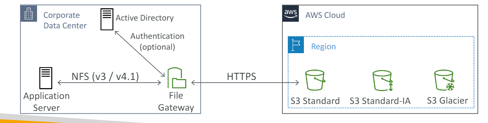
        - Volume Gateway
            - block storage using iSCSI protocol backed by S3
            - backed by EBS snapshots which can help restore on-premises volumes!
            - cached volumes: entire dataset is stored on S3 and low latency access to most recent data
            - stored volumes: entire dataset is on premise, scheduled backups to S3
                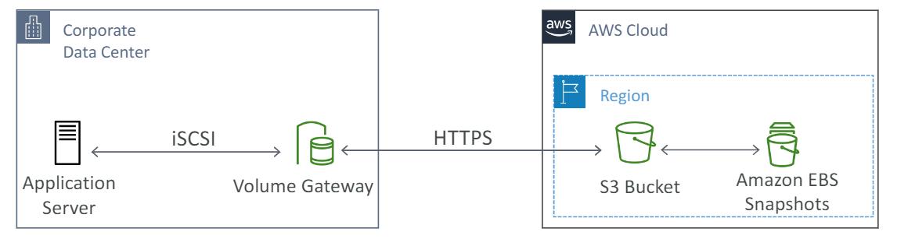
        - Tape Gateway
            - some companies have backup processes using physical tapes 
            - with Tape Gateway, companies use the same processes but, in the cloud
            - Virtual Tape Library (VTL) backed by Amazon S3 and Glacier
            - back up data using existing tape-based processes (and iSCSI interface)
            - works with leading backup software vendors
                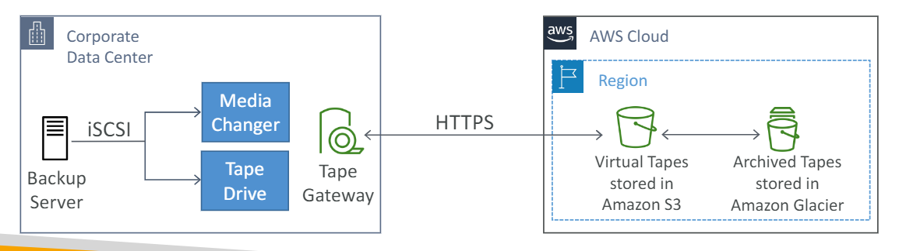
    - hardware appliance
        - Using Storage Gateway means you need on-premises virtualization
        - Otherwise, you can use a Storage Gateway Hardware Appliance
            - you can buy it on amazon.com
            - works with File Gateway, Volume Gateway,Tape Gateway
            - has the required CPU, memory, network,SSD cache resources
            - helpful for daily NFS backups in small data centers
    - Summary
        - On-premises data to the cloud => Storage Gateway
        - File access / NFS – user auth with Active Directory => File Gateway (backed by S3) ==> to backup files
        - Volumes / Block Storage / iSCSI => Volume gateway (backed by S3 with EBS snapshots) ==> to backup the whole volume
        - VTL Tape solution / Backup with iSCSI = > Tape Gateway (backed by S3 and Glacier) ==> to backup the tapes
        - No on-premises virtualization => Hardware Appliance

### Amazon FSx

- Amazon FSx for Windows (File Server)
    - EFS is a shared POSIX system for Linux systems.
    - FSx for Windows is a fully managed Windows file system share drive
    - Supports SMB protocol & Windows NTFS
    - Microsoft Active Directory integration, ACLs, user quotas
    - Built on SSD, scale up to 10s of GB/s, millions of IOPS, 100s PB of data
    - Can be accessed from your on-premise infrastructure
    - Can be configured to be Multi-AZ (high availability)
    - Data is backed-up daily to S3
- Amazon FSx for Lustre
    - Lustre is a type of parallel distributed file system, for large-scale computing
    - The name Lustre is derived from “Linux” and “cluster”
    - Machine Learning, High Performance Computing (HPC)
    - Video Processing, Financial Modeling, Electronic Design Automation
    - Scales up to 100s GB/s, millions of IOPS, sub-ms latencies
    - Seamless integration with S3
    - Can “read S3” as a file system (through FSx)
    - Can write the output of the computations back to S3 (through FSx)
    - Can be used from on-premise servers
- FSx File System Deployment Options
    - Scratch File System
        - Temporary storage
        - Data is not replicated (doesn't persist if file server fails)
        - High burst (6x faster, 200 MBps/TB)
        - Usage: short-term processing, optimize costs
    - Persistent File System
        - Long-term storage
        - Data is replicated within same AZ
        - Replace failed files within minutes
        - Usage: long-term processing, sensitive data
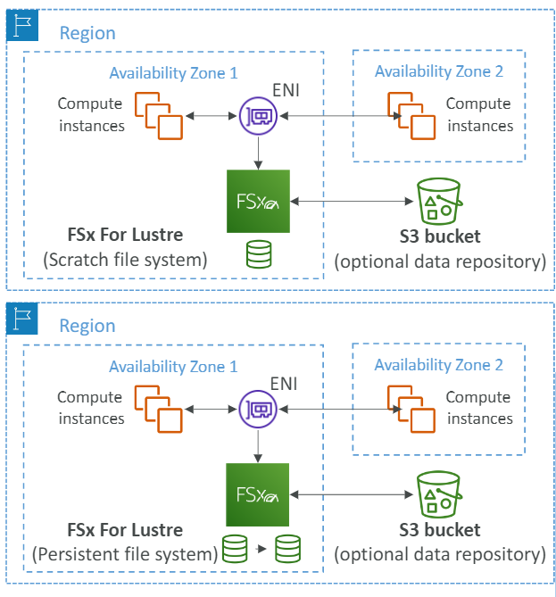
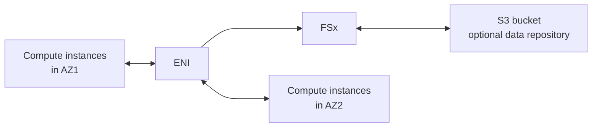
```mermaid
flowchart LR
A[Compute instances<br> in AZ1]<-->B[ENI]
B--->C[FSx]
B<--->E[Compute instances<br>in AZ2]
C<--->D[S3 bucket<Br>optional data repository]


```

### AWS Transfer Family

- A fully-managed service for file transfers into and out of Amazon S3 or Amazon EFS using the FTP protocol
- Supported Protocols
    - AWS Transfer for FTP (File Transfer Protocol (FTP)- only within VPC)
    - AWS Transfer for FTPS (File Transfer Protocol over SSL (FTPS))
    - AWS Transfer for SFTP (Secure File Transfer Protocol (SFTP))
- Managed infrastructure, Scalable, Reliable, Highly Available (multi-AZ)
- Pay per provisioned endpoint per hour + data transfers in GB
- Store and manage users’ credentials within the service
- Integrate with existing authentication systems (MS Active Directory, LDAP, Okta, Amazon Cognito, custom)
- Usage: sharing files, public datasets, CRM, ERP, …

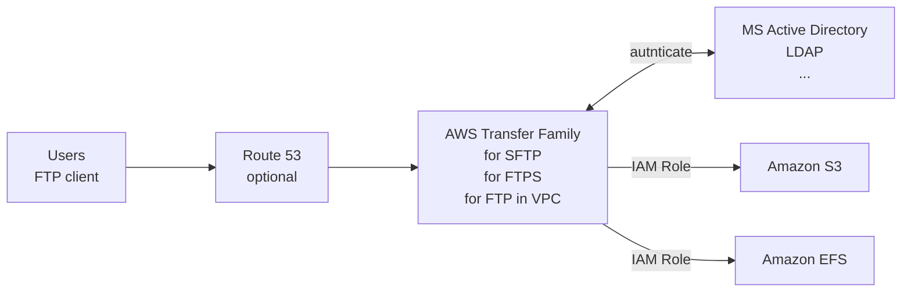
```mermaid
flowchart LR
A[Users<br>FTP client]--->B[Route 53<br>optional]
B--->C[AWS Transfer Family<br>for SFTP<br>for FTPS<br>for FTP in VPC]
C<--autnticate-->D[MS Active Directory<br>LDAP<br>...]
C--IAM Role-->E[Amazon S3]
C--IAM Role-->F[Amazon EFS]


```

### Storage Comparison

- S3: Object Storage
- Glacier: Object Archival
- EFS: Network File System for Linux instances, POSIX filesystem
- FSx for Windows: Network File System for Windows servers
- FSx for Lustre: High Performance Computing Linux file system
- EBS volumes: Network storage for one EC2 instance at a time
- Instance Storage: Physical storage for your EC2 instance (high IOPS)
- Storage Gateway: File Gateway, Volume Gateway (cache & stored), Tape Gateway
- Snowball / Snowmobile: to move large amount of data to the cloud, physically
- Database: for specific workloads, usually with indexing and querying

### AWS DataSync

- AWS DataSync simplifies, automates, and accelerates moving data between on-premises storage systems and AWS Storage services, as well as between AWS Storage services.
    - AWS DataSync Agent is deployed asn an agent on a server and connects to your NAS or file system to copy data to AWS and write data from AWS
        - used with NFS- and SMB-compatible file system
    - DataSync seamlessly and securely connects to Amazon S3, EFS, FSx to copy data and metadata to and from AWS
    - replication can be done hourly, daily or weekly
- DataSync automatically encrypts data and accelerates transfer over the WAN
    - It performs automatic data integrity checks in-transit and at-rest


## AWS Integration & Messaging

### background
* when we start deploying multiple applications, they will inevitably need to communicate with one another
* there are two patterns of application communication:
    * synchronous communications (application to application)
    * asynchronous / event based (application to queue to application)
• synchronous between applications can be problematic if there are sudden spikes of traffic
• what if you need to suddenly encode 1000 videos but usually it’s 10?
* in that case, it’s better to decouple your applications,
    * using SQS: queue model
    * using SNS: publish /subscribe model 
    * using Kinesis: real-time streaming model
* these services can scale independently from our application!


### Amazon SQS
* standard queue:
    * oldest offering (over 10 years old)
    * fully managed service, used to **decouple applications**
    * attributes:
        * unlimited throughput, unlimited number of messages in queue
        * default retention of messages: 4 days, maximum of 14 days
        * low latency (<10 ms on publish and receive)
        * limitation of 256KB per message sent
    * can have duplicate messages (at least once delivery, occasionally)
    * can have out of order messages (best effort ordering)
* producing messages
    * produced to SQS using the SDK (SendMessage API)
    * the message is persisted in SQS until a consumer deletes it
    * message retention: default 4 days, up to 14 days
    * example: send an order to be processed
        * order id
        * customer id
        * any attributes you want
    * SQS standard: unlimited throughput
* consuming messages
    * consumers (running on EC2 instances, servers, or AWS Lambda)…
    * poll SQS for messages (receive up to 10 messages at a time)
    * process the messages (example: insert the message into an RDS database)
    * delete the messages using the DeleteMessage API
* multiple EC2 instances consumers
    * consumers receive and process messages in parallel
    * at least once delivery
    * best-effort message ordering
    * consumers delete messages after processing them
    * we can scale consumers horizontally to improve throughput of processing
* Security:
    * encryption:
        * in-flight encryption using HTTPS API
        * at-rest encryption using KMS keys
        * client-side encryption if the client wants to perform encryption/decryption itself
    * access controls: IAM policies to regulate access to the SQS API
        * cross account access
        * publish S3 event notification to SQS Queue
    * SQS Access Policies (similar to S3 bucket policies)
        * useful for cross-account access to SQS queues
        * useful for allowing other services (SNS, S3…) to write to an SQS queue
* SQS with Auto Scaling Group (ASG)
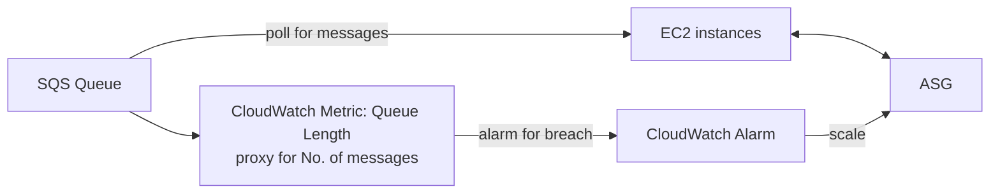
```mermaid
flowchart LR
A[SQS Queue]--poll for messages-->B[EC2 instances]
B <-->C[ASG]
A-->D[CloudWatch Metric: Queue Length<br>proxy for No. of messages]
D--alarm for breach-->E[CloudWatch Alarm]
E--scale-->C
```
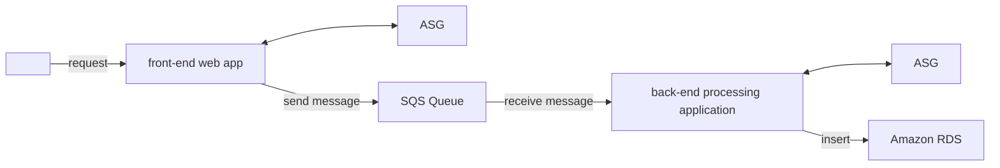
```mermaid
flowchart LR
A[" "]--request-->B[front-end web app]
B <-->C[ASG]
B--send message-->D[SQS Queue]
D--receive message-->E[back-end processing application]
E <-->G[ASG]
E--insert-->H[Amazon RDS]
```

* SQS - message visibility timeout
	* after a message is polled by a consumer, it becomes invisible to other consumers
	* by default, the `message visibility timeout` is 30 seconds
	* that means the message has 30 seconds to be processed
	* visibility timeout maximum is 12 hours
	* after the message visibility timeout is over, the message is “visible” in SQS
	* if a message is not processed within the visibility timeout, it will be processed twice
	* a consumer could call the ChangeMessageVisibility API to get more time
	* if visibility timeout is high (hours), and consumer crashes, re-processing will take time
	* if visibility timeout is too low (seconds), we may get duplicates
* SQS - Dead Letter Queue
	* if a consumer fails to process a message within the Visibility Timeout… 
		* the message goes back to the queue!
	* we can set a threshold of how many times a message can go back to the queue
	* after the MaximumReceives threshold is exceeded, the message goes into a `dead letter queue` (DLQ)
	* useful for **debugging**!
	* make sure to process the messages in the DLQ before they expire:
		* good to set a retention of 14 days in the DLQ
	* DLQ is also used in SNS and Lambda function when delivery / process fails (Lambda will re-try twice)
* Amazon SQS – Delay Queue
	* delay a message (consumers don’t see it immediately) up to 15 minutes
	* default is 0 seconds (message is available right away)
	* can set a default at queue level
	* can override the default on send using the DelaySeconds parameter
* SQS – Request-Response Systems
	* a request-response paradigm (using correlation ID as request/response header)
	* to implement this pattern: use the SQS Temporary Queue Client
	* it leverages virtual queues instead of creating / deleting SQS queues (cost-effective)
* Amazon SQS – FIFO Queue
	* FIFO = First In First Out (ordering of messages in the queue)
	* limited throughput: 300 msg/s without batching, 3000 msg/s with
	* exactly-once send capability (by removing duplicates)
	* messages are processed in order by the consumer
* short polling vs long polling 
	* by default, queues use short polling.
	* with short polling,
		* the ReceiveMessage request queries only a subset of the servers (based on a weighted random distribution) to find messages that are available to include in the response.
		* Amazon SQS sends the response right away, even if the query found no messages.
	* with long polling, 
		* the ReceiveMessage request queries all of the servers for messages.
		* Amazon SQS sends a response after it collects at least one available message, up to the maximum number of messages specified in the request.
		* Amazon SQS sends an empty response only if the polling wait time expires.

### Amazon SNS
* overview:
    * the `event producer` only sends message to one SNS topic
    * as many `event receivers` (subscriptions) as we want to listen to the SNS topic notifications
		* notifications are **pushed** to subscribers via SMS, email, SQS to mobile devices or any HTTP dendpoint
		* all messages published to Amazon SNS are stored redundantly across multiple AZs
    * each subscriber to the topic will get all the messages 
		* a topic is an `access point` for allowing recipients to dynamically subscribe for identical copies of the same notification
        * new feature to filter messages
    * SNS service limit:
        * Up to 10M subscriptions per topic
        * 100,000 topics limit
    * Subscribers can be:
        * SQS
        * HTTP / HTTPS (with delivery retries – how many times)
        * Lambda
        * emails
        * SMS messages
        * mobile Notifications
	* inexpensive, pay-as-you-go model with no up-front costs
	* web-based AWS Management Console offers the simplicity of a point-and-click interface
* integration with other AWS services >> send data directly to SNS for notifications
    * CloudWatch (for alarms)
    * Auto Scaling Groups notifications
    * Amazon S3 (on bucket events)
    * CloudFormation (upon state changes => failed to build, etc)
* How to publish
    * Topic Publish (using the SDK)
        * create a topic
        * create a subscription (or many)
        * publish to the topic
    * Direct Publish (for mobile apps SDK)
        * create a platform application
        * create a platform endpoint
        * publish to the platform endpoint
        * works with Google GCM, Apple APNS, Amazon ADM
	* when a topic is created, a unique ARN (Amazon Resource Name) is assigned to include the serve name, region, AWS ID of the user and the topic name
		* the ARN will be returned as part of the API call to create the topic
* Security
    * encryption:
        * in-flight encryption using https API
        * at-rest encryption using KMS keys
        * client-side encryption if the client wants to perform encryption/decryption itself
    * access controls: IAM policies to regulate access to the SNS API
    * SNS Access Policies (similar to S3 bucket policies)
        * useful for cross-account access to SNS topics
        * useful for allowing other services (S3) to write to an SNS topic
* Amazon SNS - FIFO
	* FIFO = First In First Out (ordering of messages in the topic)
	* similar features as SQS FIFO:
		* ordering by Message Group ID (all messages in the same group are ordered)
		* deduplication using a Deduplication ID or Content Based Deduplication
	* **can only have SQS FIFO queues as subscribers**
	* limited throughput (same throughput as SQS FIFO)
* SNS - Message Filter
	* JSON policy used to filter messages sent to SNS topic’s subscriptions
	* If a subscription doesn’t have a filter policy, it receives every message

### SNS + SQS: Fan Out
* overview:
    * push once in SNS, receive in all SQS queues that are subscribers
    * fully decoupled, no data loss
    * SQS allows for: data persistence, delayed processing and retries of work
    * ability to add more SQS subscribers over time
    * make sure your SQS queue access policy allows for SNS to write
* application: S3 Events to multiple queues:
    * for the same combination of: event type (e.g. object create) and prefix (e.g. images/) 
        * you can only have one S3 Event rule (send message to a specific SNS topic)
    * if you want to send the same S3 event to many SQS queues, use fan-out


### Kinesis
* overview
    * makes it easy to collect, process, and analyze streaming data in real-time
    * ingest real-time data such as: Application logs, Metrics, Website clickstreams,IoT telemetry data
* Kinesis Data Streams: capture, process, and store data streams
    * billing is per shard provisioned, can have as many shards as you want
    * retention between 1 day (default) to 365 days
    * ability to reprocess (replay) data
    * once data is inserted in Kinesis, it can’t be deleted (immutability)
    * data that shares the same partition goes to the same shard (ordering)
    * producers: 
        * 1 MB/sec or 1000 msg/sec per shard write to Kinesis Data Streams
        * AWS SDK, Kinesis Producer Library (KPL), Kinesis Agent, applications
        * application logs, website clickstreams, IoT data
    * consumers:
        * write your own: Kinesis Client Library (KCL), AWS SDK
        * Managed: AWS Lambda, Kinesis Data Firehose, Kinesis Data Analytics
        * 2 MB/sec (shared) per shard all consumers OR
            * 2 MB/sec (enhanced) per shard per consumer
* Kinesis Data Firehose: load data streams into AWS data stores
    * fully managed service, no administration, automatic scaling, serverless
    * producers:
        * up to 1 MB/sec to Kinesis Data Firehose
        * AWS SDK, KPL, Kinesis Agent, applications
        * Kinesis Data Streams, Amazon CloudWatch (logs & events), AWS IoT, etc
    * consumers:
        * **AWS: Redshift / Amazon S3 / ElasticSearch**
        * 3rd party partner: Splunk / MongoDB / DataDog / NewRelic /
        * Custom: send to any HTTP endpoint
    * pay for data going through Firehose
    * near real-time
        * 60 seconds latency minimum for non full batches
        * Or minimum 32 MB of data at a time
    * supports many data formats, conversions, transformations, compression
    * supports custom data transformations using AWS Lambda
    * can send failed or all data to a backup S3 bucket
* Kinesis Data Analytics: analyze data streams with SQL or Apache Flink
    * perform real-time analytics on Kinesis Streams (or Kinesis Firehose) using SQL
    * fully managed, no servers to provision
    * automatic scaling
    * real-time analytics
    * pay for actual consumption rate
    * can create streams out of the real-time queries
    * use cases:
        * time-series analytics
        * real-time dashboards
        * real-time metrics
* Kinesis Video Streams: capture, process, and store video streams

| Kinesis Data Stream                        | Kinesis Data Firehose                                               |
|--------------------------------------------|---------------------------------------------------------------------|
| streaming service for ingest at scale      | load streaming data into Amazon services<br>3rd party / custom HTTP |
| write consum code (producer/consumer)      | fully managed                                                       |
| real-time (~200 ms)                        | near real-time (buffer time min 60 sec)                             |
| manage scaling (shard splitting / merging) | automatic scaling                                                   |
| data storage for 1 to 365 days             | no data storage                                                     |
| supports replay capability                 | doesn't support replay capability                                   |

### Kinesis vs SQS ordering
* Let’s assume 100 trucks, 5 kinesis shards, 1 SQS FIFO
* Kinesis Data Streams:
    * On average you’ll have 20 trucks per shard
        * send using a *partition key* value of the *truck_id* 
    * Trucks will have their data ordered within each shard
        * the same key will always go to the same shard
    * The maximum amount of consumers in parallel we can have is 5
    * Can receive up to 5 MB/s of data
* SQS FIFO
    * You only have one SQS FIFO queue
    * You will have 100 Group ID
    * You can have up to 100 Consumers (due to the 100 Group ID)
    * You have up to 300 messages per second (or 3000 if using batching)


### SQS vs SNS vs Kinesis
* SQS:
    * consumer “pull data” (polling)
    * data is deleted after being consumed
    * can have as many workers (consumers) as we want
    * no need to provision throughput
    * ordering guarantees only on FIFO queues
    * individual message delay capability
* SNS:
    * push data to many subscribers
    * up to 12,500,000 subscribers
    * data is not persisted (lost if not delivered)
    * Pub/Sub
    * up to 100,000 topics
    * no need to provision throughput
    * integrates with SQS for fan- out architecture pattern
    * FIFO capability for SQS FIFO
* Kinesis:
    * standard: pull data
        * 2 MB per shard
    * enhanced-fan out: push data
        * 2 MB per shard per consumer
    * possibility to replay data
    * meant for real-time big data, analytics and ETL
    * ordering at the shard level
    * data expires after X days
    * must provision throughput


### Amazon MQ
* overview:
    * SQS, SNS are “cloud-native” services, and they’re using proprietary protocols from AWS.
    * traditional applications running from on-premise may use open protocols such as: MQTT, AMQP, STOMP, Openwire, WSS
    * when migrating to the cloud, instead of re-engineering the application to use SQS and SNS, we can use Amazon MQ
    * Amazon MQ = managed Apache ActiveMQ
        * Amazon MQ doesn't *scale* as much as SQS / SNS
        * Amazon MQ runs on a dedicated machine, can run in high-availability with failover
            * by setting up an active MQ Broker in AZ-1, and a standby Broker in AZ-2
            * both brokers have access to EFS
        * Amazon MQ has both queue feature (~SQS) and topic features (~SNS)
		
		
### Simple Workflow Service (SWF)
* a web service that makes it easy to coordinate work across distributed application components that enables applications to be designed as a coordination of tasks
* `domain` provides a way of scoping SWF resources within your AWS accounts.
	* it is possible to have >1 workflow in a domain
	* workflows in different domains can't interact with each other
* use-case: media processing, web application back-end, business process workfklow, analytics pipelines
	* example: order fulfilment from web to warehouse to delivery
* tasks represent invocations of various processing steps in an application can be performed by executable code, web service calls, human actions, and scripts
	* has built-in **human intervention** step
* code runs on EC2 (not serverless)
* SWF actors:
    * workflow starters: an application can initiate a workflow
    * deciders: control the follow of activity tasks in a workflow execution (decision step)
    * activity workers: carry out the activity tasks (activity step)
* Step Functions is recommended to be used for new applications, except:
    * if you need external signals to intervene in the processes
    * if you need child processes that return values to parent processes
* SWF vs SQS


| feature             | SWF           | SQS                                              |
|---------------------|---------------|--------------------------------------------------|
| retention period    | up to 1 year  | up to 14 days                                    |
| API style           | task-oriented | message-oriented                                 |
| task duplication    | No            | unless has FIFO enabled                          |
| task/event tracking | Yes           | you need to implement application-level tracking |


## AWS Container

### Docker overview
* what is container?
    * a container is a package that contains an application, libraries, runtime, and tools required to run it
    * runs on a container engine like `Docker`
    * provides the isolation benefits of virtualization with less overhead and faster starts than VMs
    * containerized applications are portable and offer a consistent environment
* what is Docker?
    * Docker is a software development platform to deploy apps
    * apps are packaged in containers that can be run on any OS
    * apps run the same, regardless of where they’re run
        * any machine
        * no compatibility issues
        * predictable behavior
        * less work
        * easier to maintain and deploy
        * works with any language, any OS, any technology
* where are Docker images stored
    * Docker images are stored in Docker Repositories
    * public: Docker Hub https://hub.docker.com/
        * find base images for many technologies or OS:
            * Ubuntu
            * MySQL
            * NodeJS,Java
    * private: Amazon ECR (Elastic Container Registry)
    * public: Amazon ECR Public
* Docker versus Virtual Machines
    * Docker is ”sort of” a virtualization technology, but not exactly
    * Resources are shared with the host => many containers on one server
        * infrastructure>>Host OS>>Hypervisor>>VMs (resources: CPU, RAM, storage are segmented)
        * infrastructure>>Host OS>>Docker Daemon>>containers
* Docker Primer
    ```mermaid
    flowchart LR
    A[Dockerfile<br>FROM ubuntu:18.04<br>COPY ./app<br>RUN make /app<br>CMD python /app/app.py]-->B[Docker Image]
    B--push-->C[Docker Repository]
    C--pull-->B
    B--run-->D[Docker Container]
    ```
### Docker Containers Management
* to manage containers, we need a container management platform
* three choices:
    * ECS (Elastic Container Service): Amazon’s own container platform 
        * launch Docker containers on AWS
        * you must provision & maintain the infrastructure (the EC2 instances)
        * AWS takes care of starting / stopping containers
            * `ECS Agents`: installed in each EC2 instances 
                * Can be in multi-AZs within the VPC
            * `Cluster`: logical collection of ECS resources
            * `Task Definition`: defines your application. 
                * similar to a Dockerfile but for running containers in ECS
                * can define multiple containers in a task definition
            * `Container Definition`: inside a task definition, it defines the individual containers a task uses
                * controls CPU and memory allocation and port mapping
            * `ECS Tasks` runs in each container
                * *An ECS task is configuration / parameters sets to run Docker containers in ECS*
                * single running copy of any containers defined by a task definition
            * `Service`: allows task definitions to be scaled by adding tasks
                * define min and max values
            * `Registry`: storage for container images
                * used to download images to create containers
        * has integrations with the Application Load Balancer
        * ECS is free, you pay for the EC2 and data storage costs
    * Fargate: Amazon’s own Serverless container platform (uses ECS technology)
        * launch Docker containers on AWS
        * you do not provision the infrastructure (no EC2 instances to manage) – simpler!
        * **Serverless offering**
        * works with both ECS and EKS
        * each workload runs in its own kernel
        * isolation and security
        * AWS just runs containers for you based on the CPU / RAM you need
            * each ECS Task is connected to an ENI
        * choose EC2 over Fargate if:
            * compliance reason
            * require broader customization (across instances)
            * require GPU
    * EKS (Elastic :Kubernetes Service) Amazon’s managed Kubernetes (open source)
        * It is a way to launch managed Kubernetes clusters on AWS
        * Kubernetes is an open-source system for automatic deployment, scaling and management of containerized (usually Docker) application
        * It’s an alternative to ECS, similar goal but different API
        * EKS supports EC2 if you want to to deploy worker nodes or Fargate to deploy serverless containers
        * Auto Scaling Group among EKS `Pods` (container groups) in private subnet; ELB & NAT gateway in public subnet
        * Use case: if already using Kubernetes on-premises or in another cloud, and wants to migrate to AWS using Kubernetes
        * Kubernetes is **cloud-agnostic** (can be used in any cloud – Azure, GCP)
* IAM Roles for ECS Tasks
    * EC2 Instance Profile (Instance Roles):
        * used by the ECS agent
        * makes API calls to ECS service
        * send container logs to CloudWatch logs
        * allow CloudTrail to log / monitor EC2 activities
        * pull docker image from ECR
        * reference sensitive data in secrets manager or SSM parameter store
    * ECS Task Role:
        * allow each task to have a specific Role (to talk to other AWS services)
        * use different Roles for the different ECS Services you run
        * task Role is defined in the task definition
        * has more granular control over Instance Roles on task level (least privilege approach)
* ECS Data Volumes - EFS File system
    * works for both EC2 Tasks and Fargate tasks
    * ability to mount EFS volumes onto tasks
    * tasks launched in any AZ will be able to share the same data in the EFS volume
    * Fargate + EFS = serverless + data storage without managing servers
    * use case: persistent multi-AZ shared storage for your containers
* Load Balancing:
    * distribute traffic evenly across tasks in your service
    * supports ALB, NLB, CLB
    * Load Balancing for EC2 Launch Type
        * We get a **dynamic port mapping**
        * the ALB supports finding the right port on your EC2 Instances
        * you must allow on the EC2 instance’s security group any port from the ALB security group
    * Load Balancing for Fargate
        * each task has a unique IP
        * you must allow on the ENI’s security group the task port from the ALB security group
    * ALB allows:
        * dynamic host port mapping
        * path-based routing
        * priority rules
        * recommended over NLB or CLB
* ECS tasks invoked by EventBridge:
    * EventBridge connects applications using events. 
        * an event is a signal that a system’s state has changed,
    * use-case: user uploading object to S3 bucket triggers ECS Task by EventBridge to process the object / transfer metadata to DynamoDB
* ECS Scaling:
    * auto-scaling can be done at both ECS Task level via CloudWatch
        * triggered by various metrics: e.g., CPU usage, queue length etc)
    * and ECS Capacity Provider (EC2) level (optional)
* ECS Rolling Updates
    * when updating from v1 to v2, we can control how many tasks can be started and stopped, and in which order
    * minimum healthy percent (0-100%): the min running tasks (v1)
        * allowed to terminate tasks = actual running capacity (100%) - min health percent
    * maximum percent (100-200%): the max of tasks in total. 
        * allowed to create tasks = max percent - actual running capacity (100%)
* Amazon ECR – Elastic Container Registry
    * store, manage and deploy containers on AWS, pay for what you use
    * fully integrated with ECS & IAM for security, backed by Amazon S3
    * supports image vulnerability scanning, version, tag, image lifecycle
    * works with on-premises deployment
    * highly available
    * integrate with IAM
    * you pay for storage and transfer


## Serverless Overview

### What's Serverless
* serverless is a new paradigm in which the developers don’t have to manage servers anymore
    * they just deploy code
    * they just deploy functions 
* initially, serverless == faas (function as a service)
* serverless was pioneered by AWS Lambda but now also includes anything that’s managed: databases, messaging, storage, etc.
* serverless does not mean there are no servers - it means you just don’t manage / provision / see them

### serverless in AWS
* AWS Lambda
* DynamoDB
* AWS Cognito
* AWS API Gateway
* Amazon S3
* AWS SNS & SQS
* AWS kinesis data Firehose
* Aurora Serverless
* Step Functions
* Fargate


### AWS Lambda intro
* AWS Lambda vs EC2

| EC2                                   | Lambda                                   |
|---------------------------------------|------------------------------------------|
| virtual servers in the cloud          | virtual functions - no servers to manage |
| limited by ram and CPU                | limited by time - short execution        |
| continuously running                  | run on-demand                            |
| scaling = intervention to +/- servers | scaling is automated                     | 
* benefits 
    * easy pricing:
        * pay per request and compute time
        * free tier of 1,000,000 AWS Lambda requests and 400,000 gbs of compute time
    * integrated with the whole AWS suite of services
    * integrated with many programming languages
    * easy monitoring through AWS CloudWatch
    * easy to get more resources per functions (up to 10GB of RAM!)
    * increasing RAM will also improve CPU and network!
    * scales out (not up) automatically
    * support AWS X-ray debugging
* Lambda computation mode:
    * use as event-driven compute service in response to events (e.g.,from Amazon S3 bucket or DynamoDB)
    * use as compute service to run in response to HTTP requests using API Gateway or API calls made using AWS SDKs
* language support
    * node.js (javascript)
    * python
    * java (java 8 compatible)
    * c# (.net core)
    * golang
    * c# / powershell
    * ruby
    * custom runtime API (community supported, example rust)
    * Lambda container image
        * the container image must implement the Lambda runtime API
        * ECS / Fargate is preferred for running arbitrary docker images
* Lambda integration: 
    * ALB, Cognito, Lex, Alexa, API Gateway, CloudFront, and Kinesis Data Firehose are all valid direct (synchronous) triggers for Lambda functions.
    * S3, SNS, SES, CloudFormation, CloudWatch logs/events, CodeCommit, AWS config can asynchronous invoke Lambda
    * Amazon Kinesis Stream, SQS and DynamoDB Streams are poll-based invokes
* use-case:
    * serverless thumbnail creation:
        * new image in S3 triggers Lambda to create a thumbnail
        * Lambda pushes new thumbnail in S3
        * Lambda pushes metadata in DynamoDB
    * serverless cron job:
        * also known as software utility cron >> is a time-based scheduler
        * CloudWatch Eventbridge trigger every 1 hour Lambda to perform a task
* pricing
    * overall pricing information [here](https://AWS.Amazon.com/Lambda/pricing/)
    * pay per calls:
        * first 1,000,000 requests are free
        * $0.20 per 1 million requests thereafter ($0.0000002 per request)
    * pay per duration: (in increment of 1 ms)
        * 400,000 GB-seconds of compute time per month for free
        * == 400,000 seconds if function is 1GB RAM
        * == 3,200,000 seconds if function is 128 MB RAM
        * after that $1.00 for 600,000 GB-seconds
    * it is usually very cheap to run AWS Lambda so it’s very popular
* limits - per region
    * execution:
        * memory allocation: 128 MB – 10GB (64 MB increments)
        * maximum execution time: 900 seconds (15 minutes)
        * environment variables (4 KB)
        * disk capacity in the function container (in /tmp): 512 MB
        * concurrency executions: 1000 (can be increased)
    * deployment:
        * Lambda function deployment size (compressed *.zip): 50 MB
        * size of uncompressed deployment (code + dependencies): 250 MB
        * can use the /tmp directory to load other files at startup
        * size of environment variables: 4 KB
* Lambda@edge
    * you have deployed a content delivery network (CDN) using CloudFront
        * what if you wanted to run a global AWS Lambda alongside?
        * or how to implement request filtering before reaching your application?
    * for this, you can use Lambda@edge: deploy Lambda functions alongside your CloudFront CDN
        * build more responsive applications
        * you don't manage servers, Lambda is deployed globally
        * customize the CDN content
        * pay only for what you use
    * you can use Lambda to change CloudFront requests and responses:
        * after CloudFront receives a request from a viewer (viewer request)
        * before CloudFront forwards the request to the origin (origin request)
        * after CloudFront receives the response from the origin (origin response)
        * before CloudFront forwards the response to the viewer (viewer response)
        * you can also generate responses to viewers without ever sending the request to the origin
    * use-cases
        * website security and privacy
        * dynamic web application at the edge
        * search engine optimization (SEO)
        * intelligently route across origins and data centers
        * bot mitigation at the edge
        * real-time image transformation
        * a/b testing
        * user authentication and authorization
        * user prioritization
        * user tracking and analytics


### DynamoDB
* overview
    * fully managed, highly available with replication across 3 AZ
    * NO-SQL database - not a relational database
    * scales to massive workloads, distributed database
    * millions of requests per seconds, trillions of row, 100s of TB of storage
    * fast and consistent in performance (low latency on retrieval)
    * integrated with IAM for security, authorization and administration
    * enables event driven programming with DynamoDB streams
    * low cost and auto scaling capabilities
* basics
    * DynamoDB is made of tables
    * each table has a **primary key** (must be decided at creation time)
    * each table can have an infinite number of items (= rows)
    * each item has attributes (can be added over time – can be null)
    * maximum size of a item is 400KB
    * data types supported are:
        * scalar types: string, number, binary, boolean, null
        * document types: list, map
        * set types: string set, number set, binary set
* provisioned throughput
    * table must have provisioned read and write capacity units
    * read capacity units (RCU): throughput for reads ($0.00013 per RCU)
        * 1 RCU = 1 strongly consistent read of 4 KB per second
        * 1 RCU = 2 eventually consistent read of 4 KB per second
    * write capacity units (WCU): throughput for writes ($0.00065 per WCU)
        * 1 WCU = 1 write of 1 KB per second
    * option to setup auto-scaling of throughput to meet demand
    * throughput can be exceeded temporarily using *burst credit*
    * if burst credit are empty, you’ll get a *provisionedthroughputexception*
    * it's then advised to do an exponential back-off retry
* DynamoDB - DAX
    * DAX = DynamoDB accelerator
    * seamless cache for DynamoDB, no application re-write
    * writes go through DAX to DynamoDB
    * micro second latency for cached reads & queries
    * solves the hot key problem (too many reads)
    * 5 minutes TTL for cache by default
    * up to 10 nodes in the cluster
    * multi AZ (3 nodes minimum recommended for production)
    * secure (encryption at rest with KMS, VPC, IAM, CloudTrail...)
* DynamoDB streams
    * changes in DynamoDB (create, update, delete) can end up in a DynamoDB stream
    * this stream can be read by AWS Lambda, and we can then do:
        * react to changes in real time (welcome email to new users)
        * analytics
        * create derivative tables / views
        * insert into ElasticSearch
    * could implement cross region replication using streams
    * stream has 24 hours of data retention
* DynamoDB new features
    * transactions (new from nov 2018)
        * all or nothing type of operations
        * coordinated insert, update & delete across multiple tables
        * include up to 10 unique items or up to 4 MB of data
    * on demand (new from nov 2018)
        * no capacity planning needed (WCU / RCU) – scales automatically
             * **Capacity planning**: provision WCU & RCU, can enable auto scaling
        * 2.5x more expensive than provisioned capacity (use with care)
        * helpful when spikes are un-predictable or the application is very low throughput
* security
    * VPC endpoints available to access DynamoDB without internet
    * access fully controlled by IAM
    * encryption at rest using KMS
    * encryption in transit using SSL / TLS
* other features
    * backup and restore feature available
        * point in time restore like RDS
        * no performance impact
    * Global Tables
        * multi region, fully replicated, high performance
        * active active replication, many regions
        * must enable DynamoDB Streams
        * useful for low latency, DR purposes
    * Amazon DMS can be used to migrate to DynamoDB (from Mongo, Oracle, MySQL, S3, etc)
    * You can launch a local DynamoDB on your computer for development purposes


### AWS API Gateway
* overview:
    * a fully managed service that makes it easy for developers to publish, maintain, monitor and secure APIs at any scale
    * user can create API that acts as a "front door" for applications to access data, business logic or functionality from your back-end services
    * AWS Lambda + API Gateway: No infrastructure to manage
* features:
    * support for the WebSocket Protocol
    * handle API versioning (v1, v2)
    * handle different environments (dev, test, prod…)
    * handle security (Authentication and Authorization)
    * create API keys - allows tracking and control
    * handle request throttling - to prevent attack
    * connect to CloudWatch to log all requests for monitoring
    * Swagger / Open API import to quickly define APIs
    * transform and validate requests and responses
    * generate SDK and API specifications
    * cache API responses: reduce the number of calls made to your endpoint and improve the latency (TTL in seconds)
    * if using Javascript/AJAX that uses multiple domains with API Gateway, ensure you have anbled CORS on API Gateway (for cross origin resource sharing)
		* CORS is enforced by the client
* Integrations High Level
    * Lambda Function
        * invoke Lambda function
        * easy way to expose REST API backed by AWS Lambda
    * HTTP
        * expose HTTP(S) endpoints in the backend to define a RESTful API
        * example: internal HTTP API on premise, Application Load Balancer
        * why? Add rate limiting, caching, user authentications, API keys, etc
    * AWS Service
        * expose any AWS API through the API Gateway
        * example: start an AWS Step Function workflow, post a message to SQS
        * why? add authentication, deploy publicly, rate control…
* Endpoint Types (send each API endpoint to a different target)
    * Edge-Optimized (default): For global clients
        * requests are routed through the CloudFront Edge locations (improves latency)
        * the API Gateway still lives in only one region
    * Regional:
        * for clients within the same region
        * could manually combine with CloudFront (more control over the caching strategies and the distribution)
    * Private:
        * can only be accessed from your VPC using an interface VPC endpoint (ENI)
        * use a resource policy to define access
* Security
    * IAM Permissions
        * create an IAM policy authorization and attach to User / Role
        * API Gateway verifies IAM permissions passed by the calling application
        * good to provide access within your own infrastructure
        * leverages **Sig v4** capability where IAM credential are in headers
        * use-case:
            * great for users / roles already within your AWS account
            * handle authentication + authorization
            * leverages Sig v4
    * Lambda Authorizer (formerly Custom Authorizers)
        * uses AWS Lambda to validate the token in header being passed
        * option to cache result of authentication
        * helps to use OAuth / SAML / 3rd party type of authentication
        * Lambda must return an IAM policy for the user
        * use-case:
            * great for 3rd party tokens
            * very flexible in terms of what IAM policy is returned
            * handle Authentication + Authorization
            * pay per Lambda invocation
    * Cognito User Pools
        * cognito fully manages user lifecycle
        * API Gateway verifies identity automatically from AWS Cognito
        * no custom implementation required
        * *cognito only helps with authentication, not authorization*
        * use-case
            * you manage your own user pool (can be backed by Facebook, Google login etc)
            * no need to write any custom code
            * must implement authorization in the backend
* to configure API Gateway
	* define an API (container)
	* define resources and nested resources (URL paths)
	* for each resource:
		* select supported HTTP methods (verbs)
		* set security
		* choose target (such as EC2, Lambda, DynamoDB, etc)
		* set request and response transformations
* to deploy API Gateway
	* deploy API to a stage:
		* uses API Gateway domain, by default
		* can use custom domain
		* now supports AWS Certificate Manager: free SSL/TLS certs


### AWS Cognito
* we want to give our users an identity so that they can interact with our application.
* Cognito User Pools:
    * sign in functionality for app users
        * create a serverless database of user for your mobile apps
        * simple login: Username (or email) / password combination
        * possibility to verify emails / phone numbers and add MFA
        * can enable Federated Identities (Facebook, Google, SAML)
        * sends back a JSON Web Tokens (JWT)
    * integrate with API Gateway (for authentication)
* Cognito Identity Pools (Federated Identity):
    * goal: 
        * provide AWS credentials to users so they can access AWS resources directly
    * how:
        * log in to federated identity provider – or remain anonymous
        * get temporary AWS credentials back from the Federated Identity Pool
        * these credentials come with a pre-defined IAM policy stating their permissions (assuming an IAM role)
    * example:
        * Provide (temporary) access to write to S3 bucket using Facebook Login
    * integrate with Cognito User Pools as an identity provider
		* Amazon Security Token Service (STS):  to create and provide trusted users with temporary security credentials that can control access to your AWS resources.
* Cognito Sync:
    * synchronize data from device to Cognito.
        * store preferences, configuration, state of app
        * cross device synchronization (any platform – ios, android, etc…)
        * offline capability (synchronization when back online)
        * **requires federated identity pool in cognito (not user pool)**
        * store data in datasets (up to 1mb)
        * up to 20 datasets to synchronise
    * deprecated and replaced by appsync

### AWS SAM - Serverless Application Model
* SAM = Serverless Application Model
    * CloudFormation extension optimized for serverless applications developing and deployment
* all the configuration is YAML code
    * Lambda Functions
    * DynamoDB tables
    * API Gateway
    * Cognito User Pools
* SAM can help you to run Lambda, API Gateway, DynamoDB locally
* SAM can use CodeDeploy to deploy Lambda functions


## Serverless Architectures

### Mobile application: MyTodoList

- problem
    - we want to create a mobile application with the following requirements
    - expose as REST API with HTTPS
    - serverless architecture
    - users should be able to directly interact with their own folder in S3
    - users should authenticate through a managed serverless service
    - the users can write and read to-dos, but they mostly read them
    - the database should scale, and have some high read throughput
- solution
    - serverless REST API: HTTPS, API Gateway, Lambda, DynamoDB
    - using Cognito to generate temporary credentials with STS to access S3 bucket with restricted policy.
        - app users can directly access AWS resources this way.
        - pattern can be applied to DynamoDB, Lambda
    - caching the reads on DynamoDB using DAX
    - caching the REST requests at the API Gateway level
    - security for authentication and authorization with Cognito, STS
        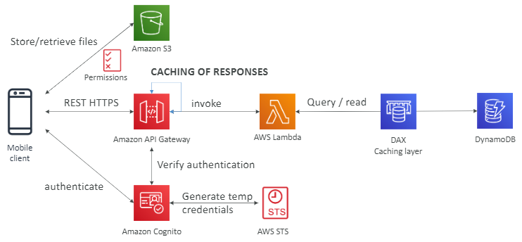

### Serverless hosted website: MyBlog.com

- problem
    - this website should scale globally
    - blogs are rarely written, but often read
    - some of the website is purely static files, the rest is a dynamic REST API
    - caching must be implement where possible
    - any new users that subscribes should receive a welcome email
    - any photo uploaded to the blog should have a thumbnail generated
- solution
    - static content being distributed using CloudFront with S3
    - the REST API was serverless, doesn't need Cognito because public
    - we leveraged a Global DynamoDB table to serve the data globally
    - (we could have used Aurora Global Tables)
    - we enabled DynamoDB streams to trigger a Lambda function
    - the lambda function had an IAM role which could use SES
    - SES (Simple Email Service) was used to send emails in a serverless way
    - S3 can trigger SQS / SNS / Lambda to notify of events
        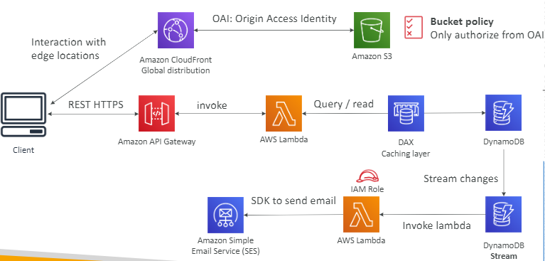
        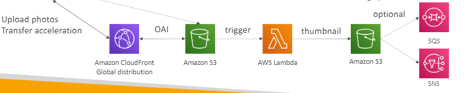

### Micro Services Architecture

- problem
    - we want to switch to a micro service architecture
    - many services interact with each other directly using a REST API
    - each architecture for each micro service may vary in form and shape
    - we want a micro-service architecture so we can have a leaner development lifecycle for each service
- solution
    - you are free to design each micro-service the way you want
    - synchronous patterns: API Gateway, Load Balancers
    - asynchronous patterns: SQS, Kinesis, SNS, Lambda triggers (S3)
    - challenges with micro-services:
        - repeated overhead for creating each new microservice,
        - issues with optimizing server density/utilization
        - complexity of running multiple versions of multiple microservices simultaneously
        - proliferation of client-side code requirements to integrate with many separate services.
    - some of the challenges are solved by serverless patterns:
        - API Gateway, Lambda scale automatically and you pay per usage
        - you can easily clone API, reproduce environments
        - generated client SDK through Swagger integration for the API Gateway
            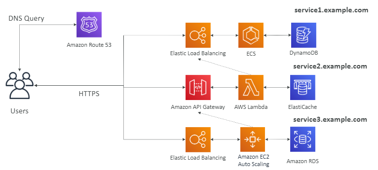

### Distributing paid content

- problem
    - we sell videos online and users have to paid to buy videos
    - each videos can be bought by many different customers
    - we only want to distribute videos to users who are premium users
    - we have a database of premium users
    - links we send to premium users should be short lived
    - our application is global
    - we want to be fully serverless
- solution
    - we have implemented a fully serverless solution:
		- cognito for authentication
		- DynamoDB for storing users that are premium
			- 2 serverless applications
			- premium user registration
		- CloudFront Signed URL generator
		- content is stored in S3 (serverless and scalable)
		- integrated with CloudFront with OAI (origin access identities) for security (users can’t bypass)
		- CloudFront can only be used using Signed URLs to prevent unauthorized users
		- what about S3 Signed URL? They’re not efficient for global access
		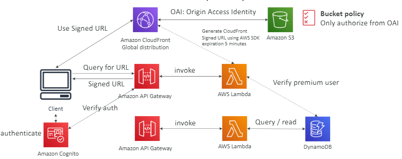

### Software Updates Offloading

- problem
    - we have an application running on EC2, that distributes software updates once in a while
    - when a new software update is out, we get a lot of request and the content is distributed in mass over the network. It’s very costly
    - we don’t want to change our application, but want to optimize our cost and CPU, how can we do it?
- solution
    - Why CloudFront?
        - no changes to architecture
        - will cache software update files at the edge
        - software update files are not dynamic, they’re static (never changing)
        - our EC2 instances aren’t serverless
        - but CloudFront is, and will scale for us
        - our ASG will not scale as much, and we’ll save tremendously in EC2
        - we’ll also save in availability, network bandwidth cost, etc
        - easy way to make an existing application more scalable and cheaper
        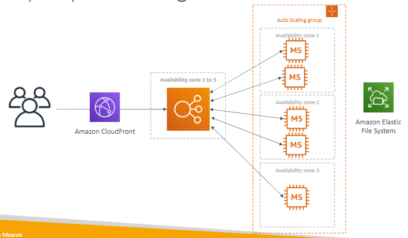

### Big Data Ingestion Pipeline

- problem
    - we want the ingestion pipeline to be fully serverless
    - we want to collect data in real time
    - we want to transform the data
    - we want to query the transformed data using SQL
    - the reports created using the queries should be in S3
    - we want to load that data into a warehouse and create dashboard
- solution
    - IoT Core allows you to harvest data from IoT devices
    - kinesis is great for real-time data collection
    - Firehose helps with data delivery to S3 in near real-time (1 minute)
    - Lambda can help Firehose with data transformations
    - Amazon S3 can trigger notifications to SQS
    - Lambda can subscribe to SQS (we could have connecter S3 to Lambda)
    - Athena is a serverless SQL service and results are stored in S3
    - the reporting bucket contains analyzed data and can be used by reporting tool such as AWS QuickSight, Redshift, etc…
    


## Database in AWS

### Choosing the Right Database
* we have a lot of managed databases on AWS to choose from
* questions to choose the right database based on your architecture:
    * read-heavy, write-heavy, or balanced workload? throughput needs? will it change, does it need to scale or fluctuate during the day?
    * how much data to store and for how long? will it grow? average object size?  how are they accessed?
    * data durability? source of truth for the data ?
    * latency requirements? concurrent users?
    * data model? how will you query the data? joins? structured? semi-structured?
    * strong schema? more flexibility? reporting? search? rdbms / nosql?
        * RDBMS: relational database management system
    * license costs? Switch to Cloud Native DB such as Aurora?
* Database Types
    * RDBMS (= SQL / OLTP) - great for joins
        * RDS, Aurora 
    * NoSQL database - no joins, no SQL
        * DynamoDB (~JSON), 
        * ElastiCache (key / value pairs), 
        * graphs: 
            * Neptune -displays relationships between data
    * object store: 
        * S3 (for big objects) / Glacier (for backups / archives)
    * data warehouse (= SQL Analytics / BI): 
        * Redshift (OLAP), 
        * Athena
    * search - free text, unstructured searches
        * ElasticSearch (JSON) 


### RDS 
* Overview
    * managed PostgreSQL / MySQL / Oracle / SQL Server
    * must provision an EC2 instance & EBS Volume type and size
    * support for Read Replicas and Multi AZ
    * security through IAM, Security Groups, KMS , SSL in transit
    * backup / snapshot / point in time restore feature
    * managed and scheduled maintenance
    * monitoring through CloudWatch
    * use case: store relational datasets (RDBMS / OLTP), perform SQL queries, transactional inserts / update / delete is available
* for the exam
    * **operations**: small downtime when failover happens, when maintenance happens, scaling in read replicas / ec2 instance / restore EBS implies manual intervention, application changes
    * **security**: AWS responsible for OS security, we are responsible for setting up KMS, security groups, IAM policies, authorizing users in DB, using SSL
    * **reliability**: Multi AZ feature, failover in case of failures
    * **performance**: depends on EC2 instance type, EBS volume type, ability to add Read Replicas. Doesn’t auto-scale
    * **cost**: Pay per hour based on provisioned EC2 and EBS


### Aurora
* overview
    * compatible API for PostgreSQL / MySQL
    * data is held in 6 replicas, across 3 AZ
    * auto healing capability
    * multi AZ, Auto Scaling Read Replicas
    * read Replicas can be Global
    * aurora database can be Global for DR or latency purposes
    * auto scaling of storage from 10GB to 64 TB
    * define EC2 instance type for aurora instances
    * same security / monitoring / maintenance features as RDS
    * `Aurora Serverless` for unpredictable / intermittent workloads
    * `Aurora Multi-Master` for continuous writes failover
    * use case: same as RDS, but with less maintenance / more flexibility / more performance
* for the exam
    * **operations**: less operations, auto scaling storage
    * **security**: AWS responsible for OS security, we are responsible for setting up KMS, security groups, IAM policies, authorizing users in DB, using SSL
    * **reliability**: Multi AZ, highly available, possibly more than RDS, Aurora Serverless option, Aurora Multi-Master option
    * **performance**: 5x performance (according to AWS) due to architectural optimizations. Up to 15 Read Replicas (only 5 for RDS)
    * **cost**: Pay per hour based on EC2 and storage usage. Possibly lower costs compared to Enterprise grade databases such as Oracle


### ElastiCache
* overview
    * managed Redis / Memcached (similar offering as RDS, but for caches)
    * in-memory data store, sub-millisecond latency
    * must provision an EC2 instance type
    * support for Clustering (Redis) and Multi AZ, Read Replicas (sharding)
    * security through IAM, Security Groups, KMS, Redis Auth
    * backup / snapshot / point in time restore feature
    * managed and scheduled maintenance
    * monitoring through CloudWatch
    * use case: key/value store, frequent reads, less writes, cache results for DB queries, store session data for websites, cannot use SQL.
* for the exam
    * **operations**: same as RDS
    * **security**: AWS responsible for OS security, we are responsible for setting up KMS, security groups, IAM policies, users (Redis Auth), using SSL
    * **reliability**: Clustering, Multi AZ
    * **performance**: sub-millisecond performance, in memory, read replicas for sharding, very popular cache option
    * **cost**: pay per hour based on EC2 and storage usag


### DynamoDB
* overview
    * AWS proprietary technology, managed NoSQL database
		* data stored on SSD storage
    * serverless, provisioned capacity, auto scaling, on demand capacity (Nov 2018)
    * can replace ElastiCache as a key/value store (storing session data for example)
    * highly Available, Multi AZ by default (spread across 3 AZs), Read and Writes are decoupled, DAX for read cache
    * reads can be eventually consistent (by default) or strongly consistent 
            * eventually consistent has better read performance
            * if you needs read the data within 1 second after write >> choose strongly consistent
    * security, authentication and authorization is done through IAM
    * DynamoDB Streams to integrate with AWS Lambda
    * backup / restore feature, **Global Table** feature
    * monitoring through CloudWatch
    * can only query on primary key, sort key, or indexes
    * use case: Serverless applications development (small documents 100s KB), distributed serverless cache, doesn’t have SQL query language available, has transactions capability from Nov 2018
* DynamoDB Accelarator (DAX):
    * fully managed, highly available, in-memory cache
    * 10x performance improvement
    * reduces request time from millisecond to microsecounds
    * no need for developers to manage caching logic
    * compatible with DynamoDB API calls
* transactions:
    * multiple "all-or-nothing" operations.e.g., financial transactions, fulfilling orders
    * 2 underlying reads or writes - prepare/commit
    * up to 25 items or 4 MB of data
* on-demand capacity
    * pay-per-request pricing
    * balance cost and performance
    * no minimum capacity
    * no charge for read/write - only storage and backups
    * could end up pay more per request than with provisioned capacity
    * use for new product launches
* on-demand backup and restore
    * backup:
        * full backups at any time
        * 0 impact on table performance or available
        * consistent within seconds and retained until deleted
        * operates within same region as the source table
    * restore: point-in-time recovery (PITR)
        * restore to any point in the last 35 days
        * incremental backups
        * not enabled by default
        * latest restorable: 5 minutes in the past
* Stream:
	* time-ordered sequence of item-level changes in a table
	* stored for 24 hours
	* insert, updates and deletes
	* combine with Lambda functions for functionalaty like stored procedures
* Global Tables
	* managed multi-master, multi-region replication
	* based on DynamoDB streams
	* no application rewrites
	* replication latency under 1 second
* Security / Connection
	* encryption at rest using KMS
	* site-to-site VPN with VPC endpoints
	* Direct Connect (DX)
	* fine-grained access
* for the exam
    * **operations**: no operations needed, auto scaling capability, serverless
    * **security**: full security through IAM policies, KMS encryption, SSL in flight
    * **reliability**: Multi AZ, Backups
    * **performance**: single digit millisecond performance, DAX for caching reads, performance doesn’t degrade if your application scales
    * **cost**: Pay per provisioned capacity and storage usage (no need to guess in advance any capacity – can use auto scaling)


### S3
* overview
    * S3 is a… key / value store for objects
    * great for big objects, not so great for small objects
    * serverless, scales infinitely, max object size is 5 TB
    * eventually consistency for overwrites and deletes
    * tiers: S3 Standard, S3 IA, S3 One Zone IA, Glacier for backups
    * features: versioning, encryption, cross region replication, etc…
    * security: IAM, Bucket Policies, ACL
    * encryption: SSE-S3, SSE-KMS, SSE-C, client side encryption, SSL in transit
    * use case: static files, key value store for big files, website hosting
* for the exam
    * **operations**: no operations needed
    * **security**: IAM, Bucket Policies, ACL, Encryption (Server/Client), SSL
    * **reliability**: 99.999999999% durability / 99.99% availability, Multi AZ, CRR
    * **performance**: scales to thousands of read / writes per second, transfer acceleration / multi-part for big files
    * **cost**: pay per storage usage, network cost, requests number


### Athena
* overview
    * fully serverless database with sql capabilities
    * used to query data in S3
    * pay per query
    * output results back to S3
    * secured through IAM
    * use case: one time SQL queries, serverless queries on S3, log analytics
* for the exam
    * **operations**: no operations needed, serverless
    * **security**: IAM + S3 security
    * **reliability**: managed service, uses Presto engine, highly available
    * **performance**: queries scale based on data size
    * **cost**: pay per query / per TB of data scanned, serverless


### Redshift
* overview
    * Redshift is based on PostgreSQL, but it’s not used for OLTP (online transaction processing)
    * it’s OLAP – online analytical processing (analytics and data warehousing)
        * applies complex queries to large amounts of historical data, aggregated from OLTP databases and other sources,
        * for data mining, analytics, and business intelligence projects. 
    * 10x better performance than other data warehouses, scale to PBs of data
    * columnar storage of data (instead of row based)
    * Massively Parallel Query Execution (MPP)
    * pay as you go based on the instances provisioned
    * has a SQL interface for performing the queries
    * BI tools such as AWS Quicksight or Tableau integrate with it
    * data is loaded from S3, DynamoDB, DMS, other DBs
        * Kinesis Data Firehose to Redshift cluster via S3 copy
        * S3 bucket to Redshift cluster via Internet or Enhanced VPC Routing
            * with Internet: using COPY command
            * Redshift Enhanced VPC Routing: COPY / UNLOAD goes through VPC
        * EC2 instance to Redshift cluster (better to write data in batches) 
            * e.g., with JDBC driver: Java Database Connectivity
    * from 1 node to 128 nodes, up to 160 GB of space per node
		* support single node mode and multi-node
			* leader node: for query planning, results aggregation (no charge)
			* compute node: for performing the queries, send results to leader (be charged upon)
    * Redshift Spectrum: perform queries directly against S3 
        * query data that is already in S3 without loading it
        * must have a `Redshift cluster` available to start the query
        * the query is then submitted to thousands of Redshift Spectrum nodes
    * snapshots & DR:
        * Redshift has no “Multi-AZ” mode
        * snapshots are point-in-time backups of a cluster, stored internally in S3
        * snapshots are incremental (only what has changed is saved)
        * you can restore a snapshot into a new cluster
        * automated: every 8 hours, every 5 GB, or on a schedule. set retention
			* by default 1 day to maximum retention period of 35 days
			* always attempts to keep at least 3 copies of your data
        * manual: snapshot is retained until you delete it
        * you can configure Amazon Redshift to automatically copy snapshots (automated or manual) of a cluster to another AWS Region
* for the exam:
    * **operations**: like RDS
    * **security**: IAM, VPC, KMS, SSL (like RDS)
    * **reliability**: auto healing features, cross-region snapshot copy
    * **performance**: 10x performance vs other data warehousing, compression
    * **cost**: pay per node provisioned, 1/10th of the cost vs other warehouses
    * **Vs **Athena: faster queries / joins / aggregations thanks to indexes
    * **remember**: Redshift = Analytics / BI / Data Warehouse


### AWS Glue
* managed extract, transform, and load (ETL) service
* useful to prepare and transform data for analytics
* fully serverless service
* Glue Data Catalog: catalog of datasets
	* inputs: S3, RDS, DynamoDB, JDBC
	* process: AWS Glue Data Crawler => writes Metadata
	* output: Athena, Redshift Spectrum,EMR (Elastic MapReduce)

### EMR
* EMR is a cloud based big data platform for processing vast amounts of data using open source tools such as Apache Spark, Hive, HBase, Flink, Hudi, and Presto
	* with EMR, you can run petabyte-scale analysis at less than half the cost of traditional on-prem solutions
	* 3 time faster than standard Apache Spark
	* the central component of EMR is the cluster (a collection of EC2 instance, a.k.a. a node)
		* EMR installs different software components on each node type (giving each node a role in a distributed application like Apache Hadoop)
			* master node: a node that manages the cluster
			* core node: runs tasks and stores data
			* task node: only runs tasks and does not store data in HDFS (task node is optional)
		* supports periodically archive the log file stored on the master node to S3 (at 5 min intervals)
			* need to be configured when creating the cluster for the first time


### Neptune
* overview
    * fully managed graph database
    * when do we use Graphs?
        * high relationship data
        * social networking: Users friends with Users, replied to comment on post of user and likes other comments.
        * knowledge graphs (Wikipedia)
    * highly available across 3 AZ, with up to 15 read replicas
    * point-in-time recovery, continuous backup to Amazon S3
    * support for KMS encryption at rest + HTTPS
* for the exam
    * **operations**: similar to RDS
    * **security**: IAM, VPC, KMS, SSL (similar to RDS) + IAM Authentication
    * **reliability**: Multi-AZ, clustering
    * **performance**: best suited for graphs, clustering to improve performance
    * **cost**: pay per node provisioned (similar to RDS)
    * **remember**: Neptune = Graphs


### ElasticSearch
* overview
    * example: In DynamoDB, you can only find by primary key or indexes.
        * with ElasticSearch, you can search any field, even partially matches
    * it’s common to use ElasticSearch as a complement to another database
    * ElasticSearch also has some usage for Big Data applications
    * you can provision a cluster of instances
    * built-in integrations: Amazon Kinesis Data Firehose, AWS IoT, and Amazon CloudWatch Logs for data ingestion
    * security through Cognito & IAM, KMS encryption, SSL & VPC
    * comes with Kibana (visualization) & Logstash (log ingestion) – ELK stack
* for the exam
    * **operations**: similar to RDS
    * **security**: Cognito, IAM, VPC, KMS, SSL
    * **reliability**: Multi-AZ, clustering
    * **performance**: based on ElasticSearch project (open source), petabyte scale
    * **cost**: pay per node provisioned (similar to RDS)
    * **remember**: ElasticSearch = Search / Indexing


## AWS Monitoring & Audit

### AWS CloudWatch
* AWS CloudWatch Metrics
    * CloudWatch provides metrics for every services in AWS
    * metric is a variable to monitor (CPUUtilization, NetworkIn)
        * metrics belong to namespaces
        * dimension is an attribute of a metric (instance id, environment, etc).
        * up to 10 dimensions per metric
        * metrics have timestamps
    * can create CloudWatch dashboards of metrics
* EC2 Detailed Monitoring
    * EC2 instance metrics have metrics every 5 minutes
    * with **detailed monitoring** (for a cost), you get data every 1 minute
        * use detailed monitoring if you want to more prompt scale your ASG!
        * the AWS Free Tier allows us to have 10 detailed monitoring metrics
    * note: EC2 memory usage is by default not pushed (must be pushed from inside the instance as a custom metric)
* Custom Metrics
    * possibility to define and send your own custom metrics to CloudWatch
    * ability to use dimensions (attributes) to segment metrics
        * instance.id
        * environment.name
    * metric resolution (StorageResolution API parameter – two possible value):
        * standard: 1 minute (60 seconds)
        * high resolution: 1 second – higher cost
    * use API call PutMetricData
    * use exponential back-off in case of throttle errors
* CloudWatch Dashboards
    * great way to setup dashboards for quick access to keys metrics
    * **dashboards are global**
        * dashboards can include graphs from different regions
        * you can change the time zone & time range of the dashboards
        * you can setup automatic refresh (10s, 1m, 2m, 5m, 15m)
    * pricing:
        * 3 dashboards (up to 50 metrics) for free
        * $3/dashboard/month afterwards
* CloudWatch Logs
    * applications can send logs to CloudWatch using the SDK
    * CloudWatch can collect log from:
        * Elastic Beanstalk: collection of logs from application
        * ECS: collection from containers
        * AWS Lambda: collection from function logs
        * VPC Flow Logs: VPC specific logs
        * API Gateway
        * CloudTrail based on filter
        * CloudWatch log agents: for example on EC2 machines
        * Route53: Log DNS queries
    * CloudWatch Logs can go to:
        * batch exporter to S3 for archival
        * stream to ElasticSearch cluster for further analytics
    * logs storage architecture:
        * log groups: arbitrary name, usually representing an application
        * log stream: instances within application / log files / containers
    * can define log expiration policies (never expire, 30 days, etc..)
    * using the AWS CLI we can tail CloudWatch logs
    * to send logs to CloudWatch, make sure IAM permissions are correct!
    * security: encryption of logs using KMS at the Group Level
    * CloudWatch Logs can use filter expressions
        * for example, find a specific IP inside of a log
        * metric filters can be used to trigger alarms
    * CloudWatch Logs Insights (Nov 2018) can be used to query logs and add queries to CloudWatch Dashboards
    * CloudWatch Logs for EC2
        * by default, no logs from your EC2 machine will go to CloudWatch
        * you need to run a CloudWatch agent on EC2 to push the log files you want
        * make sure IAM permissions are correct
        * the CloudWatch log agent can be setup on-premises too
    * CloudWatch Logs Agent & Unified Agent
        * for virtual servers (EC2 instances, on-premise servers…)
        * CloudWatch Logs Agent
            * **old version** of the agent
            * can only send to CloudWatch Logs
        * CloudWatch Unified Agent
            * collect additional system-level metrics directly on your Linux server / EC2 instance 
                * CPU (active, guest, idle, system, user, steal)
                * Disk Metrics (free, used, total), Disk IO (writes, reads, bytes, iops)
                * RAM (free, inactive, used, total, cached)
                * Netstat (number of TCP and UDP connections, net packets, bytes)
                * Processes (total, dead, bloqued, idle, running, sleep)
                * Swap Space (free, used, used %)
                    * reminder: out-of-the box metrics for EC2 – disk, CPU, network (high level)
            * collect logs to send to CloudWatch Logs
            * centralized configuration using SSM Parameter Store
* CloudWatch Alarms
    * alarms are used to trigger notifications for any metric
    * alarms can go to Auto Scaling, EC2 Actions, SNS notifications
    * various options (sampling, %, max, min, etc…)
    * alarm states:
        * OK
        * INSUFFICIENT_DATA
        * ALARM
    * period:
        * length of time in seconds to evaluate the metric
        * high resolution custom metrics: can only choose 10 sec or 30 sec
    * use-case:
        * EC2 Instance Recovery:
            * Status Check:
                *  instance status = check the EC2 VM
                *  system status = check the underlying hardware
            * Recovery: same private/public, Elastic IP, metadata, placement group
* CloudWatch Events
    * Source + Rule => Target
    * Event Pattern: Intercept events from AWS services (Sources)
        * example sources: EC2 Instance Start, CodeBuild Failure, S3, Trusted Advisor
        * can intercept any API call with CloudTrail integration
    * schedule or Cron (example: create an event every 4 hours)
    * a JSON payload is created from the event and passed to a target
        * compute: Lambda, Batch, ECS task
        * integration: SQS, SNS, Kinesis Data Streams, Kinesis Data Firehose
        * orchestration: Step Functions, CodePipeline, CodeBuild
        * maintenance: SSM, EC2 Actions
* Amazon EventBridge
    * EventBridge is the next evolution of CloudWatch Events
        * `default event bus`: generated by AWS services (CloudWatch Events)
        * `partner event bus`: receive events from SaaS service or applications (Zendesk, DataDog, Segment, Auth0)
        * `custom event buses`: for your own applications
        * event buses can be accessed by other AWS accounts
    * **rules**: how to process the events (similar to CloudWatch Events)
* Amazon EventBridge Schema Registry
    * EventBridge can analyze the events in your bus and infer the schema
    * the `Schema Registry` allows you to generate code for your application, that will know in advance how data is structured in the event bus
    * schema can be versioned
* Amazon EventBridge vs CloudWatch Events
    * Amazon EventBridge builds upon and extends CloudWatch Events.
    * it uses the same service API and endpoint, and the same underlying service infrastructure.
    * EventBridge allows extension to add event buses for your custom applications and your third-party SaaS apps.
    * Event Bridge has the Schema Registry capability
    * EventBridge has a different name to mark the new capabilities
        * over time, the CloudWatch Events name will be replaced with EventBridge
* CloudWatch offerings summary:
    * dashboards: to see what is happening with your AWS environment
    * logs: helps you to aggregate, monitor and store logs
    * alarms: allows you to set alarms that notify you when particular thresholds are hit
    * events: helps you to respond to state changes in your AWS resources


### AWS CloudTrail
* overview
    * provides governance, compliance and audit for your AWS Account
    * CloudTrail is enabled by default!
    * get an history of events / API calls made within your AWS Account by:
        * console
        * SDK
        * CLI
        * AWS Services
    * can put logs from CloudTrail into CloudWatch Logs or S3
    * a trail can be applied to **All Regions** (default) or **a single Region**.
    * if a resource is deleted in AWS, investigate CloudTrail first!
* CloudTrail events
    * management events:
        * *by default, trails are configured to log management events.*
        * operations that are performed on resources in your AWS account
        * examples:
            * configuring security (IAM AttachRolePolicy)
            * configuring rules for routing data (Amazon EC2 CreateSubnet)
            * setting up logging (AWS CloudTrail CreateTrail)
        * can separate **read events** (that don't modify resources) from **write events** (that may modify resources)
    * data events:
        * *by default, data events are not logged (because high volume operations)*
        * Amazon s3 object-level activity (e.g., GetObject, DeleteObject, PutObject): can separate read and write events
        * AWS Lambda function execution activity (the invoke api)
    * CloudTrail Insights events:
        * enable `CloudTrail Insights` to detect unusual activity in your account:
            * inaccurate resource provisioning
            * hitting service limits
            * bursts of AWS IAM actions
            * gaps in periodic maintenance activity
        * CloudTrail Insights analyzes normal management events to create a baseline
        * and then continuously analyzes write events to detect **unusual patterns**
            * anomalies appear in the CloudTrail console
            * event is sent to Amazon S3
            * an EventBridge event is generated (for automation needs)
* CloudTrail Events Retention
    * events are stored for 90 days in CloudTrail
    * to keep events beyond this period, log them to S3 and use Athena


### AWS Config
* overview
    * helps with auditing and recording compliance of your AWS resources
    * helps record configurations and changes over time
    * possibility of storing the configuration data into S3 (analyzed by Athena)
    * questions that can be solved by AWS Config:
        * is there unrestricted SSH access to my security groups?
        * do my buckets have any public access?
        * how has my ALB configuration changed over time?
    * you can receive alerts (SNS notifications) for any changes
    * AWS Config is a **per-region** service
    * can be aggregated across regions and accounts
* AWS Config Resource
    * view compliance of a resource over time
    * view configuration of a resource over time
    * view CloudTrail API calls if enabled
* AWS Config Rules
    * can use AWS managed (pre-defined) config rules (over 75)
    * can make custom config rules (must be defined in AWS Lambda)
        * evaluate if each EBS disk is of type gp2
        * evaluate if each EC2 instance is t2.micro
    * rules can be evaluated / triggered:
        * for each config change
        * and / or: at regular time intervals
    * can trigger CloudWatch Events if the rule is non-compliant (and chain with Lambda)
    * rules can have auto remediation:
        * if a resource is not compliant, you can trigger an auto remediation
        * e.g., stop instances with non-approved tags
    * AWS Config Rules does not prevent actions from happening: **no deny**
    * pricing: no free tier, $2 per active rule per region per month


### CloudWatch vs CloudTrail vs Config
* CloudWatch
    * performance monitoring (metrics, CPU, network, etc) & dashboards
    * events & alerting
    * log aggregation & analysis
* CloudTrail
    * record API calls made within your Account by everyone
    * can define trails for specific resources
    * global service
* Config
    * record configuration changes
    * evaluate resources against compliance rules
    * get timeline of changes and compliance


## Identity and Access Management (IAM) - Advanced

### AWS STS - Security Token Service

- overview:
    - allows to grant limited and temporary access to AWS resources
    - token is valid for up to one hour (must be refreshed)
    - AssumeRole
        - within your own account: for enhanced security
        - Cross Account Access: assume role in target account to perform actions there
    - AssumeRoleWithSAML
        - Return credentials for users logged with SAML
            - SAML: Security Assertion Markup Language, an open standard that allows identity providers (IdP) to pass authorization credentials to service providers.
    - AssumeRoleWithWebIdentity
        - return creds for users logged with an IdProvider (Facebook Login, Google Login, OIDC compatible…)
        - AWS recommends against using this, and using Cognito instead
    - GetSessionToken
        - for MFA, from a user or AWS account root user
- using STS to assume a role
    - define an IAM Role within your account or cross-account
    - define which principals can access this IAM Role
    - use AWS STS to retrieve credentials and impersonate the IAM Role you have access to (AssumeRole API)
    - temporary credentials can be valid between 15 minutes to 1 hour
- cross account access with STS
    1.  in production account, admin creates role that grants *development account* read/write access to ProductionApp bucket
    2.  in development account, admin grants members of the *group developers* permission to assume the UpdateApp role
    3.  developer requests access to role
    4.  STS returns role credentials
    5.  developer updates ProductionApp by using the role credentials

### Identity Federation in AWS

- overview:
    - federation lets users outside of AWS to assume temporary role for accessing AWS resources.
    - these users assume identity provided access role.
    - federations can have many flavors:
        - SAML 2.0
        - Custom Identity Broker
        - Web Identity Federation with Amazon Cognito
        - Web Identity Federation without Amazon Cognito
        - Single Sign On
        - Non-SAML with AWS Microsoft AD
    - using federation, you don’t need to create IAM users (user management is outside of AWS)
- SAML 2.0 Federation
    - to integrate Active Directory / ADFS with AWS (or any SAML 2.0)
    - provides access to AWS Console or CLI (through temporary creds)
    - no need to create an IAM user for each of your employees
        - using SAML-based federation for API access to AWS
            - 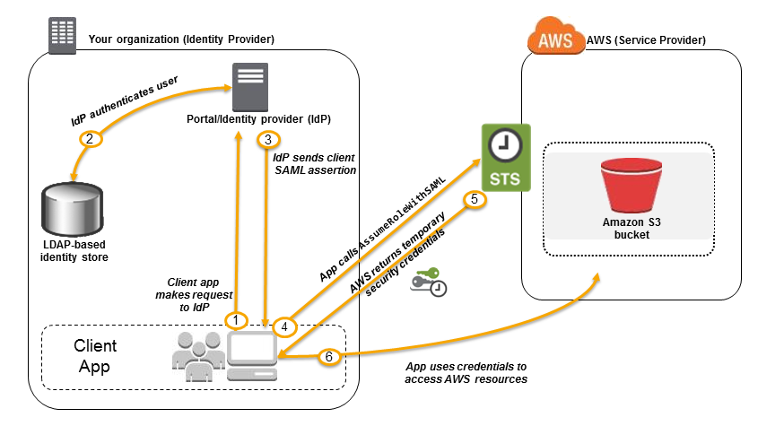
    - enabling SAML 2.0 federated users to access the AWS Management Console
        - Active Directory federation services (same process as with any SAML 2.0 compatible IdP)
        - 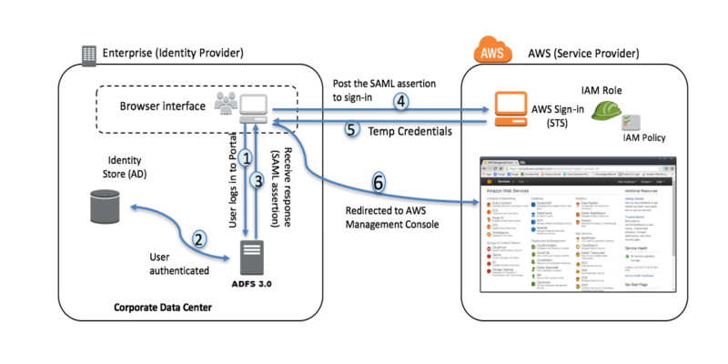
        - needs to setup a trust between AWS IAM and SAML (both ways)
        - SAML 2.0 enables web-based, cross domain SSO
        - uses the STS API: AssumeRoleWithSAML
        - note federation through SAML is the *old way* of doing things
        - amazon Single Sign On (SSO) Federation is the *new managed and simpler way*
            - 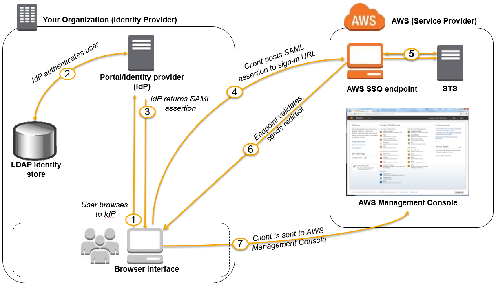
- Custom Identity Broker Application
    - use only if identity provider is not compatible with SAML 2.0
    - the identity broker must determine the appropriate IAM policy
    - uses the STS API: AssumeRole or GetFederationToken
    - 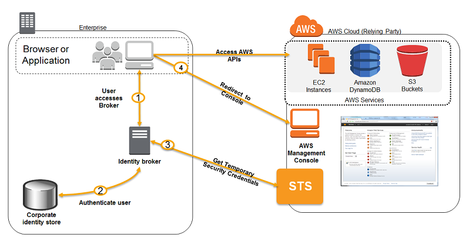
- Web Identity Federation – AssumeRoleWithWebIdentity
    - not recommended by AWS – use Cognito instead (allows for anonymous users, data synchronization, MFA)
        - 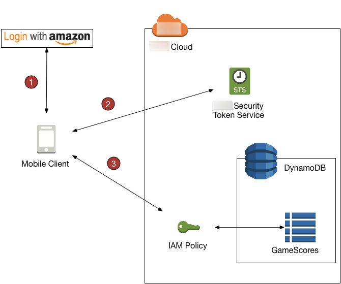
        - AWS Cognito
            - goal:
                - provide direct access to AWS Resources from the Client Side (mobile, web app)
            - example:
                - Provide (temporary) access to write to S3 bucket using Facebook Login
            - problem:
                - we don’t want to create IAM users for our app users
            - how:
                - log in to federated identity provider – or remain anonymous
                - get temporary AWS credentials back from the Federated Identity Pool
                - these credentials come with a pre-defined IAM policy stating their permissions

### AWS Directory Services

- what is Microsoft AD
    - found on any Windows Server with AD Domain Services
    - database of objects: User Accounts, Computers, Printers, File Shares, Security Groups
    - centralized security management, create account, assign permissions
    - objects are organized in trees 
    - a group of trees is a forest (with group policy)
    - LDAP and DNS protocols
    - Kerboeros, LDAP, and NTLM authentication
    - highly available
- AWS Managed Microsoft AD
    - create your own AD in AWS, manage users locally, supports MFA
    - AD domain controllers (DCs) running Windows Server
        - reachable by applications in your VPC
        - Add DCs for HA and performance
        - exclusive access to DCs
    - establish trust connections with your on- premise AD
        - extend existing AD to on-premises using **AD Trust**
- AD Connector
    - Directory Gateway (proxy) to redirect to on- premise AD
    - users are managed on the on-premise AD
    - avoid caching info in the cloud
    - allow on-prem users to log in to AWS using AD
	- scale across multiple AD Connectors
    - use-case:
        - join EC2 instances to your existing AD domain
- Simple AD
    - AD-compatible managed directory on AWS
    - Basic AD features
    - Small = 500; Large = 5,000 users
    - cannot be joined with on-premise AD
        - does not support **AD Trust**
    - use-cases:
        - easier to manage EC2 
        - linux workloads that need LDAP
* Amazon Cloud Directory
    * not support for AD
    * directory-based store for developers
    * multiple hierarchies with hundreds of millions of objects
    * use cases: org charts, course catalogs, device registries
    * fully managed service


### AWS Organizations

- overview
    - global service
    - allows to manage multiple AWS accounts
        - the main account is the master account – you can’t change it
        - other accounts are member accounts
            - member accounts can only be part of one organization
    - `Consolidated Billing` across all accounts - single payment method
    - pricing benefits from aggregated usage (volume discount for EC2, S3)
    - API is available to automate AWS account creation
- Multi Account Strategies
    - create accounts per department, per cost center, per dev / test / prod,
        - based on regulatory restrictions (using SCP), for better resource isolation (ex: VPC),
        - to have separate per-account service limits, isolated account for logging
    - Multi Account vs One Account Multi VPC
        - use tagging standards for billing purposes
        - enable CloudTrail on all accounts, send logs to central S3 account
        - send CloudWatch Logs to central logging account
        - establish Cross Account Roles for Admin purposes
- Service Control Policies (SCP)
    - whitelist or blacklist IAM actions
    - applied at the operation unit (OU) or Account level
    - does not apply to the Master Account
    - SCP is applied to all the Users and Roles of the Account, including Root user
    - the SCP does not affect service-linked roles
        - service-linked roles enable other AWS services to integrate with AWS Organizations and can't be restricted by SCPs.
    - SCP must have an **explicit** Allow (does not allow anything by default)
    - use cases:
        - restrict access to certain services (for example: can't use EMR)
        - enforce PCI compliance by explicitly disabling services
- Moving Accounts
    - To migrate accounts from one organization to another
            1.  remove the member account from the old organization
            2.  send an invite to the new organization
            3.  accept the invite to the new organization from the member account
    - If you want the master account of the old organization to also join the new organization, do the following:
            1.  remove the member accounts from the organizations using procedure above
            2.  delete the old organization
            3.  repeat the process above to invite the old master account to the new org
- AWS Organization Best Practice
    - use MFA on root account
    - paying account should be used for billing purposes only 
        - do not deploy resources into the paying account
    - enable / disable AWS services using SCP on OU or individual accounts level

### IAM Advanced

- IAM Conditions
    - "aws:SourceIP" - restrict / allow specific IP from which the API calls are being made
    - "aws:RequestRegion" - restrict / allow the region the API calls are made to
    - "aws:PrincipalTag" / "ec2:ResourceTag" - restrict based on tags
    - "aws:MultiFactorAuthPresent" - force MFA
- IAM for S3
    - ListBucket permission applies to "arn:aws:s3:::bucketname"
        - bucket level permission
    - GetObject, PutObject, DeleteObject applies to "arn:aws:s3:::bucketname/*"
        - object level permission
- IAM Roles vs Resource Based Policies
    - when you assume a role (user, application or service), you give up your original permissions and take the permissions assigned to the role
    - when using a resource based policy, the principal doesnt have to give up his permissions
    - example: user in account A needs to scan a DynamoDB table in account A and dump it in an S3 bucket in account B.
    - supported by: Amazon S3 buckets, SNS topics, SQS queues
- IAM Permission Boundaries
    - IAM Permission Boundaries are supported for users and roles (not groups)
    - advanced feature to use a managed policy to set the maximum permissions an IAM entity can get.
    - can be used in combinations of AWS Organizations SCP
        - 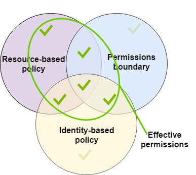
    - use cases
        - delegate responsibilities to non administrators within their permission boundaries, for example create new IAM users
        - allow developers to self-assign policies and manage their own permissions, while making sure they can't *escalate* their privileges (= make themselves admin)
        - useful to restrict one specific user (instead of a whole account using Organizations & SCP)
- IAM Policy Evaluation Logic
    - 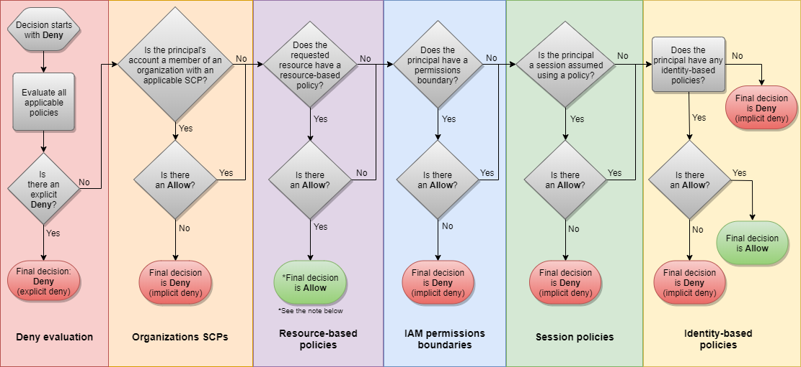

### AWS Resource Access Manager (RAM)

- overview
    - share AWS resources that you own with other AWS accounts
    - share with any account or within your Organization
    - avoid resource duplication!
    - AWS resources that are sharable:
        - App Mesh, Aurora, CodeBuild, EC2, EC2 Image Builder, License Manager, Resource Groups, Route 53
    - VPC Subnets:
        - Allow to have all the resources launched in the same subnets
        - Must be from the same AWS Organizations.
        - cannot share security groups and default VPC
        - participants can manage their own resources in there
        - participants can't view, modify, delete resources that belong to other participants or the owner
    - AWS Transit Gateway
    - Route53 Resolver Rules
    - License Manager Configurations
- VPC example
    - each account
        - is responsible for its own resources
        - cannot view, modify or delete other resources in other accounts
    - network is shared so
        - anything deployed in the VPC can talk to other resources in the VPC
        - applications are accessed easily across accounts, using private IP!
        - security groups from other accounts can be referenced for maximum security

### AWS Single Sign-On (SSO)

- overview
    - centrally manage Single Sign-On to access multiple accounts and 3rd-party business applications.
    - integrated with AWS Organizations
    - supports SAML 2.0 markup
        - allow you log into applications based on their sessions in another context
        - e.g., Microsoft AD => Google Drive
    - integration with on-premise Active Directory
    - centralized permission management
    - centralized auditing with CloudTrail


## AWS Security & Encryption

### Why encryption
* Encryption in flight (SSL)
    * data is encrypted before sending and decrypted after receiving
    * SSL certificates help with encryption (HTTPS)
    * encryption in flight ensures no MITM (man in the middle attack) can happen
* Data is encrypted after being received by the server
    * data is decrypted before being sent
    * it is stored in an encrypted form thanks to a key (usually a data key)
    * the encryption / decryption keys must be managed somewhere and the server must have access to it
* Client side encryption
    * data is encrypted by the client and never decrypted by the server
    * data will be decrypted by a receiving client
    * the server should not be able to decrypt the data
    * could leverage Envelope Encryption


### AWS KMS (Key Management Service)
* overview
    * anytime you hear encryption for an AWS service, it’s most likely KMS
    * easy way to control access to your data, AWS manages keys for us
    * fully integrated with IAM for authorization
    * seamlessly integrated into:
        * Amazon EBS: encrypt volumes
        * Amazon S3: Server side encryption of objects
        * Amazon Redshift: encryption of data
        * Amazon RDS: encryption of data
        * Amazon SSM: Parameter store
        * etc
    * but you can also use the CLI / SDK
* Customer Master Key (CMK) Types
    * symmetric (AES-256 keys)
        * first offering of KMS, single encryption key that is used to Encrypt and Decrypt
        * AWS services that are integrated with KMS use Symmetric CMKs
        * necessary for envelope encryption
        * you never get access to the Key unencrypted (must call KMS API to use)
        * **you can import your own symmetric keys**
    * asymmetric (RSA & ECC key pairs)
        * public (Encrypt) and Private Key (Decrypt) pair
        * used for Encrypt/Decrypt, or Sign/Verify operations
        * the public key is downloadable, but you can’t access the Private Key unencrypted
        * must call the KMS API to use private key
        * use case: encryption outside of AWS by users who can’t call the KMS API
        * AWS services integrated with KMS **do not** support asymmetric CMKs
* Key Management Service
    * able to fully manage the keys & policies:
        * create
        * rotation policies
        * disable
        * enable
    * able to audit key usage (using CloudTrail)
    * three types of Customer Master Keys (CMK):
        * AWS Managed Service Default CMK: free
            * used by default if you pick encryption in most AWS services
            * only that service can use them directly
        * Customer Managed (allow key rotation, controlled by key policies):
            * User Keys created in KMS: $1 / month
            * User Keys imported (must be 256-bit symmetric key): $1 / month
        * AWS Owned CMK:
            * used by AWS on a shared basis across many accounts
    * + pay for API call to KMS ($0.03 / 10000 calls)
* KMS 101
    * anytime you need to share sensitive information >> use KMS
        * database passwords
        * credentials to external service
        * private key of SSL certificates
    * the value in KMS is that the CMK used to encrypt data can never be retrieved by the user, and the CMK can be rotated for extra security
    * never ever store your secrets in plain-text, especially in your code!
    * encrypted secrets can be stored in the code / environment variables
    * KMS can only help in encrypting up to 4KB of data per call
    * if data > 4 KB, use envelope encryption
    * to give access to KMS to someone:
        * make sure the Key Policy allows the user
        * make sure the IAM Policy allows the API calls
* KMS Key Policies
    * control access to KMS keys, similar to S3 bucket policies
    * difference: you cannot control access without them
    * default KMS Key Policy:
        * created if you don't provide a specific KMS Key Policy
        * complete access to the key to the root user = entire AWS account
        * gives access to the IAM policies to the KMS key
    * custom KMS Key Policy:
        * define users, roles that can access the KMS key
        * define who can administer the key
        * useful for cross-account access of your KMS key
* Copying Snapshots across regions: **KMS keys are bound to the region**
    1. EBS volume encrypted with KMS (Key A)
    2. EBS Snapshot encrypted with KMS (Key A)
    3. KMS ReEncrypt with KMS (Key B)
    4. EBS Snapshot encrypted with KMS (Key B)
    5. EBS volume encrypted with KMS (Key B)
* Copying Snapshots across accounts
    1. Create a Snapshot, encrypted with your own CMK
    2. Attach a KMS Key Policy to authorize cross-account access
    3. Share the encrypted snapshot 
    4. (in target) Create a copy of the Snapshot, encrypt it with a KMS Key in your account
    5. Create a volume from the snapshot
* KMS Automatic Key Rotation
    * for customer-managed CMK (not AWS managed CMK)
    * if enabled: automatic key rotation happens every 1 year
    * previous key is kept active so you can decrypt old data
    * new key has the same CMK ID (only the backing key is changed)
    * only support for symmetric CMK 
        * not supported for asymmetric CMK
* KMS Manual Key Rotation
    * when you want to rotate key every 90 days, 180 days, etc
    * New Key has a different CMK ID
    * keep the previous key active so you can decrypt old data
    * better to use aliases in this case (to hide the change of key for the application)
        * key alias can point to both old and new keys
    * good solution to rotate CMK that are not eligible for automatic rotation (e.g., asymmetric CMK)


### AWS System Management (SSM) Parameter Store
* overview
    * secure storage for configuration and secrets
        * passwords, database connection strings, license codes, API keys
    * optional Seamless Encryption using KMS (otherwise store in plaintext)
    * serverless, scalable, durable, easy SDK
    * version tracking of configurations / secrets
    * configuration management using path & IAM
    * notifications with CloudWatch Events
    * integration with CloudFormation
* SSM Parameter Store Hierarchy
    * format
        * /my-department/my-app/dev/db-url
        * /my-department/my-app/prod/db-pwd
    * can call view GetParameters or GetParametersByPath API (Lambda Function)
    * up to 15 levels deep
* standard vs advanced parameter tiers

|                                                                           | standard                                              | advanced                                   |
|---------------------------------------------------------------------------|-------------------------------------------------------|--------------------------------------------|
| total number of params allowed (per account and region)                   | 10k                                                   | 100k                                       |
| max size of a param value                                                 | 4 KB                                                  | 8 KB                                       |
| param policies available                                                  | No                                                    | Yes                                        |
| cost                                                                      | no charge                                             | charges apply                              |
| storage pricing                                                           | free                                                  | $0.05/advanced param/month                 |
| API interaction pricing <br>(high throughput-HT = <br> 1k transaction per second) | standard: free <br> HT: $0.05 per 10k API interaction | standard/HT: $0.05 per 10k API interaction |

* Parameters Policies (for advanced parameters)
    * allow to assign a TTL to a parameter (expiration date) to force updating or deleting sensitive data such as passwords
    * can assign multiple policies at a time

### AWS Secrets Manager
* newer service, meant for storing secrets
* capability to force rotation of secrets every X days
* automate generation of (*random*) secrets on **rotation** (uses Lambda)
* integration with Amazon RDS (MySQL, PostgreSQL, Aurora)
* secrets are encrypted using KMS
* mostly meant for RDS integration


### CloudHSM
* KMS => AWS manages the software for encryption
* CloudHSM => AWS provisions encryption hardware
* dedicated hardware (HSM = Hardware Security Module)
* you manage your own encryption keys entirely (not AWS)
    * the key is irretrievable if lost
* HSM device is tamper resistant, **FIPS 140-2 Level 3** compliance
* supports both symmetric and asymmetric encryption (SSL/TLS keys)
* no free tier available
* must use the CloudHSM Client Software runs within a VPC in your account
* Redshift supports CloudHSM for database encryption and key management
* industry-standard APIs - no AWS APIs
* use-cases:
    * good option to use with SSE-C encryption
        * server-side encryption with customer-provided encryption keys 
    * PKCS#11
    * Java Cryptography Extensions (JCE)
    * Microsoft CryptoNG (CNG)
* high availability
    * CloudHSM clusters can be spread across Multi AZ (HA) – must setup
    * great for availability and durability
* CloudHSM Diagram:
    * IAM permissions: CRUD an HSM Cluster
    * CloudHSM Software: Manage the Keys + Usersjk
* connection:
    * CloudHSM Client connects with AWS CloudHSM via SSL connection (user manages the keys)
    * AWS manages the hardware / can't recovery your keys if you lose your credentials
    * IAM permissions: CRUD an HSM Cluster
    * CloudHSM Software: manage the Keys + Users

| Feature                    | AWS KMS                                                                                    | AWS CloudHSM                                                                             |
|----------------------------|--------------------------------------------------------------------------------------------|------------------------------------------------------------------------------------------|
| Tenancy                    | Multi-Tenant                                                                               | Single-Tenant                                                                            |
| Standard                   | FIPS 140-2 Level 2                                                                         | FIPS 140-2 Level 3                                                                       |
| Master Keys                | AWS Owned CMK<br>AWS Managed CMK<br>Customer Managed CMK                                   | Customer Managed CMK                                                                     |
| Key Types                  | Symmetric<br>Asymmetric<br>Digital Signing                                                 | Symmetric<br>Asymmetric<br>Digital Signing & Hashing                                     |
| Key Accessibility          | Accessible in multiple AWS regions<br>can't access keys outside the region it's created in | Accessible in multiple AWS regions<br>can access keys outside the region it's created in |
| Cryptographic Acceleration | None                                                                                       | SSL/TLS Acceleration<br>Oracle TDE Acceleration                                          |
| Access & Authentication    | AWS IAM                                                                                    | you create users and manage their permissions                                            |
| High Availability          | AWS Managed Service                                                                        | Add multiple HSMs over different AZs                                                     |
| Audit Capability           | CloudTrail<br>CloudWatch                                                                    | CloudTrail<br>CloudWatch<br>MFA support                                                   |
| Free Tier                  | Yes                                                                                        | No                                                                                       | 


### AWS Shield
* AWS Shield Standard:
    * free service that is activated for every AWS customer
    * provides protection from attacks such as SYN/UDP floods, reflection attacks and other layer 3/layer 4 attacks
* AWS Shield Advanced:
    * optional DDoS mitigation service ($3,000 per month per organization)
    * protect against more sophisticated attack on Amazon EC2, ELB, CloudFront, Global Accelerator, and Route 53
    * 24/7 access to AWS DDoS response team (DRT)
    * protect against higher fees during usage spikes due to DDoS
* Sample Reference Architecture for DDoS Protection
    * Route 53 (AWS Shield) >> CloudFront (AWS Shield + AWS WAF) >> VPC (public subnets: AWS Shield) >> VPC (private subnets: AWS Shield)
    * you need to request permissions to conduct DDoS test, penetration test and vulnerability scan


### AWS WAF – Web Application Firewall
* protects your web applications from common web exploits (Layer 7)
* layer 7 is HTTP (vs Layer 4 is TCP)
* deploy on Application Load Balancer, API Gateway, CloudFront and AWS AppSync
* Define Web ACL (Web Access Control List):
    * rules can include: IP addresses, HTTP headers, HTTP body, or URI strings
    * protects from common attack - SQL injection and Cross-Site Scripting (XSS)
        * by detecting presence of SQL code or script that is likely to be malicious
    * size constraints, geo-match (block countries)
    * rate-based rules (to count occurrences of events) – for DDoS protection
* AWS WAF allows 3 different behaviours:
    * whitelisting
    * blacklisting
    * count the request that matches the properties you specify, request properties: 
        * originating IP address
        * originating country
        * request size
        * values in request headers
        * string in request matching regex patterns
        * SQL code (injection)
        * cross-site scripting (XSS)


### AWS Firewall Manager
* manage rules in all accounts of an AWS Organization
* common set of security rules
* WAF rules (Application Load Balancer, API Gateways, CloudFront)
* AWS Shield Advanced (ALB, CLB, Elastic IP, CloudFront distributions)
* security Groups for EC2 and ENI resources in VPC


### Amazon GuardDuty
* intelligent threat discovery to protect AWS account
* uses machine learning algorithms, anomaly detection, 3rd party data
* one click to enable (30 days trial), no need to install software
* input data includes:
    * CloudTrail Logs: unusual API calls, unauthorized deployments
    * VPC Flow Logs: unusual internal traffic, unusual IP address
    * DNS Logs: compromised EC2 instances sending encoded data within DNS queries
* can setup CloudWatch Event rules to be notified in case of findings
* CloudWatch Events rules can target AWS Lambda or SNS
* can protect against CryptoCurrency attacks (has a dedicated finding for it)


### Amazon Inspector
* overview:
    * automated security assessments for ec2 instances
    * analyze the running OS against known vulnerabilities
    * analyze against unintended network accessibility
    * AWS Inspector Agent must be installed on OS in EC2 instances
    * after the assessment, you get a report with a list of vulnerabilities
    * possibility to send notifications to SNS
* What does AWS Inspector evaluate?
    * remember: only for EC2 instances
    * for network assessments: (agentless)
        * network reachability
    * for host assessments: (with agent)
        * common vulnerabilities and exposures
        * Center for Internet Security (CIS) Benchmarks
        * security best practices

### Amazon Macie
* Amazon Macie is a fully managed data security and data privacy service 
    * that uses machine learning and pattern matching to discover and protect your sensitive data in AWS.
* Macie helps identify and alert you to sensitive data, such as personally identifiable information (PII)
    * great for PCI-DSS compliance and preventing ID theft
* used for S3 buckets and notify CloudWatch Events / EventBridge
    * can also analyze CloudTrail logs for suspicious API activity
* includes Dashboards, Reports and Alerting


### AWS Shared Responsibility Model
* AWS responsibility - Security of the Cloud
    * protecting infrastructure (hardware, software, facilities, and networking) that runs all of the AWS services
    * managed services like S3, DynamoDB, RDS etc
* customer responsibility - Security in the Cloud
    * for EC2 instance, customer is responsible for management of the guest OS (including security patches and updates), firewall & network configuration, IAM etc
    * Encrypting application data 
* Shared controls:
    * Patch Management, Configuration Management, Awareness & Training
*  Example, for RDS
    * AWS responsibility:
        * manage the underlying EC2 instance, disable SSH access
        * automated DB patching
        * automated OS patching
        * audit the underlying instance and disks & guarantee it functions
    * your responsibility:
        * check the ports / IP / security group inbound rules in DB’s SG
        * in-database user creation and permissions
        * creating a database with or without public access
        * ensure parameter groups or DB is configured to only allow SSL connections
        * database encryption setting
* Example, for S3
    * AWS responsibility:
        * guarantee you get unlimited storage
        * guarantee you get encryption
        * ensure separation of the data between different customers
        * ensure AWS employees can’t access your data
    * your responsibility:
        * bucket configuration
        * bucket policy / public setting
        * IAM user and roles
        * enabling encryption
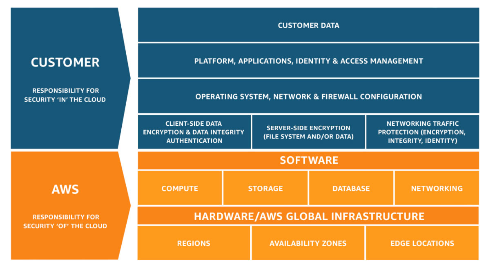


## Networking - VPC

### Understanding CIDR - IPv4
* overview
    * CIDR = Classless Inter-Domain Routing
    * CIDR are used for Security Groups rules, or AWS networking in general
    * they help to define an IP address range
        * we've seen WW.XX.YY.ZZ/32 == one IP
        * we've seen 0.0.0.0/0 == all IPs
        * but we can define for example: 192.168.0.0/26: 192.168.0.0 – 192.168.0.63 (64 IP)
    * A CIDR has two components:
        * the base IP (XX.XX.XX.XX)
        * the *Subnet Mask* (/26)
            * number of IPs is calculated as 2^(32-subnet mask) => 2^(32-26)=64
    * the base IP represents an IP contained in the range
    * the subnet masks defines how many bits can change in the IP
    * the subnet mask can take two forms. Examples:
        * 255.255.255.0 (less common)
        * /24 (more common)
* Private vs Public IP (IPv4) Allowed ranges
    * the Internet Assigned Numbers Authority (IANA) established certain blocks of IPV4 addresses for the use of private (LAN) and public (Internet) addresses.
    * private IP can only allow certain values
        * 10.0.0.0 – 10.255.255.255 (10.0.0.0/8) <= in big networks
        * 172.16.0.0 – 172.31.255.255 (172.16.0.0/12) <= default AWS one
        * 192.168.0.0 – 192.168.255.255 (192.168.0.0/16) <= small netowkr, e.g,. @home
    * all the rest of the IP on the internet are public IP

### VPC in AWS – IPv4
* overview
    * VPC = Virtual Private Cloud
    * you can have multiple VPCs in a region (max 5 per region – soft limit)
    * max CIDR per VPC is 5. For each CIDR:
        * min size is /28 = 16 IP Addresses
        * max size is /16 = 65536 IP Addresses
    * because VPC is private, only the Private IP ranges are allowed:
        * 10.0.0.0 – 10.255.255.255 (10.0.0.0/8)
        * 172.16.0.0 – 172.31.255.255 (172.16.0.0/12)
        * 192.168.0.0 – 192.168.255.255 (192.168.0.0/16)
    * your VPC CIDR should not overlap with your other networks (ex: corporate)
* Default VPC Walkthrough
    * all new accounts have a default VPC
    * new instances are launched into default VPC if no subnet is specified
    * default VPC have internet connectivity and all instances have public IP
		* The default subnet has MapPublicIPOnLaunch set to the value of true. 
		* So when an EC2 is launched, a public and private IP is available for the instance.
    * we also get a public and a private DNS name
* When creating a VPC:
    * a default route table, NACL and a default security group will be created automatically
            * SG are reginal, can span AZs but not cross regions
    * no subnet or internet gateway will be created automatically
* Subnets - IPv4
    * 1 subnet = 1 AZ
        * you can't stretch 1 subnet across multiple AZs
        * you can have multiple subnets in the same AZ
    * AWS reserves 5 IPs address (first 4 and last 1 IP address) in each Subnet
        * these 5 IPs are not available for use and cannot be assigned to an instance
        * ex, if CIDR block 10.0.0.0/24, reserved IP are:
            * 10.0.0.0: Network address
            * 10.0.0.1: Reserved by AWS for the VPC router
            * 10.0.0.2: Reserved by AWS for mapping to Amazon-provided DNS
            * 10.0.0.3: Reserved by AWS for future use
            * 10.0.0.255: Network broadcast address. AWS does not support broadcast in a VPC, therefore the address is reserved
    * exam Tip:
        * if you need 29 IP addresses for EC2 instances, you can't choose a Subnet of size /27 (32 IP)
            * you need at least 64 IP, Subnet size /26 (64-5 = 59 > 29, but 32-5 = 27 < 29)
        * AWS customers are welcome to carry out security assessments or penetration tests against their AWS infrastructure without prior approval for 8 services:
            * EC2, NAT Gateways and ELB, Lambda and Lambda Edge
            * RDS, Aurora, 
            * CloudFront, API Gateways 
            * Lightsail resources, Elastic Beanstalk environments

### Internet Gateways
* overview
    * Internet gateways helps our VPC instances connect with the internet
    * it scales horizontally and is HA and redundant
    * must be created separately from VPC
    * one VPC can only be attached to one IGW and vice versa
    * Internet Gateway is also a NAT for the instances that have a public IPv4
    * Internet Gateways on their own do not allow internet access
        * route tables must also be edited
* NAT Instances – Network Address Translation (outdated but still at the exam)
    * allows instances in the private subnets to connect to the internet
    * amazon Linux AMI pre-configured are available
    * NAT instance configuration:
        * must be launched in a public subnet
        * **must disable EC2 flag: Source / Destination Check**
        * must have Elastic IP attached to it 
            * max 5 Elastic IP per region per account
        * route table must be configured to route traffic from private subnets to NAT Instance
    * not highly available / resilient setup out of the box
        * would need to create ASG in multi AZ + resilient user-data script
    * Internet traffic bandwidth depends on EC2 instance performance
    * must manage security groups & rules:
        * inbound:
            * allow HTTP / HTTPS Traffic coming from Private Subnets
            * allow SSH from your home network (access is provided through Internet Gateway)
        * outbound:
            * allow HTTP / HTTPS traffic to the internet
* NAT Gateway
    * AWS managed NAT, higher bandwidth, better availability, no admin
    * pay by the hour for usage and bandwidth
    * NAT is created in a specific AZ, uses an Elastic IP
        * cannot be used by an instance directly in that subnet (only from other subnets)
        * requires an IGW (Private Subnet => NAT => IGW)
    * 5 Gbps of bandwidth with automatic scaling up to 45 Gbps
    * no security group to manage / required
        * still need to update your route tables
    * NAT Gateway with High Availability
            * NAT Gateway is resilient within a single-AZ
            * must create multiple NAT Gateway in multiple AZ for fault-tolerance
            * there is no cross AZ failover needed because if an AZ goes down it doesn't need NAT
                    * setup NAT gateway in each AZ to ensure resources use the NAT gateway in the same AZ
* Internet Gateway vs NAT Gateway:
    * IGW allows instances with public IPs to access the internet
    * NGW allows instances with **no** public IPs to access the internet
* NAT instances vs NAT Gateway

| Attribute | NAT gateway | NAT instance |
| --- | --- | --- |
| Availability | Highly available. NAT gateways in each Availability Zone are implemented with redundancy. Create a NAT gateway in each Availability Zone to ensure zone-independent architecture. | Use a script to manage failover between instances. |
| Bandwidth | Scale up to 45 Gbps. | Depends on the bandwidth of the instance type. |
| Maintenance | Managed by AWS. You do not need to perform any maintenance. | Managed by you, for example, by installing software updates or operating system patches on the instance. |
| Performance | Software is optimized for handling NAT traffic. | A generic AMI that's configured to perform NAT. |
| Cost | Charged depending on the number of NAT gateways you use, duration of usage, and amount of data that you send through the NAT gateways. | Charged depending on the number of NAT instances that you use, duration of usage, and instance type and size. |
| Type and size | Uniform offering; you don’t need to decide on the type or size. | Choose a suitable instance type and size, according to your predicted workload. |
| Public IP addresses | Choose the Elastic IP address to associate with a public NAT gateway at creation. | Use an Elastic IP address or a public IP address with a NAT instance. You can change the public IP address at any time by associating a new Elastic IP address with the instance. |
| Private IP addresses | Automatically selected from the subnet's IP address range when you create the gateway. | Assign a specific private IP address from the subnet's IP address range when you launch the instance. |
| Security groups | You cannot associate security groups with NAT gateways. You can associate them with the resources behind the NAT gateway to control inbound and outbound traffic. | Associate with your NAT instance and the resources behind your NAT instance to control inbound and outbound traffic. |
| Network ACLs | Use a network ACL to control the traffic to and from the subnet in which your NAT gateway resides. | Use a network ACL to control the traffic to and from the subnet in which your NAT instance resides. |
| Flow logs | Use flow logs to capture the traffic. | Use flow logs to capture the traffic. |
| Port forwarding | Not supported. | Manually customize the configuration to support port forwarding. |
| Bastion servers | Not supported. | Use as a bastion server. |
| Traffic metrics | View [CloudWatch metrics for the NAT gateway](https://docs.aws.amazon.com/vpc/latest/userguide/vpc-nat-gateway-cloudwatch.html). | View CloudWatch metrics for the instance. |
| Timeout behavior | When a connection times out, a NAT gateway returns an RST packet to any resources behind the NAT gateway that attempt to continue the connection (it does not send a FIN packet). | When a connection times out, a NAT instance sends a FIN packet to resources behind the NAT instance to close the connection. |
| IP fragmentation | Supports forwarding of IP fragmented packets for the UDP protocol.<br><br>Does not support fragmentation for the TCP and ICMP protocols. Fragmented packets for these protocols will get dropped. | Supports reassembly of IP fragmented packets for the UDP, TCP, and ICMP protocols. |

### DNS Resolution in VPC
* EnableDnsSupport: (= DNS Resolution setting)
    * default True
    * helps decide if DNS resolution is supported for the VPC
    * if True, queries the AWS DNS server at 169.254.169.253
* EnableDnsHostname: (= DNS Hostname setting)
    * false by default for newly created VPC, True by default for Default VPC
    * won't do anything unless enableDnsSupport=true
    * if True, Assign public hostname to EC2 instance if it has a public IP
* if you use custom DNS domain names in a private zone in Route 53, you must set both these attributes to true


### Network ACL (NACL) & Security Groups
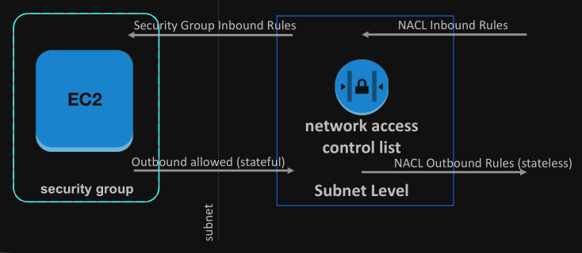
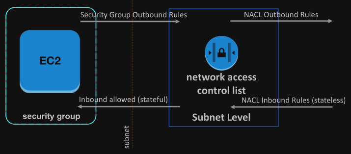
* NACL are like a firewall which control traffic from and to subnet
    * default NACL allows everything outbound and everything inbound
	* newly created (custom) NACL will deny everything
		* you need to configure both inbound and outbound traffic separately
	* you can associate a NACL to multiple subnets, however 1 subnet can only have 1 NACL
* one NACL per Subnet, new Subnets are assigned the Default NACL
* define NACL rules:
    * rules have a number (1-32766) and higher precedence with a lower number
    * e.g. If you define #100 ALLOW and #200 DENY, IP will be allowed
    * last rule is an asterisk (*) and denies a request in case of no rule match
    * AWS recommends adding rules by increment of 100
* NACL are a great way of blocking a specific IP at the subnet level
* Ephemeral ports
    * diff systems use diff range of ports
        * linux kernels: 32768-61000
        * ELB: 1024-65535
        * Windows OS: 1025-50000
        * Windows Server 2008 and later: 49152-65535
        * a NAT gateway: 1024-65535
        * AWS Lambda functions: 1024-65534
    * to cover the different types of clients that initiate traffic to public-facing instances in your VPC
        * you can open ephemeral ports 1024-65535. 
        * you can also add rules to the ACL to deny traffic on any malicious ports within that range. 
* Network ACLs vs Security Groups

| Security group | Network ACL |
| --- | --- |
| Operates at the instance level | Operates at the subnet level |
| Supports allow rules only | Supports allow rules and deny rules |
| Is stateful: Return traffic is automatically allowed, regardless of any rules | Is stateless: Return traffic must be explicitly allowed by rules |
| We evaluate all rules before deciding whether to allow traffic | We process rules in order, starting with the lowest numbered rule, when deciding whether to allow traffic |
| Applies to an instance only if someone specifies the security group when launching the instance, or associates the security group with the instance later on | Automatically applies to all instances in the subnets that it's associated with (therefore, it provides an additional layer of defense if the security group rules are too permissive) |


### VPC Peering
* overview
    * connect two VPC, privately using AWS network
    * make them behave as if they were in the same network
    * must not have overlapping CIDR
    * VPC Peering connection is not transitive 
        * must be established for each VPC that need to communicate with one another
    * you can do VPC peering with another AWS account
        * VPC peering can work inter-region, cross-account
        * you can reference a security group of a peered VPC (works cross account)
    * you must update route tables in each VPC’s subnets to ensure instances can communicate

### VPC Endpoints
* endpoints allow you to connect to AWS Services using a private network instead of the public www network
* endpoints are virutal devices, scale horizontally and are redundant
* they remove the need of IGW, NAT, etc to access AWS Services
    * interface: provisions an ENI (private IP address) as an entry point (must attach security group) 
        * most AWS services (powered by PrivateLink)
    * gateway: (like a NAT Gateway) provisions a target and must be used in a route table – S3 and DynamoDB
* in case of issues:
    * check DNS Setting Resolution in your VPC
    * check Route Tables

### Flow Logs
* overview
    * capture information about IP traffic going into your interfaces (3 layers):
        * VPC Flow Logs
        * Subnet Flow Logs
        * Elastic Network Interface Flow Logs
    * helps to monitor & troubleshoot connectivity issues
    * flow logs data can go to S3 / CloudWatch Logs
    * captures network information from AWS managed interfaces too: ELB, RDS, ElastiCache, Redshift, WorkSpace
* Flow Log Syntax
    * version> account-id> interface-id> srcaddr> dstaddr> srcport> dstport> protocol> packets> bytes> start> end> action> log- status>
    * srcaddr, dstaddr help identify problematic IP
    * srcport, dstport help identity problematic ports
    * action : success or failure of the request due to Security Group / NACL
    * can be used for analytics on usage patterns, or malicious behavior
    * flow logs example: https://docs.aws.amazon.com/vpc/latest/userguide/flow-logs.html#flow-log-records
    * query VPC flow logs using Athena on S3 or CloudWatch Logs Insight
* Flow Logs: Looking at ACTION field How to troubleshoot SG vs NACL issue?
    * For incoming requests
        * Inbound REJECT: NACL or SG
        * Inbound ACCEPT, outbound REJECT: NACL
    * For outgoing requests
        * Outbound REJECT: NACL or SG
        * Outbound ACCEPT, inbound REJECT: NACL
* exam tips:
    * you can't enable flow logs for VPCs that are peered with your VPC unless the peer VPC is in your account
    * you can tag flow logs
    * you can't change flow logs configuration after creation
        * you can't associate a different IAM role with the flow log
    * not all IP traffic is monitored. e.g., 
        * traffic generated by instances when contact Amazon DNS server
        * traffic generated by a Windows instance for Amazon Window license activation
        * traffic to and from 169.254.169.254 for instnce metadata
        * DHCP traffic
        * traffic to the reserved IP address for the default VPC router


### Bastion Hosts
* a bastion host is a special-purpose computer on a network designed and configured to withstand attacks.
    * allows you to securely administer (via SSH or RDP) an EC2 instance located in a private subnet.
* we can use a bastion Host to SSH into our private instances
* the bastion is in the public subnet which is then connected to all other private subnets
* bastion Host security group must be tightened
* HA with bastion:
    * strategy 1: 2 bastion in 2 public subnets (in 2 AZs) connected by NLB with static IP addresses and health checks to fail over from one host to the other
        * can't use an ALB, as it is layer 7 and you need to use layer 4
    * strategy 2: 1 bastion in 2 public subnets (using ASG to launch the second when the existing bastion fails) = less expensive
        * you can use a user data script to provision the same EIP to the new host
        * downtime when provisioning the new EC2 instance
* exam Tip: Make sure the bastion host only has port 22 (for SSH, or 3389 for RDP) traffic from the IP you need, not from the security groups of your other instances

### Site to Site VPN
* A site-to-site virtual private network (VPN) is a connection between two or more networks
    * such as a corporate network and a branch office network
	* VPN gateway <--> site to site VPC connection <--> customer gateway
* Virtual Private Gateway:
    * VPN concentrator on the AWS side of the VPN connection
    * VGW is created and attached to the VPC from which you want to create the Site-to-site VPN connection
    * possibility to customize the ASN (autonomous system number)
* Customer Gateway:
    * software application or physical device on customer side of the VPN connection
    * https://docs.aws.amazon.com/vpc/latest/adminguide/Introduction.html#DevicesTested
    * IP Address:
        * use static, internet-routable IP address for your customer gateway device.
        * if your CGW behind NAT (with NAT-T), use the public IP address of the NAT


### Direct Connect and Direct Connect Gateway
* Direct Connect (DX)
    * provides a dedicated private connection from a remote network to your VPC
        * dedicated connection must be setup between your data-center (DC) and AWS Direct Connect locations
        * you need to setup a Virtual Private Gateway on your VPC
            * you need to create a PUBLIC virtual interface in the DX console
            * connect Customer Gateway with Virtual Private Gateway via VPC connection
        * access public resources (e.g., S3) and private (e.g., EC2) on same connection
    * use cases:
        * increase bandwidth throughput - working with large data sets – lower cost
        * more consistent network experience - applications using real-time data feeds
        * hybrid Environments (on prem + cloud)
    * supports both IPv4 and IPv6
* Direct Connect Gateway
    * to setup a Direct Connect to one or more VPC in many different regions (same account),use a Direct Connect Gateway
* Connection types
    * Dedicated Connections: 1Gbps and 10 Gbps capacity
        * physical Ethernet port dedicated to a customer
        * request made to AWS first, then completed by AWS Direct Connect Partners
    * Hosted Connections: 50Mbps, 500 Mbps, to 10 Gbps
        * connection requests are made via AWS Direct Connect Partners
        * capacity can be added or removed on demand
        * 1, 2, 5, 10 Gbps available at select AWS Direct Connect Partners
    * lead times are often longer than 1 month to establish a new connection
* Encryption
    * data in transit is not encrypted but is private
    * AWS Direct Connect + VPN provides an IPsec-encrypted private connection
        * IPsec: a secure network protocol suite that authenticates and encrypts the packets of data over an internet protocol network 
    * good for an extra level of security, but slightly more complex to put in place
* Resiliency
    * high resiliency for critical workloads
        * one connection at multiple locations
    * maximum resiliency for critical workloads
        * separate connections terminating on separate devices in more than one location


### Egress Only Internet Gateway
* egress only Internet Gateway is for IPv6 only
    * similar function as a NAT, but a NAT is for IPv4
* good to know: IPv6 are all public addresses
    * therefore all our instances with IPv6 are publicly accessibly
* egress Only Internet Gateway gives our IPv6 instances access to the internet
    * whilst denying any internet based resources to connection back into the VPC, so they won’t be directly reachable by the internet
    * after creating an Egress Only Internet Gateway, edit the route tables


### AWS PrivateLink - VPC Endpoint Services
* Exposing services in your VPC to other VPC
    * option 1: make it public:
        * goes through the public WWW
        * tough to manage access
    * option 2: VPC peering
        * must create many peering relations
        * opens the whole network
* AWS PrivateLink (VPC Endpoint Services)
    * most secure & scalable way to expose a service to 1000s of VPC (own or other accounts, customer VPC)
        * does not require VPC peering, internet gateway, NAT, route tables
    * requires a network load balancer (on Service VPC) and ENI (on Customer VPC)
        * if the NLB is in multiple AZ, and the ENI in multiple AZ, the solution is fault tolerant!


### EC2-Classic & AWS ClassicLink (deprecated)
* EC2-Classic: instances run in a single network shared with other customers
* Amazon VPC: your instances run logically isolated to your AWS account
* ClassicLink allows you to link EC2-Classic instances to a VPC in your account
    * must associate a security group
    * enables communication using private IPv4 addresses
    * removes the need to make use of public IPv4 addresses or Elastic IP addresses
* likely to be distractors at the exam

### AWS VPN CloudHub
* provide secure communication between sites, if you have multiple VPN connections
* low cost hub-and-spoke model for primary or secondary network connectivity between locations
    * is a form of transport topology optimization in which traffic planners organize routes as a series of "spokes" that connect outlying points to a central "hub"
* it's a VPN connection so it goes over the public internet
    * but all traffic between customer gateway and the AWS VPN CloudHub is encrypted


### Transit Gateway
* for having transitive peering between thousands of VPC and on-premises, hub-and-spoke (star) connection
    * regional resource, can work cross-region
    * share cross-account using Resource Access Manager (RAM)
    * you can peer Transit Gateways across regions
* route Tables: limit which VPC can talk with other VPC
* works with Direct Connect Gateway, VPN connections
* supports IP Multicast (not supported by any other AWS service)
* Site-to-Site VPN ECMP
    * ECMP = Equal-cost multi-path routing
    * routing strategy to allow to forward a packet over multiple best path
    * use case: create multiple Site- to-Site VPN connections to increase the bandwidth of your connection to AWS


### VPC Section Summary
* CIDR: IP Range
* VPC: Virtual Private Cloud => we define a list of IPv4 & IPv6 CIDR
* subnets:Tied to an AZ, we define a CIDR
* Internet Gateway: at the VPC level, provide IPv4 & IPv6 Internet Access
* Route Tables: must be edited to add routes from subnets to the IGW, VPC Peering Connections, VPC Endpoints, etc
* NAT Instances: gives internet access to instances in private subnets. Old, must be setup in a public subnet, disable Source / Destination check flag
* NAT Gateway: managed by AWS, provides scalable internet access to private instances, IPv4 only
* private DNS + Route 53: enable DNS Resolution + DNS hostnames (VPC)
* NACL: Stateless, subnet rules for inbound and outbound, don’t forget ephemeral ports
* Security Groups: Stateful, operate at the EC2 instance level
* VPC Peering: Connect two VPC with non overlapping CIDR, non transitive
* VPC Endpoints: Provide private access to AWS Services (S3, DynamoDB, CloudFormation, SSM) within VPC
* VPC Flow Logs: Can be setup at the VPC / Subnet / ENI Level, for ACCEPT and REJECT traffic, helps identifying attacks, analyze using Athena or CloudWatch Log Insights
* Bastion Host: Public instance to SSH into, that has SSH connectivity to instances in private subnets
* Site to Site VPN: setup a Customer Gateway on DC, a Virtual Private Gateway on VPC, and site-to-site VPN over public internet
* Direct Connect: setup a Virtual Private Gateway on VPC, and establish a direct private connection to an AWS Direct Connect Location
* Direct Connect Gateway: setup a Direct Connect to many VPC in different regions • 
* Internet Gateway Egress: like a NAT Gateway, but for IPv6
* PrivateLink / VPC Endpoint Services:
    * connect services privately from your service VPC to customers VPC
    * doesn't need VPC peering, public internet, NAT gateway, route tables
    * must be used with Network Load Balancer & ENI
* ClassicLink: connect EC2-Classic instances privately to your VPC
* VPN CloudHub: hub-and-spoke VPN model to connect your sites
* Transit Gateway: transitive peering connections for VPC, VPN & XX


### Networking Costs in AWS per GB - Simplified
* Use Private IP instead of Public IP for good savings and better network performance
* Use same AZ for maximum savings (at the cost of high availability)
* Minimizing egress traffic network cost
    * egress traffic: outbound traffic (from AWS to outside)
    * ingress traffic: inbound traffic - from outside to AWS (typically free)
    * try to keep as much internet traffic within AWS to minimize costs
    * Direct Connect location that are co-located in the same AWS Region result in lower cost for egress network
* S3 Data Transfer Pricing – Analysis for USA
    * S3 ingress: free
    * S3 to Internet: $0.09 per GB
    * S3 Transfer Acceleration:
        * faster transfer times (50 to 500% better)
        * additional cost on top of Data Transfer Pricing: +$0.04 to $0.08 per GB
    * S3 to CloudFront: $0.00 per GB
    * CloudFront to Internet: $0.085 per GB (slightly cheaper than S3)
        * caching capability (lower latency)
        * reduce costs associated with S3 Requests Pricing (7x cheaper with CloudFront)
    * S3 Cross Region Replication: $0.02 per GB
* Pricing: NAT Gateway vs Gateway VPC Endpoint
    * NAT Gateway
        * $0.045 NAT Gateway / hour
        * $0.045 NAT Gateway data processed / GB
        * $0.09 Data transfer out to S3 (cross-region)
        * $0.00 Data transfer out to S3 (same-region)
    * Gateway VPC Endpoint
        * No cost for using Gateway Endpoint.
        * $0.01 Data transfer in/out (same- region)


### IPv6 in VPC
* IPv4 cannot be disabled for your VPC and subnets
* you can enable IPv6 (they’re public IP addresses) to operate in dual-stack mode:
    * example: 2001:0db8:0000:0000:0000:ff00:0042:8329
    * supports ~2^128 IPv6 addresses (vs 2^32 for IPv4)
* your EC2 instances would get at least a private internal IPv4 and a public IPv6
* they can communicate using either IPv4 or IPv6
* IPv6 Troubleshooting
    * IPv4 cannot be disabled for your VPC and subnets
    * so if you cannot launch an instance in your subnet
        * it's not because it cannot acquire an IPv6 (the space is very large)
        * it's because there are no available IPv4 in your subnet
    * solution: create a new IPv4 CIDR in your subnet
	
### AWS VPC Components
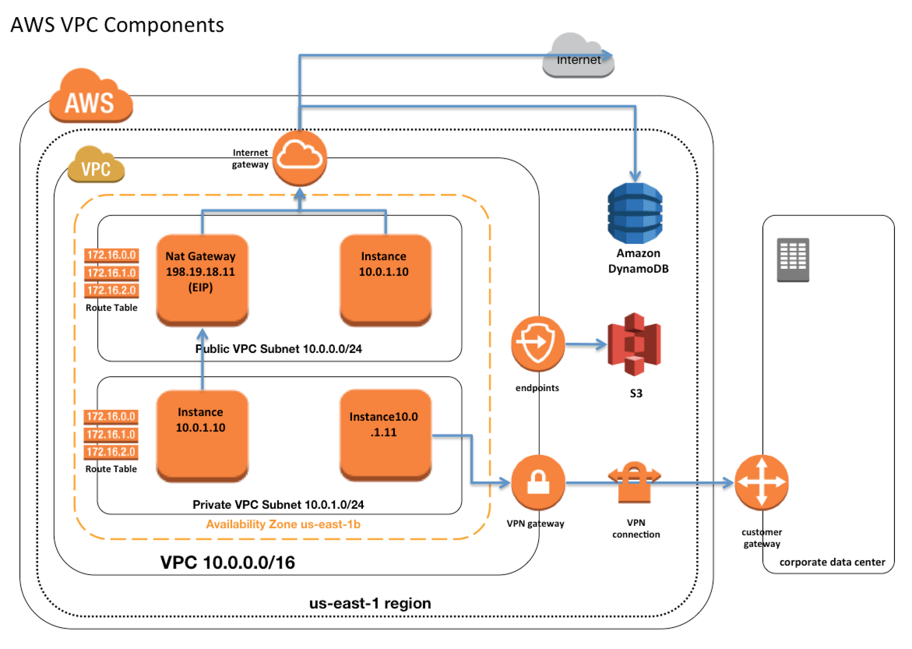


## Disaster Recovery Overview

### Disaster Recovery Overview
* any event that has a negative impact on a company’s business continuity or finances is a disaster
* disaster recovery (DR) is about preparing for and recovering from a disaster
* what kind of disaster recovery?
    * on-premise => On-premise: traditional DR, and very expensive
    * on-premise => AWS Cloud: hybrid recovery
    * AWS Cloud Region A => AWS Cloud Region B
* need to define two terms:
    * RPO: Recovery Point Objective
        * a measure of maximum tolerable amount of data can afford to lose (before the disaster)
        * longer RPO results more data loss
    * RTO: Recovery Time Objective
        * th time to recover your IT infrastructure and services  (after the disaster)
        * longer RTO results longer downtime


### Disaster Recovery Strategies
* Backup and Restore
    * high RPO
    * scheduled regular snapshots and/or AWS Storage Gateway + AWS Snowball
* Pilot Light
    * a small version of the app is always running in the cloud
    * useful for the critical core (pilot light)
    * very similar to Backup and Restore
    * faster than Backup and Restore as critical systems are already up
* Warm Standby
    * full system is up and running, but at minimum size
    * upon disaster, we can scale to production load
* Hot Site / Multi Site Approach
    * very low RTO (minutes or seconds) – very expensive
    * full Production Scale is running AWS and On Premise

### Disaster Recovery Tips
* Backup
    * EBS Snapshots, RDS automated backups / Snapshots, etc
    * regular pushes to S3 / S3 IA / Glacier, Lifecycle Policy, Cross Region Replication
    * from On-Premise: Snowball or Storage Gateway
* High Availability
    * use Route53 to migrate DNS over from Region to Region
    * RDS Multi-AZ, ElastiCache Multi-AZ, EFS, S3
    * Site to Site VPN as a recovery from Direct Connect
* Replication
    * RDS Replication (Cross Region), AWS Aurora + Global Databases
    * database replication from on-premise to RDS
    * Storage Gateway
* Automation
    * CloudFormation / Elastic Beanstalk to re-create a whole new environment
    * Recover / Reboot EC2 instances with CloudWatch if alarms fail
    * AWS Lambda functions for customized automations
* Chaos
    * Netflix has a simian-army randomly terminating EC2


### DMS – Database Migration Service
* overview
    * quickly and securely migrate databases to AWS, resilient, self healing
    * the source database remains available during the migration
    * supports:
        * homogeneous migrations: e.g., Oracle to Oracle
        * heterogeneous migrations: e.g., Microsoft SQL Server to Aurora
    * continuous Data Replication using `change data capture` (CDC)
    * you must create an EC2 instance to perform the replication tasks
* DMS Sources and Targets
    * SOURCES:
        * On-Premise and EC2 instances databases: Oracle, MS SQL Server, MySQL, MariaDB, PostgreSQL, MongoDB, SAP, DB2
        * Azure: Azure SQL Database
        * Amazon RDS: all including Aurora
        * Amazon S3
    * TARGETS:
        * On-Premise and EC2 instances databases: Oracle, MS SQL Server, MySQL, MariaDB, PostgreSQL, SAP
        * Amazon RDS
        * Amazon Redshift
        * Amazon DynamoDB
        * Amazon S3
        * ElasticSearch Service
        * Kinesis Data Streams
        * DocumentDB (compatible with MongoDB)
* AWS Schema Conversion Tool (SCT)
    * convert your Database’s Schema from one engine to another
    * example OLTP: (SQL Server or Oracle) to MySQL, PostgreSQL, Aurora
    * example OLAP: (Teradata or Oracle) to Amazon Redshift
    * prefer compute-intensive instances to optimize data conversions
    * you do not need to use SCT if you are migrating the same DB engine
        * e.g., On-Premise PostgreSQL => RDS PostgreSQL
    * the DB engine is still PostgreSQL (RDS is the platform)
    * continuous replication:
        * to captures ongoing changes after complete initial (full-load) migration  
        * ongoing replication = change data capture (CDC) 
        * This process works by collecting changes to the database logs using the database engine's native API.


### On-Premise strategy with AWS
* ability to download Amazon Linux 2 AMI as a VM (.iso format)
    * works with VMware, KVM, VirtualBox (Oracle VM), Microsoft Hyper-V
* VM Import / Export
    * migrate existing applications into EC2
    * create a DR repository strategy for your on-premise VMs
    * can export back the VMs from EC2 to on-premise
* AWS Application Discovery Service
    * gather information about your on-premise servers to plan a migration
    * install the AWS Application Discovery Agentless Connector as a virtual appliance on VMware vCenter
    * build server utilization and dependency mappings
    * the collected data is retained in ecrypted format in an AWS Application Discovery Service data store
        * allow export as CSV to estimate the Total Cost of Ownership (TCO) of running on AWS and to plan your migration 
    * track progress with AWS Migration Hub on migrating the discovered servers, also store the data collected
* AWS Database Migration Service (DMS)
    * Replicate On-premise => AWS , AWS => AWS, AWS => On-premise
    * works with various database technologies (Oracle, MySQL, DynamoDB, etc..)
* AWS Server Migration Service (SMS)
    * incremental replication of on-premise live servers to AWS
    * can be used as a backup tool, multi-site strategy (on-prem and off-prem), and a DR tool


### AWS DataSync
* move large amount of data from on-premise to AWS, can synchronize to: 
    * Amazon S3 (any storage classes – including Glacier)
    * Amazon EFS
    * Amazon FSx for Windows
* move data from your NAS or file system via NFS or SMB
    * NFS = network file system (linux)
    * SMB = server messaging protocol (windows)
* replication tasks can be scheduled hourly, daily, weekly
* leverage the DataSync agent to connect to your systems
    * can setup a bandwidth limit


### AWS Backup
* fully managed service
* centrally manage and automate backups across AWS services
* no need to create custom scripts and manual processes
* supported services:
    * Amazon FSx
    * Amazon EFS
    * Amazon DynamoDB
    * Amazon EC2
    * Amazon EBS
    * Amazon RDS (All DBs engines)
    * Amazon Aurora
    * AWS Storage Gateway (Volume Gateway)
* supports cross-region backups
* supports cross-account backups
* supports PITR for supported services
    * PITC = point-in-time recovery
* On-Demand and Scheduled backups
* tag-based backup policies
* you create backup policies known as Backup Plans
    * backup frequency (every 12 hours, daily, weekly, monthly, cron expression)
    * backup window
    * transition to Cold Storage (Never, Days, Weeks, Months, Years)
    * retention Period (Always, Days, Weeks, Months, Years)


### Transferring large amount of data into AWS
* example: transfer 200 TB of data in the cloud. We have a 100 Mbps internet connection.
* over the internet / Site-to-Site VPN:
    * immediate to setup
    * will take 200(TB)*1000(GB)*1000(MB)*8(Mb)/100 Mbps = 16,000,000s = 185d
* over Direct Connect 1Gbps:
    * long for the one-time setup (over a month)
    * will take 200(TB)*1000(GB)*8(Gb)/1 Gbps = 1,600,000s = 18.5d
* over Snowball:
    * will take 2 to 3 snowballs in parallel
    * takes about 1 week for the end-to-end transfer
    * can be combined with DMS
* for on-going replication / transfers: Site-to-Site VPN or DX with DMS or DataSync


## More Solution Architectures

### Lambda, SNS & SQS
* SQS ==Try, retry==>Lambda
    * SQS sends failed request to DQL
* SQS (FIFO) ==Try, retry, potentially blocking==>Lambda
    * SQS sends failed request to DQL
* SNS --asynchronous-->Lambda (retry if fail)
    * Lambda sends failed request to DQL (SQS)
* Fan out pattern: delivery to multiple SQS
    * SDK --put-->SNS==fan out==> to multiple SQS


### S3 Events
* S3:ObjectCreated, S3:ObjectRemoved, S3:ObjectRestore, S3:Replication
* object name filtering possible (*.jpg)
* use case: generate thumbnails of images uploaded to S3
* can create as many S3 events as desired
* S3 event notifications typically deliver events in seconds but can sometimes take a minute or longer
* if two writes are made to a single non- versioned object at the same time, it is possible that only a single event notification will be sent
* if you want to ensure that an event notification is sent for every successful write, you can enable versioning on your bucket.


### Caching Strategies
* things to consider:
    * TTL, network, computation. cost, latency
* cache can take places at:
    * CloudFront, API Gateway, Redix / Memcached / DAX


### Blocking an IP address
* client --> NACL (deny rule) --> EC2 with security group (can only setup allow rules) + optional firewall software in EC2 
* client --> NACL --> ALB (with security group, connection termination) --> EC2 with security group
* client --> NACL --> ALB (install WAF IP for address filtering) --> EC2 with security group
* client --> NACL --> NLB (pass through, no security group) --> EC2 with security group
* client --> CloudFront (geo restriction + WAF IP filtering) --> NACL (not helpful) --> ALB --> EC2


### High Performance Computing (HPC)
* what is HPC:
    * the cloud is the perfect place to perform HPC
        * you can create a very high number of resources in no time
        * you can speed up time to results by adding more resources
        * you can pay only for the systems you have used
    * perform genomics, computational chemistry, financial risk modeling, weather prediction, machine learning, deep learning, autonomous driving
* which services help perform HPC?
    * data management & transfer
        * AWS Direct Connect:
            * move GB/s of data to the cloud, over a private secure network
        * Snowball & Snowmobile
            * move PB of data to the cloud
        * AWS DataSync
            * move large amount of data between on-premise and S3, EFS, FSx for Windows
    * compute and networking
        * EC2 Instances:
            * CPU optimized, GPU optimized
            * EC2 Fleets
            * Spot Instances / Spot Fleets for cost savings + Auto Scaling
        * EC2 Placement Groups: Cluster for good network performance
            * same rack, same AZ with low latency 10Gbps network
        * EC2 Enhanced Networking (SR-IOV: single root I/O virtualization)
            * higher bandwidth, higher PPS (packet per second), lower latency
            * option 1: Elastic Network Adapter (ENA) up to 100 Gbps
            * option 2: Intel 82599 Virtual Function (VF) up to 10 Gbps – LEGACY
        * Elastic Fabric Adapter (EFA)
            * improved ENA for HPC, only works for Linux
            * great for inter-node communications, tightly coupled workloads
            * leverages Message Passing Interface (MPI) standard
            * bypasses the underlying Linux OS to provide low-latency, reliable transport
    * storage
        * instance-attached storage:
            * EBS: scale up to 64000 IOPS with io1 Provisioned IOPS
            * Instance Store: scale to millions of IOPS, linked to EC2 instance, low latency
        * network storage:
            * Amazon S3: large blob, not a file system
            * Amazon EFS: scale IOPS based on total size, or use provisioned IOPS
            * Amazon FSx for Lustre:
                * HPC optimized distributed file system, millions of IOPS
                * backed by S3
    * automation and orchestration
        * AWS Batch
            * to easily and efficiently run hundreds of thousands of batch computing jobs
            * supports multi-node parallel jobs, which enables you to run single jobs that span multiple EC2 instances.
            * easily schedule jobs and launch EC2 instances accordingly
        * AWS ParallelCluster
            * open source cluster management tool to deploy HPC on AWS
            * configure with text files
            * automate creation of VPC, Subnet, cluster type and instance types


### creating a highly available EC2 instance
* Elastic IP address
* approaches to consider:
    * CloudWatch Event (or Alarm based on metric) => Lambda => start the (standby) instance attach the Elastic IP
    * ASG with settings: 1 min, 1 max, 1 desired >=2 AZ
        * EC2 user data to attach the Elastic IP
        * EC2 instance role to allow API calls to attach the Elastic IP
    * ASG + EBS Volume => Snapshot => Volume (in a separated AZ) managed by ASG lifecycle hook


### High Availability for a Bastion Host
* HA options for the bastion host
    * run 2 across 2 AZ
    * run 1 across 2 AZ with 1 ASG 1:1:1
* routing to the bastion host
    * if 1 bastion host, use an elastic IP with ec2 user-data script to access it
    * if 2 bastion hosts, use an Network Load Balancer (layer 4) deployed in multiple AZ
    * if NLB, the bastion hosts can live in the private subnet directly
* note: can't use ALB as the ALB is layer 7 (HTTP protocol)
    * SSH requires layer 4 access


## Other Services

### CICD
* Continuous Integration
    * developers push the code to a code repository often (GitHub / CodeCommit / Bitbucket / etc)
    * a testing / build server checks the code as soon as it's pushed (CodeBuild / Jenkins CI / etc)
    * the developer gets feedback about the tests and checks that have passed / failed
    * find bugs early, fix bugs
    * deliver faster as the code is tested
    * deploy often
    * happier developers, as they’re unblocked
* Continuous Delivery
    * ensure that the software can be released reliably whenever needed.
    * ensures deployments happen often and are quick
    * shift away from one release every 3 months to 5 releases a day
    * that usually means automated deployment
        * CodeDeploy
        * Jenkins CD
        * Spinnaker
* CICD Workflow
    * Code: AWS CodeCommit / GitHub or 3rd party code repository
    * Build => Test: AWS CodeBuild / Jenkins CI or 3rd party CI servers
    * Deploy => Provision: AWS Elastic Beanstalk / AWS CodeDeploy + User Managed EC2 Instances Fleet (CloudFormation)
    * Orchestrate: AWS CodePipeline


### CloudFormation
* Infrastructure as Code
    * currently, we have been doing a lot of manual work; All this manual work will be very tough to reproduce:
        * in another region
        * In another AWS account
        * within the same region if everything was deleted
    * wouldn't it be great, if all our infrastructure was code?
        * that code would be deployed and create / update / delete our infrastructure
* What is CloudFormation
    * CloudFormation is a declarative way of outlining your AWS Infrastructure, for any resources (most of them are supported).
    * for example, within a CloudFormation template, you say:
        * i want a security group
        * i want two EC2 machines using this security group
        * i want two Elastic IPs for these EC2 machines
        * i want an S3 bucket
        * i want a load balancer (ELB) in front of these machines
    * then CloudFormation creates those for you, in the right order, with the exact configuration that you specify
    * `Quick Start` is a bunch of CloudFormation templates already built by AWS Solution Architects allowing you to create complex environments very quickly
* Benefits
    * infrastructure as code
        * no resources are manually created, which is excellent for control
        * the code can be version controlled for example using git
        * changes to the infrastructure are reviewed through code
    * cost
        * each resources within the stack is tagged with an identifier so you can easily see how much a stack costs you
        * you can estimate the costs of your resources using the CloudFormation template
        * savings strategy: In Dev, you could automation deletion of templates at 5 PM and recreated at 8 AM, safely
    * productivity
        * ability to destroy and re-create an infrastructure on the cloud on the fly
        * automated generation of Diagram for your templates!
        * declarative programming (no need to figure out ordering and orchestration)
    * separation of concern: create many stacks for many apps, and many layers. Ex:
        * VPC stacks
        * network stacks
        * app stacks
    * don't re-invent the wheel
        * leverage existing templates on the web!
        * leverage the documentation
* How CloudFormation Works
    * templates have to be uploaded in S3 and then referenced in CloudFormation
    * to update a template, we can't edit previous ones. We have to re- upload a new version of the template to AWS
    * stacks are identified by a name
    * deleting a stack deletes every single artifact that was created by CloudFormation.
* Deploying CloudFormation templates
    * manual way:
        * editing templates in the CloudFormation Designer
        * using the console to input parameters, etc
    * automated way:
        * editing templates in a YAML file
        * using the AWS CLI (Command Line Interface) to deploy the templates
        * recommended way when you fully want to automate your flow
* CloudFormation Building Blocks
    * templates components
        * resources: your AWS resources declared in the template (MANDATORY)
        * parameters: the dynamic inputs for your template
        * mappings: the static variables for your template
        * outputs: references to what has been created
        * conditionals: list of conditions to perform resource creation
        * metadata
    * Templates helpers:
        * references
        * functions
* CloudFormation - StackSets
    * create, update, or delete stacks across multiple accounts and regions with a single operation
    * administrator account to create StackSets
    * trusted accounts to create, update, delete stack instances from StackSets
    * when you update a stack set, all associated stack instances are updated throughout all accounts and regions


### AWS Step Functions
* build serverless visual workflow to orchestrate your Lambda functions
* represent flow as a JSON state machine
* features: sequence, parallel, conditions, timeouts, error handling
* can also integrate with EC2, ECS, On premise servers, API Gateway
* maximum execution time of 1 year
* possibility to implement human approval feature
* use cases:
    * order fulfillment
    * data processing
    * web applications
    * any workflow


### Amazon EMR
* EMR stands for Elastic MapReduce
* EMR helps creating Hadoop clusters (Big Data) to analyze and process vast amount of data
* the clusters can be made of hundreds of EC2 instances
* also supports Apache Spark, HBase, Presto, Flink
* EMR takes care of all the provisioning and configuration
* auto-scaling and integrated with Spot instances
* use cases: data processing, machine learning, web indexing, big data


### AWS Opsworks
* AWS Opsworks = Managed Chef & Puppet
    * Chef & Puppet help you perform server configuration automatically, or repetitive actions
    * they work great with EC2 & On Premise VM
        * works with Linux / Windows
        * they help with managing configuration as code
        * helps in having consistent deployments
    * in the exam: Chef & Puppet needed => AWS Opsworks
* Chef / Puppet have similarities with SSM / Beanstalk / CloudFormation 
    * can automate: user accounts, cron, ntp, packages, services
    * they leverage *Recipes* or *Manifests*
    * they’re open-source tools that work cross-cloud
    * it's an alternative to AWS SSM (systems Manager)


### AWS Elastic Transcoder
* convert media files (video + music) stored in S3 into various formats for tablets, PC, Smartphone, TV, etc
* features: bit rate optimization, thumbnail, watermarks, captions, DRM, progressive download, encryption
* 4 Components:
    * jobs: what does the work of the transcoder
    * pipeline: Queue that manages the transcoding job
    * presets: Template for converting media from one format to another
    * notifications: SNS for example
* pay for what you use, scales automatically, fully managed
    * charge based on the minutes that you transcode and the resolution at which you transcode


### AWS WorkSpaces
* managed, secure cloud desktop
* great to eliminate management of on-premise VDI (Virtual Desktop Infrastructure)
* on demand, pay per by usage
* secure, encrypted, network isolation
* integrated with Microsoft Active Directory


### AWS AppSync
* store and sync data across mobile and web apps in real-time
* makes use of GraphQL (mobile technology from Facebook)
* Client Code can be generated automatically
* integrations with DynamoDB / Lambda
* real-time subscriptions
* offline data synchronization (replaces Cognito Sync)
* fine grained security

### Cost Explorer
* visualize, understand, and manage your AWS costs and usage over time
* create custom reports that analyze cost and usage data.
* analyze your data at a high level: total costs and usage across all accounts
    * or monthly, hourly, resource level granularity
* choose an optimal `Savings Plan` (to lower prices on your bill)
* forecast usage up to 12 months based on previous usage

### AWS X-Ray
* analyze and debug production, distributed applications. e.g., ones built using a micro-services architecture. 
*  traces user requests as they travel through application with an end-to-end view of app performance
*  you can follow request paths to pinpoint where in your application and what is causing performance issues
*  works with EC2, ECS, Lambda, SQS, SNS, Elastic Beanstalk

### AWS other services cheat-sheet
* CodeCommit: service where you can store your code. Similar service is GitHub
* CodeBuild: build and testing service in your CICD pipelines
* CodeDeploy: deploy the packaged code onto EC2 and AWS Lambda
* CodePipeline: orchestrate the actions of your CICD pipelines (build stages, manual approvals, many deploys, etc)
* CloudFormation: Infrastructure as Code for AWS. Declarative way to manage, create and update resources.
* ECS (Elastic Container Service): Docker container management system on AWS. Helps with creating micro-services.
* ECR (Elastic Container Registry): Docker images repository on AWS. Docker Images can be pushed and pulled from there
* Step Functions: Orchestrate / Coordinate Lambda functions and ECS containers into a workflow
* SWF (Simple Workflow Service): Old way of orchestrating a big workflow.
* EMR (Elastic Map Reduce): Big Data / Hadoop / Spark clusters on AWS, deployed on EC2 for you
* Glue: ETL (Extract Transform Load) service on AWS
* OpsWorks: managed Chef & Puppet on AWS
* ElasticTranscoder: managed media (video, music) converter service into various optimized formats
* Organizations: hierarchy and centralized management of multiple AWS accounts
* Workspaces: Virtual Desktop on Demand in the Cloud. Replaces traditional on-premise VDI infrastructure
* AppSync: GraphQL as a service on AWS
* SSO (Single Sign On): One login managed by AWS to log in to various business SAML 2.0-compatible applications (office 365 etc)


## Whitepapers

### Well Architected Framework 
* General Guiding Principles
    * stop guessing your capacity needs
    * test systems at production scale
    * automate to make architectural experimentation easier
    * allow for evolutionary architectures
        * design based on changing requirements
    * drive architectures using data
    * improve through game days
        * simulate applications for flash sale days
* 5 Pillars (`OSPCR`)
    * Operational Excellence
        * includes the ability to run and monitor systems to deliver business value and to continually improve supporting processes and procedures
        * design Principles
            * perform operations as code - Infrastructure as code
            * annotate documentation - Automate the creation of annotated documentation after every build
            * make frequent, small, reversible changes - So that in case of any failure, you can reverse it
            * refine operations procedures frequently - And ensure that team members are familiar with it
            * anticipate failure
            * learn from all operational failures
        * relevant AWS Services
            * prepare: AWS CloudFormation, AWS Config
            * operate: AWS CloudFormation, AWS Config, AWS CloudTrail, Amazon CloudWatch, X-Ray
            * evolve: AWS CloudFormation, AWS CodeBuild, AWS CodeCommit, AWS CodeDeploy, AWS CodePipeline
    * Security
        * includes the ability to protect information, systems, and assets while delivering business value through risk assessments and mitigation strategies
        * design Principles
            * implement a strong identity foundation - Centralize privilege management and reduce (or even eliminate) reliance on long-term credentials - Principle of least privilege - IAM
            * enable traceability - Integrate logs and metrics with systems to automatically respond and take action
            * apply security at all layers - from edge network, VPC, subnet, load balancer, to every instance, operating system, and application
            * automate security best practices
            * protect data in transit and at rest - Encryption, tokenization, and access control
            * keep people away from data - Reduce or eliminate the need for direct access or manual processing of data
            * prepare for security events - Run incident response simulations and use tools with automation to increase your speed for detection, investigation, and recovery
        * relevant AWS Services
            * Identity and Access Management: IAM, AWS-STS, MFA token, AWS Organizations
            * Detective Controls: AWS Config, AWS CloudTrail, Amazon CloudWatch
            * Infrastructure Protection: Amazon CloudFront, Amazon VPC, AWS Shield, AWS WAF, Amazon Inspector
            * Data Protection: KMS, S3, Elastic Load Balancing (ELB), Amazon EBS, Amazon RDS
            * Incident Response: IAM, AWS CloudFormation, Amazon CloudWatch
    * Reliability
        * ability of a system to recover from infrastructure or service disruptions, dynamically acquire computing resources to meet demand, and mitigate disruptions such as mis-configurations or transient network issues
        * design Principles
            * test recovery procedures - Use automation to simulate different failures or to recreate scenarios that led to failures before
            * automatically recover from failure - Anticipate and remediate failures before they occur
            * scale horizontally to increase aggregate system availability - Distribute requests across multiple, smaller resources to ensure that they don't share a common point of failure
            * stop guessing capacity - Maintain the optimal level to satisfy demand without over or under provisioning - Use Auto Scaling
            * manage change in automation - Use automation to make changes to infrastructure
        * relevant AWS Services
            * Foundation: IAM, Amazon VPC, Service Quotas, AWS Trusted Advisor
            * Change Management: AWS Auto Scaling, Amazon CloudWatch, AWS Config
            * Failure Management: Backups, AWS CloudFormation, Amazon S3, Amazon S3 Glacier, Amazon Route 53
    * Performance Efficiency
        * includes the ability to use computing resources efficiently to meet system requirements, and to maintain that efficiency as demand changes and technologies evolve
        * design Principles
            * democratize advanced technologies - Advance technologies become services and hence you can focus more on product development
            * go global in minutes - Easy deployment in multiple regions
            * use serverless architectures - Avoid burden of managing servers
            * experiment more often - Easy to carry out comparative testing
            * mechanical sympathy - Be aware of all AWS services
        * relevant AWS Services
            * Selection: AWS Auto Scaling, AWS Lambda, Amazon EBS, Amazon S3, Amazon RDS
            * Review: AWS CloudFormation, AWS News Blog
            * Monitoring: Amazon CloudWatch, AWS Lambda
            * Trade-offs: Amazon RDS, Amazon ElastiCache, AWS Snowball, Amazon CloudFront
    * Cost Optimization
        * includes the ability to run systems to deliver business value at the lowest price point
        * design Principles
            * adopt a consumption mode - Pay only for what you use
            * measure overall efficiency - Use CloudWatch
            * stop spending money on data center operations - AWS does the infrastructure part and enables customer to focus on organization projects
            * analyze and attribute expenditure - Accurate identification of system usage and costs, helps measure return on investment (ROI) - Make sure to use tags
            * use managed and application level services to reduce cost of ownership - As managed services operate at cloud scale, they can offer a lower cost per transaction or service
        * relevant AWS Services
            * Expenditure Awareness: AWS Budgets, AWS Cost and Usage Report, AWS Cost Explorer, Reserved Instance Reporting
            * Cost-Effective Resources: Spot instance, Reserved instance, S3 Glacier
            * Matching supply and demand: AWS Auto Scaling, AWS Lambda
            * Optimizing Over Time: AWS Trusted Advisor, AWS Cost and Usage Report


### Trusted Advisor
* no need to install anything – high level AWS account assessment
* analyze your AWS accounts and provides recommendation:
    * cost optimization
    * performance
    * security
    * fault tolerance
    * service limits
* `Core Checks and Recommendations` – all customers
* can enable weekly email notification from the console
* `Full Trusted Advisor` – Available for Business & Enterprise support plans
    * ability to set CloudWatch alarms when reaching limit
    * Programmatic Access using AWS Support API
* Trusted Advisor Checks Examples
    * cost optimization:
        * low utilization EC2 instances, idle load balancers, under-utilized EBS volumes
        * reserved instances & savings plans optimizations,
    * performance:
        * high utilization EC2 instances, CloudFront CDN optimizations
        * EC2 to EBS throughput optimizations, Alias records recommendations
    * security:
        * MFA enabled on Root Account, IAM key rotation, exposed Access Keys
        * S3 Bucket Permissions for public access, security groups with unrestricted ports
    * fault tolerance:
        * EBS snapshots age, Availability Zone Balance
        * ASG Multi-AZ, RDS Multi-AZ, ELB configuration
    * service limits (service quota, maximum number of service resources or operations that apply to an account / a region)
